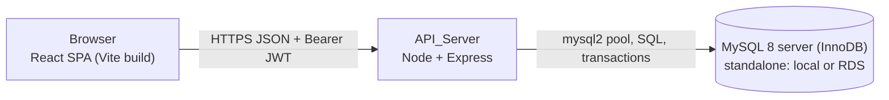
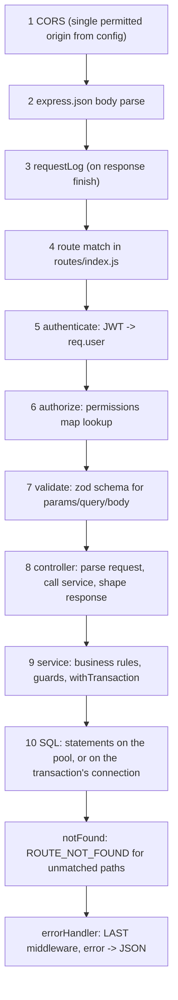
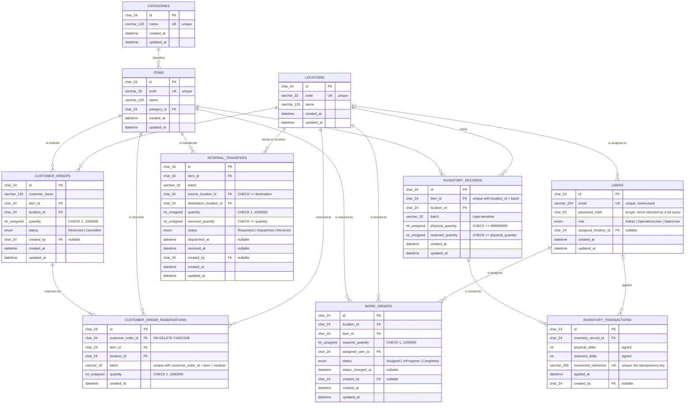

# Design Document

## Overview

Mini Operations ERP is a two-process application: an Express REST API (`backend/`) on Node.js talking to MySQL 8 with hand-written SQL through the `mysql2` driver, and a React single-page app (`frontend/`) built with Vite. Both are plain JavaScript, no TypeScript.

The design follows one rule above all others: every file must be explainable in an interview. That means conventional Express layering (routes → controllers → services → SQL, plus middleware), no dependency-injection container, no ORM, no repository layer, no CQRS, no event bus, no GraphQL. Where the requirements demand something non-obvious (multi-table transactions, conditional reservation updates, movement-reference idempotency), the design states the rule in one place and gives it a name, so a live change request touches one function.

Three decisions carry the correctness of the whole system, and everything else follows from them:

1. **Available quantity is derived, never stored.** `physicalQuantity - reservedQuantity` is computed by exactly one exported function, and the same module owns the one SQL expression that encodes the same rule for conditional updates. Adding a `damagedQuantity` later means editing that one file and the schema. (Req 3.3, 15.1)
2. **Every stock movement is a transaction that writes the balance and the ledger row together.** One helper, `withTransaction`, owns connection lifecycle, commit, rollback, `finally`-block cleanup, and transient-error retry. Services never call `beginTransaction` directly. (Req 8.1–8.5)
3. **Concurrency safety comes from the database's write result, not from a prior read.** Reservations and dispatches issue an `UPDATE` whose *`WHERE` clause* carries the availability condition. If it matches no row, the movement failed — there is no read-then-write window to lose. (Req 7.4–7.7)

MySQL 8 with InnoDB is the relational database the original brief asks for. Shared entities are referenced by foreign key rather than duplicated (Req 3.2), the application still checks existence explicitly so a caller gets `INVALID_REFERENCE` (400) instead of a raw constraint failure, and multi-step movements run inside ordinary InnoDB transactions. No special deployment shape is needed: a standalone MySQL server does transactions, so local development, the test suite, and a managed host such as RDS all behave the same way.

**Raw SQL over an ORM, deliberately.** Every query in the backend is a hand-written statement with positional `?` placeholders, escaped by `mysql2`. The three hardest requirements in the brief — a conditional `UPDATE` whose predicate the database evaluates, `SELECT ... FOR UPDATE` row locking in a chosen order, and deadlock-driven retry — are all things an ORM abstracts away and then makes you fight to get back. Writing the statements out means the locking and the predicate are visible in the file that depends on them, and there is no query-generation layer between the design and what the server executes.

**`CHAR(24)` hex primary keys, not `AUTO_INCREMENT`.** Ids are 24-character lowercase hex strings generated in application code by `src/db/id.js`. That shape is what the API already exposed and what its validation layer already enforces (`/^[a-f0-9]{24}$/`), so the HTTP contract, the OpenAPI spec, and the web client were untouched by the move to MySQL. A sequential integer key would also leak each table's row count to any caller who can read one id. The cost is a 24-byte key rather than 8, which at this scale is irrelevant.

### Research notes that shaped the design

- **Transactions need nothing but InnoDB.** `BEGIN`/`COMMIT`/`ROLLBACK` work on a single ordinary MySQL server as long as the tables are InnoDB, so the setup friction of a special deployment shape does not exist here — a real simplification, and the reason the README's local-setup steps are "install MySQL, run `npm run migrate`". The failure mode worth guarding is quieter: on a non-InnoDB engine those statements are accepted and silently ignored, so `src/db/connect.js` and the test harness both check the storage engine and say so loudly. ([InnoDB and transactions](https://dev.mysql.com/doc/refman/8.0/en/innodb-introduction.html))
- **Transient errors are expected, not exceptional.** InnoDB reports two failures that mean "your timing was unlucky, not your logic": `ER_LOCK_DEADLOCK` (1213), where the deadlock detector picked this transaction as the victim and rolled it back, and `ER_LOCK_WAIT_TIMEOUT` (1205), where it waited too long for a row lock another transaction held. Both are answered by re-running the whole callback from its first read, which is exactly Req 8.5's "at most 3 retries". Everything else — a guard, a unique-index violation, a `CHECK` failure — is deterministic and would fail again identically. ([deadlocks](https://dev.mysql.com/doc/refman/8.0/en/innodb-deadlocks.html))
- **A conditional update can express a cross-field comparison.** The comparison goes in the `WHERE` clause of the `UPDATE` itself — `WHERE id = ? AND (physical_quantity - reserved_quantity) >= ?` — so MySQL evaluates it against the current row, under that row's lock, at the moment the write applies. The decision comes from `affectedRows`, which is what makes Req 7.4 implementable without a stored available column. ([`UPDATE`](https://dev.mysql.com/doc/refman/8.0/en/update.html))
- **`CHECK` constraints need MySQL 8.0.16 or newer.** Before that version MySQL parses a `CHECK` clause and then silently ignores it, so a schema that looks defended would not be. The nine `CHECK` constraints in `schema.sql` are load-bearing (`reserved_quantity <= physical_quantity` above all), which makes 8.0.16+ a real minimum rather than a preference. ([`CHECK` constraints](https://dev.mysql.com/doc/refman/8.0/en/create-table-check-constraints.html))
- **Unique indexes give idempotency for free.** A unique index on `movement_reference` turns a replayed business action into `ER_DUP_ENTRY` (1062) on insert, which the service maps to `DUPLICATE_INVENTORY_TRANSACTION` / `TRANSFER_ALREADY_RECEIVED`. No separate idempotency table is needed. (Req 4.5, 4.6, 6.9, 6.12, 6.16)

---

## Architecture

### Process and deployment view



The two processes share nothing but the HTTP contract. The frontend reads its API base URL from a build-time variable (`VITE_API_BASE_URL`) with no hard-coded fallback (Req 10.8, 10.11). The backend reads its required environment variables at startup and refuses to start if any is missing (Req 10.1–10.3).

### Backend folder structure

```
backend/
  src/
    config/
      index.js            # Config_Loader: the only module that reads process.env
    db/
      schema.sql          # THE schema: 10 tables, 20 FKs, 9 CHECKs, 7 unique indexes
      id.js               # newId(): the CHAR(24) hex primary keys
      pool.js             # the one mysql2 pool + query() helper
      withTransaction.js  # connection lifecycle + commit/rollback + retry wrapper
      connect.js          # opens the pool, logs server version, checks InnoDB
      mappers.js          # flat JOIN rows -> the nested shapes controllers read
    middleware/
      authenticate.js     # JWT verify -> req.user = { id, role }
      authorize.js        # route-to-role map lookup (deny-by-default for writes)
      validate.js         # zod schema runner for body/params/query
      requestLog.js       # one line per finished response
      errorHandler.js     # centralized error -> JSON
      notFound.js         # ROUTE_NOT_FOUND
    permissions.js        # THE single route-to-role map
    errors/
      AppError.js
      errorCodes.js       # code -> httpStatus table
    services/
      availability.js     # availableQuantity() + AVAILABLE_SQL + hasAvailableAtLeastSql()  <-- single source of truth
      auth.service.js
      inventory.service.js
      workOrder.service.js
      transfer.service.js
      order.service.js
      movementReference.js # movement reference string builders
    controllers/
      auth.controller.js
      inventory.controller.js
      workOrder.controller.js
      transfer.controller.js
      order.controller.js
      reference.controller.js   # items, locations, users for form dropdowns
    routes/
      index.js            # mounts all routers under /api
      auth.routes.js
      inventory.routes.js
      workOrder.routes.js
      transfer.routes.js
      order.routes.js
      reference.routes.js
    validation/
      auth.schemas.js
      inventory.schemas.js
      workOrder.schemas.js
      transfer.schemas.js
      order.schemas.js
      common.js           # objectId (the 24-hex id validator), validQuantity, batch, customerName
    openapi.js            # the served OpenAPI document, built from the route/code tables
    app.js                # express app: middleware order, routers, error handler
    server.js             # config -> connect -> listen -> SIGINT/SIGTERM shutdown
  scripts/
    migrate.js            # creates the database if absent, applies src/db/schema.sql
    seed.js               # non-interactive seed (Req 13.5)
  tests/
    setup/
      globalSetup.js      # creates the throwaway <MYSQL_DATABASE>_test database, migrates it
      globalTeardown.js   # drops it again
      dbSetup.js          # per-worker env + pool, per-test reset, fixture reload
      assertTransactional.js # aborts the run if a table is not InnoDB
      seedFixture.js      # the fixed per-test fixture
      tables.js           # small SQL-backed read accessors for assertions
      poolCount.js        # in-use / open pooled connection counts
      generators.js       # fast-check generators
      agent.js            # Supertest agent + login helpers
      authorizeTestApp.js # a minimal app for the authorize middleware's own tests
    *.test.js
  jest.config.js
  package.json
  .env.example
```

There is no `models/` folder. The row shapes live in `src/db/schema.sql`, the SQL that reads and writes them lives in the services, and `src/db/mappers.js` is the only place a flat result row becomes the nested object a controller serialises.

`app.js` exports the Express app without listening, so Supertest can drive it in-process (Req 12.13). `server.js` owns the process concerns.

### Frontend folder structure

```
frontend/
  src/
    api/client.js         # fetch wrapper: base URL, JWT header, global 401 handling
    auth/AuthContext.jsx  # { token, user, login, logout }
    components/
      Nav.jsx
      DataTable.jsx
      ErrorBanner.jsx
      EmptyState.jsx
      RequireAuth.jsx
    screens/
      LoginScreen.jsx
      InventoryScreen.jsx
      WorkOrdersScreen.jsx
      TransfersScreen.jsx
      CustomerOrdersScreen.jsx
    App.jsx               # routes for exactly five screens
    main.jsx
  index.html
  vite.config.js
  .env.example
```

Flat by design: five screens, a handful of shared components, one context, one API client. No state-management library — `useState`/`useEffect` plus refetch-after-write is enough for five list screens and is easy to defend.

### Request pipeline

Middleware order is fixed and is the thing to point at when asked "where does a request go?". Cheap and security-relevant checks run before anything touches the database.



Responsibilities per layer, stated once:

| Layer | Does | Never does |
|---|---|---|
| Route | declares path, attaches middleware in order | business logic |
| Controller | reads `req.validated` and `req.user`, calls one service function, sends response | quantity comparisons, status comparisons, SQL of its own |
| Service | owns guards, transactions, SQL, ledger writes, movement references | HTTP concerns (`req`/`res`) |
| Schema (`db/schema.sql`) | column types, enums, indexes, foreign keys, `CHECK` invariants | multi-table orchestration |

Req 15.5 is enforced by that table: every quantity comparison and every status transition lives in a named exported service function (`assertSufficientAvailable`, `assertTransferTransition`, `nextWorkOrderStatus`), so a live "change this business rule" request edits one function.

`authenticate` is mounted on the API router for everything except `POST /api/auth/login`, so an unauthenticated request is rejected with 401 before any role evaluation happens (Req 1.8, 2.1).

---

## Components and Interfaces

### 1. Availability: the single source of truth

`services/availability.js` is the only module that knows the availability formula. It exports the JS function every read path and guard calls, the SQL expression a `SELECT` projects, and the `WHERE`-clause predicate every conditional update appends. All three come from the same file so a new deducted component (for example `damagedQuantity`) is a two-line edit here plus one column in the schema (Req 15.1).

```js
// backend/src/services/availability.js

/** The one and only definition of Available_Quantity. Req 3.3, 15.1 */
function availableQuantity(record) {
  return record.physicalQuantity - record.reservedQuantity;
}

/** Sum of availableQuantity over records for one item at one location. Req 3.5, 3.12 */
function locationAvailableQuantity(records) {
  return records.reduce((total, record) => total + availableQuantity(record), 0);
}

/** The same rule as SQL, for a SELECT to project as a derived column. */
const AVAILABLE_SQL = '(physical_quantity - reserved_quantity)';

/** `AVAILABLE_SQL` qualified with a table alias, for the JOINed reads. */
function AVAILABLE_SQL_FOR(alias) {
  return `(${alias}.physical_quantity - ${alias}.reserved_quantity)`;
}

/**
 * The same rule as a WHERE-clause predicate plus its bound parameter, so a
 * conditional UPDATE decides availability inside the write itself. Req 7.4
 * "this record has at least `quantity` available"
 */
function hasAvailableAtLeastSql(quantity, alias = null) {
  const available = alias ? AVAILABLE_SQL_FOR(alias) : AVAILABLE_SQL;
  return { sql: `${available} >= ?`, params: [quantity] };
}

module.exports = {
  availableQuantity, locationAvailableQuantity,
  AVAILABLE_SQL, AVAILABLE_SQL_FOR, hasAvailableAtLeastSql, hasPhysicalAtLeastSql,
};
```

The predicate is returned as a fragment plus its parameter rather than an interpolated string, because the quantity is a *value* and must travel as a bound `?` — never concatenated into SQL. `hasPhysicalAtLeastSql` is the mirror guard for a physical decrease, kept here so both quantity predicates a conditional update can carry live in one file (Req 4.2).

Every other module imports from here. No controller, no other service, and no hand-written query subtracts `reserved_quantity` from `physical_quantity` on its own. Location availability is computed by loading the (few) matching rows and reducing with `availableQuantity`, deliberately instead of a `SUM()` that would restate the formula in a second place.

### 2. Transaction helper

One wrapper owns connection lifecycle and retry. Services pass a callback that receives a dedicated connection and performs every read and write on it.

```js
// backend/src/db/withTransaction.js
const AppError = require('../errors/AppError');
const ERROR_CODES = require('../errors/errorCodes');
const { getPool } = require('./pool');

const MAX_RETRIES = 3; // 3 retries => at most 4 executions of the callback. Req 8.5

// The only two MySQL errors worth re-running rather than reporting:
// ER_LOCK_DEADLOCK (1213) -- InnoDB picked this transaction as the deadlock victim and
// rolled it back; ER_LOCK_WAIT_TIMEOUT (1205) -- it waited too long for a row lock
// another transaction held. Both are timing outcomes, not logical failures.
const TRANSIENT_ERROR_CODES = new Set(['ER_LOCK_DEADLOCK', 'ER_LOCK_WAIT_TIMEOUT']);
const TRANSIENT_ERRNOS = new Set([1213, 1205]);

function isTransient(error) {
  if (!error) return false;
  return TRANSIENT_ERROR_CODES.has(error.code) || TRANSIENT_ERRNOS.has(error.errno);
}

/**
 * Runs `work(connection)` inside one MySQL transaction.
 * Commits on success, rolls back on any error, always releases the connection,
 * retries transient errors up to 3 times. Req 8.1-8.5
 */
async function withTransaction(work) {
  let lastError;

  for (let attempt = 0; attempt <= MAX_RETRIES; attempt += 1) {
    const connection = await getPool().getConnection();
    try {
      await connection.beginTransaction();
      const result = await work(connection);
      await connection.commit();
      return result;
    } catch (error) {
      await connection.rollback().catch(() => {});
      lastError = error;
      if (!isTransient(error)) throw error;
    } finally {
      connection.release(); // runs on every exit path. Req 8.3
    }
  }

  throw new AppError(ERROR_CODES.CONCURRENT_MODIFICATION, 'CONCURRENT_MODIFICATION',
    'The data changed while this request was being processed. Please retry.',
    { cause: lastError });
}

module.exports = { withTransaction, MAX_RETRIES, isTransient };
```

**Why a connection per transaction.** In MySQL, `BEGIN`/`COMMIT`/`ROLLBACK` are *connection state*, not call parameters: the server associates the open transaction with the connection it arrived on. Two concurrent requests sharing one connection would therefore interleave their statements inside each other's transaction — one request's `COMMIT` would commit the other's half-finished work, and a `ROLLBACK` would discard it. Taking a connection out of the pool for the transaction's duration is what keeps them isolated, and it is why the pool exists at all rather than a single connection.

The corollary is a trap worth naming: a query issued against the *pool* instead of against `tx` inside a callback runs outside the transaction, so it is neither rolled back on failure nor re-read on a retry.

Notes worth defending:

- Each attempt takes a fresh connection, so a retry genuinely re-executes the callback **from its first read** (Req 8.5). No transaction state is carried over from the failed attempt.
- `rollback()` errors are swallowed because the transaction is already doomed — and after a deadlock InnoDB has already rolled it back, so the `ROLLBACK` is a no-op that can itself complain. The original error is what the caller needs.
- Non-transient errors (our own `AppError` guards, `ER_DUP_ENTRY`, a `CHECK` violation) propagate immediately after the rollback — no pointless retries (Req 8.2).
- `connection.release()` in `finally` is what makes the in-use pooled connection count return to its pre-request value (Req 8.3). Without it the pool would be exhausted after `connectionLimit` failed requests.

Typical service usage:

```js
// backend/src/services/transfer.service.js (dispatch, abbreviated)
async function dispatchTransfer(transferId) {
  await withTransaction(async (tx) => {
    // FOR UPDATE locks the transfer row, so two concurrent dispatches of the same
    // transfer are serialised and the second sees the first's committed status.
    const [transferRows] = await tx.query(
      `SELECT id, item_id, batch, source_location_id, quantity, status
         FROM internal_transfers WHERE id = ? FOR UPDATE`,
      [transferId]
    );
    if (transferRows.length === 0) throw notFound();
    const transfer = transferRows[0];

    assertTransferTransition(transfer.status, 'Dispatched'); // named guard, Req 15.5

    await applyMovement(
      { item: transfer.item_id, location: transfer.source_location_id, batch: transfer.batch },
      {
        physicalDelta: -transfer.quantity,
        reservedDelta: 0,
        movementReference: transferMovementReference(transfer.id, 'DISPATCH'),
      },
      tx
    );

    await tx.query(
      `UPDATE internal_transfers
          SET status = 'Dispatched', dispatched_at = CURRENT_TIMESTAMP(3)
        WHERE id = ?`,
      [transfer.id]
    );
  });

  return findTransferById(transferId);
}
```

`applyMovement` in `inventory.service.js` is the single place that writes an `inventory_records` change together with its `inventory_transactions` row, always on the caller's transaction connection (Req 4.4, 8.1). It opens with `SELECT ... FOR UPDATE` on the target row, so the balances its guards judge cannot change before its `UPDATE` lands.

### 3. Movement reference scheme

A movement reference names the business action that caused a ledger row. It is composed from the action type, the id of the row that caused it, the lifecycle step, and — where one action touches several records — the affected record id. The `UNIQUE` index on `inventory_transactions.movement_reference` then makes replays fail at the database (Req 4.5, 4.6).

```js
// backend/src/services/movementReference.js
const openingMovementReference   = (recordId)           => `INVENTORY:${recordId}:OPENING`;
const adjustMovementReference    = (recordId, clientRef)=> `ADJUST:${recordId}:${clientRef}`;
const transferMovementReference  = (transferId, step)   => `TRANSFER:${transferId}:${step}`;   // DISPATCH | RECEIPT
const reserveMovementReference   = (orderId, recordId)  => `ORDER:${orderId}:RESERVE:${recordId}`;
```

| Action | Movement reference | Uniqueness gives |
|---|---|---|
| Inventory record created | `INVENTORY:<recordId>:OPENING` | exactly one opening row per record (Req 4.9) |
| Inventory adjustment | `ADJUST:<recordId>:<clientMovementReference>` | replay of the same client reference on the same record is rejected (Req 4.6) |
| Transfer dispatch | `TRANSFER:<transferId>:DISPATCH` | a transfer can dispatch once |
| Transfer receipt | `TRANSFER:<transferId>:RECEIPT` | a transfer can be received once, even under concurrent receipts (Req 6.9, 6.12, 6.16) |
| Order reservation | `ORDER:<orderId>:RESERVE:<recordId>` | one row per batch consumed, replay-safe per record (Req 7.1) |

Two details that make this work:

- Ids are generated in application code **before** the insert (`newId()` from `src/db/id.js`), so the opening ledger row and the record it describes can be written in the same transaction with a known id, and the movement reference can embed that id.
- The duplicate-key signal is `ER_DUP_ENTRY` (errno 1062) raised by the unique index on the insert itself. It is recognised in one place: `isDuplicateKey(error)` in `inventory.service.js`, which checks both `error.code` and `error.errno` so a driver upgrade that stopped populating one of them would not silently disable the check. `applyMovement` turns it into `DUPLICATE_INVENTORY_TRANSACTION` (409); the transfer receipt path maps that same signal to `TRANSFER_ALREADY_RECEIVED` (409) because that is the business meaning there (Req 6.9, 6.16).

### 4. Reservation algorithm (concurrency-safe by construction)

Customer order creation reserves across batches in **ascending batch order**, consuming each record's full availability before moving on (Req 7.1). Two mechanisms do the work: a locking `SELECT ... FOR UPDATE` over the candidate rows in that ascending order, and a conditional `UPDATE` whose `WHERE` clause carries the availability condition.

```js
// backend/src/services/order.service.js (core loop, abbreviated)
async function reserveAcrossBatches({ item, location, quantity, orderId, createdBy }, tx) {
  // Ascending batch order (Req 7.1, 15.6), locked for the duration of this transaction.
  // InnoDB holds these row locks until commit, so a second transaction reserving from
  // the same batch BLOCKS here rather than reading a value about to go stale.
  const [records] = await tx.query(
    `SELECT id, batch, physical_quantity, reserved_quantity
       FROM inventory_records
      WHERE item_id = ? AND location_id = ?
      ORDER BY batch
      FOR UPDATE`,
    [item, location]
  );

  let remaining = quantity;
  const entries = [];

  for (const record of records) {
    if (remaining === 0) break;

    // A candidate size only -- choosing this reserves nothing by itself.
    const take = Math.min(remaining, availableQuantity({
      physicalQuantity: record.physical_quantity,
      reservedQuantity: record.reserved_quantity,
    }));                                            // single source of truth
    if (take <= 0) continue;

    // The availability condition lives in the WHERE clause, evaluated by MySQL as it
    // applies the write, not in a JS comparison against a stale read. Req 7.4
    const guard = hasAvailableAtLeastSql(take);      // from availability.js
    const [result] = await tx.query(
      `UPDATE inventory_records
          SET reserved_quantity = reserved_quantity + ?
        WHERE id = ? AND ${guard.sql}`,
      [take, record.id, ...guard.params]
    );

    if (result.affectedRows !== 1) {
      // Availability disappeared between the read and this write.
      // The write's own result IS the decision. Req 7.4
      throw insufficientAvailableQuantity();   // 409 INSUFFICIENT_AVAILABLE_QUANTITY
    }

    // One ledger row per changed record, in the same transaction as the update it
    // describes (Req 4.4, 8.1). ER_DUP_ENTRY here means this ran twice for one order.
    await tx.query(
      `INSERT INTO inventory_transactions
           (id, inventory_record_id, physical_delta, reserved_delta,
            movement_reference, created_by)
       VALUES (?, ?, 0, ?, ?, ?)`,
      [newId(), record.id, take, reserveMovementReference(orderId, record.id), createdBy]
    );

    entries.push({ item, location, batch: record.batch, quantity: take });
    remaining -= take;
  }

  if (remaining > 0) {
    // Not enough total availability across every batch at this location, even though
    // every individual update that was attempted matched. Req 7.3
    throw insufficientAvailableQuantity();
  }
  return entries; // reservation lines, summing to `quantity`. Req 15.3, 15.6
}
```

The lock/update shape, isolated:

```sql
SELECT id, batch, physical_quantity, reserved_quantity
  FROM inventory_records
 WHERE item_id = ? AND location_id = ?
 ORDER BY batch
   FOR UPDATE;                                    -- take the row locks, in batch order

UPDATE inventory_records
   SET reserved_quantity = reserved_quantity + ?
 WHERE id = ? AND (physical_quantity - reserved_quantity) >= ?;
-- accepted only when affectedRows === 1; otherwise the reservation failed
```

**Why this defeats the two-concurrent-reservations race.** Take availability 100, request A reserving 80, request B reserving 50, both submitted together without awaiting one another.

A naive read-then-write implementation reads 100 in both requests, both conclude "enough", both increment, and reserved lands at 130 against physical 100 — an oversell.

Here, the decision is never made from the read. The read only picks candidate batches and a `take` size; the *authorisation* to reserve is `affectedRows === 1` on a predicate MySQL evaluates against the current row, while holding that row's lock. Walking it through:

1. **The lock serialises them.** Whichever transaction reaches the `FOR UPDATE` first holds the row lock on that batch. The other one waits there — it does not read a value that is about to change.
2. **Re-evaluation against the committed effect.** When the winner commits, the loser acquires the lock and re-reads `reserved_quantity` as 80. Its `take` is recomputed against 20 available, its predicate `20 >= 50` fails, `affectedRows` is 0, and it throws `INSUFFICIENT_AVAILABLE_QUANTITY`. Its whole transaction rolls back, so a partial reservation it had already made against an earlier batch is undone with it (Req 7.5, 7.6).
3. **If they deadlock instead**, MySQL rolls one back with `ER_LOCK_DEADLOCK`, which `withTransaction` treats as transient and retries from the first read — where it then sees the winner's committed effect and is rejected on the merits.

Correctness comes from the row lock plus the predicate, not from the retry. The retry only converts an unlucky interleaving into a second honest attempt; even with zero retries the predicate would refuse the oversell.

So the outcome is: exactly one 201, one 409, total reserved increased by exactly the committed quantity (Req 7.7). Because the guard is a per-row condition rather than a global lock, the order in which the two requests are attempted does not change the final total for the committing subset (Req 7.8). And `reserved_quantity <= physical_quantity` is enforced a second time, independently, by the `ck_inventory_reserved_lte_physical` `CHECK` constraint. Dispatch uses the identical pattern against `physical_quantity` with the same availability check, which is what keeps that invariant true after an outbound movement too (Req 3.8, 6.4, 6.5).

### 5. Authentication and authorization

**Password storage.** `bcrypt` with cost factor 10 (within the required 10–12 band, Req 1.5). Hashing happens in exactly one function, `hashPassword` in `auth.service.js`, and the only column it ever fills is `users.password_hash`, declared `CHAR(60)` because bcrypt output is always 60 characters. Nothing else writes it, and the login lookup is the only query in the codebase that names `password_hash` in a `SELECT` list — every other read of `users` selects `id, email, role` — so the hash cannot leak into a list response by accident (Req 1.1). The login result is built field by field rather than by spreading the row, for the same reason.

**Token.** `jsonwebtoken.sign({ sub, role }, config.jwtSecret, { expiresIn: '8h' })` — user id and role as claims, expiry exactly 8 hours after issuance (Req 1.6).

**`authenticate` middleware.** Reads `Authorization: Bearer <token>`; missing, malformed, badly signed, or expired all produce the same `401 UNAUTHENTICATED` (Req 1.8, 1.9). On success it sets `req.user = { id: payload.sub, role: payload.role }` and nothing else (Req 1.7). Login failures use a distinct `401 INVALID_CREDENTIALS` with an identical message for unknown email and wrong password, so email existence cannot be probed (Req 1.2–1.4, 1.10).

**`authorize` middleware and the one permission map.** Exactly one map covers every write route, including the work-order status change route, so no write route relies on deny-by-default at run time (Req 2.8, 2.14).

```js
// backend/src/permissions.js
const ROLES = ['Admin', 'OperationsUser', 'SalesUser'];

// key = "<METHOD> <mounted path>"; value = every role permitted to reach it.
// Adding a write route or a role means editing this map only. Req 2.8
const WRITE_ROUTE_PERMISSIONS = {
  'POST /api/inventory':                    ['Admin', 'OperationsUser'],
  'POST /api/inventory/:id/adjust':         ['Admin', 'OperationsUser'],
  'POST /api/work-orders':                  ['Admin'],
  'PATCH /api/work-orders/:id/status':      ['Admin', 'OperationsUser'],
  'POST /api/transfers':                    ['Admin', 'OperationsUser'],
  'POST /api/transfers/:id/dispatch':       ['Admin', 'OperationsUser'],
  'POST /api/transfers/:id/receive':        ['Admin', 'OperationsUser'],
  'POST /api/orders':                       ['Admin', 'SalesUser'],
};

module.exports = { ROLES, WRITE_ROUTE_PERMISSIONS };
```

```js
// backend/src/middleware/authorize.js
const { ROLES, WRITE_ROUTE_PERMISSIONS } = require('../permissions');
const AppError = require('../errors/AppError');

const WRITE_METHODS = new Set(['POST', 'PATCH', 'PUT', 'DELETE']);
const forbidden = () =>
  new AppError(403, 'FORBIDDEN', 'Your role is not permitted for this operation.');

function authorize(req, res, next) {
  const role = req.user && req.user.role;
  if (!ROLES.includes(role)) return next(forbidden());        // Req 2.12

  if (!WRITE_METHODS.has(req.method)) return next();          // reads: any valid role. Req 2.13

  const key = `${req.method} ${req.baseUrl}${req.route.path}`;
  const permitted = WRITE_ROUTE_PERMISSIONS[key];
  if (!permitted) return next(forbidden());                   // deny by default. Req 2.11
  if (!permitted.includes(role)) return next(forbidden());     // Req 2.3, 2.5, 2.7

  return next();                                              // Req 2.2, 2.4, 2.6
}
```

`authorize` is attached per route (`router.post('/', authorize, validate(schema), controller)`) so `req.route.path` is populated and the map key is exact. Because it runs after `authenticate`, a request with no valid token never reaches role evaluation (Req 2.1). `WRITE_ROUTE_PERMISSIONS` is also exported to the test suite, which asserts that every write route the app declares has an entry — that is what keeps criterion 2.14 true as routes are added.

**Frontend mirroring.** The same role sets are imported into the frontend as a small constant object and used for role-gated rendering (Req 2.9, 2.10, 11.7, 11.9, 11.11). The backend check is the real one; the frontend gate is only to avoid showing controls that would 403.

**Assigned location.** `users.assigned_location_id` is `CHAR(24) NULL` with a `FOREIGN KEY` to `locations(id)` (`fk_users_assigned_location`, `ON DELETE SET NULL`) and a non-unique index, `ix_users_assigned_location`, so filtering users by site is an index range scan rather than a table scan (Req 15.4). `NULL` means "not bound to one site", which is the normal state for an Admin. Nothing filters on it yet; the extensibility note records that restricting a user to their location is one location comparison added inside `authorize` next to the map lookup.

### 6. Validation

**Library: zod.** Chosen over Joi and express-validator for three concrete reasons: `.strict()` rejects unknown body fields with a per-field issue, which is exactly Req 9.2; `z.coerce` plus `.trim()` give the type coercion and whitespace trimming of Req 9.3 declaratively; and `error.issues` is already a list of `{ path, message }`, which maps one-to-one onto the `details` array Req 9.4 demands without custom formatting. It is also plain JavaScript-friendly — no TypeScript needed to get value from it.

One middleware runs the schemas:

```js
// backend/src/middleware/validate.js
function validate({ params, query, body }) {
  return (req, res, next) => {
    const result = {};
    for (const [part, schema] of Object.entries({ params, query, body })) {
      if (!schema) continue;
      const parsed = schema.safeParse(req[part]);
      if (!parsed.success) return next(validationError(part, parsed.error));
      result[part] = parsed.data;
    }
    req.validated = result;  // controllers read ONLY this. Req 9.3
    next();
  };
}
```

Shared building blocks keep the rules in one place:

```js
// backend/src/validation/common.js
const OBJECT_ID_PATTERN = /^[a-f0-9]{24}$/i;
const OBJECT_ID_REASON = reasonFor(
    'INVALID_IDENTIFIER',
    'must be a 24-character hexadecimal identifier'
);

const objectId = z
    .string({
        required_error: 'is required',
        invalid_type_error: OBJECT_ID_REASON,
    })
    .regex(OBJECT_ID_PATTERN, OBJECT_ID_REASON);            // Req 9.10

const validQuantity = z.preprocess(
    (value) => (value === undefined ? undefined : Number(value)),
    z
        .number({ required_error: 'is required', invalid_type_error: QUANTITY_REASON })
        .int(QUANTITY_REASON)
        .min(1, QUANTITY_REASON)
        .max(QUANTITY_MAX, QUANTITY_REASON)                 // Valid_Quantity
);

/** Batch label: trimmed, non-blank, at most 32 characters (Req 3.1, 3.6). */
const batch = z
    .string({ required_error: 'is required', invalid_type_error: 'must be a string' })
    .trim()
    .min(1, 'must not be blank')
    .max(32, 'must be at most 32 characters');

/** Customer name: trimmed, non-blank, at most 120 characters (Req 7.11). */
const customerName = z
    .string({ required_error: 'is required', invalid_type_error: 'must be a string' })
    .trim()
    .min(1, 'must not be blank')
    .max(120, 'must be at most 120 characters');
```

`objectId` is the validator's name in the source and stays that way, but what it accepts is a 24-character hexadecimal identifier — the stored `CHAR(24)` primary key shape generated by `src/db/id.js`, and the same shape the API has always exposed. The pattern carries the `i` flag, so either case parses, while `newId()` only ever emits lowercase. Keeping the name means no call site had to change; keeping the shape means the HTTP contract did not either.

`reasonFor` wraps a reason string with a marker naming the error code it wants, which is how a shared building block asks for `INVALID_IDENTIFIER` or `INVALID_QUANTITY` rather than the generic `VALIDATION_ERROR`: `validate.js` reads the marker, picks the response code, and strips the marker before the reason reaches the client. A new building block therefore needs one `reasonFor` call here and no change at all to `validate.js`.

Rules that follow from these:

- Every body schema ends in `.strict()`, so undeclared fields are rejected before the handler (Req 9.2).
- A failed `objectId` on a path parameter is reported as `INVALID_IDENTIFIER` (400); every other schema failure is `VALIDATION_ERROR` (400) with one entry per rejected field (Req 9.4, 9.10).
- A failure on a quantity field is reported as `INVALID_QUANTITY` (400) — the `validate` middleware checks whether every issue path names a quantity field and picks the code accordingly, so Req 4.1, 5.2, 6.13, 7.9 get their specific code while mixed failures fall back to `VALIDATION_ERROR`.
- Controllers read `req.validated.body/params/query` only, never raw `req.body`. That is the habit that keeps unvalidated input out of services.

### 7. Configuration

```js
// backend/src/config/index.js -- the only module that touches process.env (Req 10.4)
require('dotenv').config();

const REQUIRED = [
    'MYSQL_HOST',
    'MYSQL_PORT',
    'MYSQL_USER',
    'MYSQL_DATABASE',
    'JWT_SECRET',
    'PORT',
    'CORS_ORIGIN',
];

// MYSQL_PASSWORD is required to be PRESENT but is allowed to be empty: a local
// MySQL install with a passwordless root user is a legitimate development setup,
// while a silently-absent password would be a typo worth catching.
const REQUIRED_ALLOWING_EMPTY = ['MYSQL_PASSWORD'];

const ALL_REQUIRED = [...REQUIRED, ...REQUIRED_ALLOWING_EMPTY];

function loadConfig(env = process.env) {
    const isBlank = (value) => typeof value !== 'string' || value.trim() === '';

    const missing = [
        ...REQUIRED.filter((name) => isBlank(env[name])),
        ...REQUIRED_ALLOWING_EMPTY.filter((name) => typeof env[name] !== 'string'),
    ].sort((a, b) => ALL_REQUIRED.indexOf(a) - ALL_REQUIRED.indexOf(b));

    if (missing.length > 0) {
        return {
            ok: false,
            errors: [`Missing required environment variables: ${missing.join(', ')}`],
        };
    }
    // ... MYSQL_PORT and PORT must be decimal integers in 1..65535 (Req 10.9),
    // ... JWT_SECRET at least 32 characters (Req 10.10)

    return {
        ok: true,
        config: {
            // Grouped under one `mysql` object so a caller passes `config.mysql`
            // straight to mysql2's createPool without restating field names.
            mysql: {
                host: env.MYSQL_HOST,
                port: mysqlPort,
                user: env.MYSQL_USER,
                password: env.MYSQL_PASSWORD,
                database: env.MYSQL_DATABASE,
            },
            jwtSecret: env.JWT_SECRET,
            port,
            corsOrigin: env.CORS_ORIGIN,
        },
    };
}
```

`loadConfig` is pure: it reads an env object, never logs, and never exits, which is what makes every failure path testable without spawning a process. `loadOrExit` is the thin startup wrapper that writes the errors to standard error as one message and exits non-zero (Req 10.2), and the module exports the resolved object it returns, so no other module reads `process.env` (Req 10.4).

| Variable | Required | Purpose | Permitted values | Example (not a credential) |
|---|---|---|---|---|
| `MYSQL_HOST` | yes | MySQL server host | host name or IP address | `127.0.0.1` |
| `MYSQL_PORT` | yes | MySQL server port | decimal integer 1–65535 | `3306` |
| `MYSQL_USER` | yes | MySQL user | non-blank | `mini_erp_app` |
| `MYSQL_PASSWORD` | yes, may be **empty** | that user's password | any string, including `''` | `replace-with-that-user-password` |
| `MYSQL_DATABASE` | yes | database (schema) name | non-blank identifier | `mini_operations_erp` |
| `JWT_SECRET` | yes | token signing secret | ≥ 32 characters | `replace-with-32-plus-random-chars!!` |
| `PORT` | yes | API listen port | decimal integer 1–65535 | `4000` |
| `CORS_ORIGIN` | yes | permitted Web_Client origin | absolute origin | `http://localhost:5173` |
| `VITE_API_BASE_URL` | yes (frontend build) | API base URL for the SPA | absolute URL | `http://localhost:4000` |
| `SEED_ADMIN_PASSWORD`, `SEED_OPS_PASSWORD`, `SEED_SALES_PASSWORD` | yes (seed script only) | seeded user passwords | non-empty, ≤ 72 chars | `set-your-own-value` |

**Five separate `MYSQL_*` variables rather than one connection URL**, because that is the shape a managed MySQL host hands you: RDS shows the endpoint, port, user and database name on separate fields, so a deployment copies them across without assembling a URL and without a parsing step that could silently drop a query parameter. They are grouped into one `config.mysql` object at the end of the loader precisely because that is what `mysql2.createPool` takes.

`MYSQL_PASSWORD` is the one variable checked for presence rather than for content. An empty password is a real local setup (a passwordless MySQL user), so blanking it must be allowed, while omitting the line entirely is a mistake worth failing on. `MYSQL_PORT` gets the same 1–65535 integer rule as `PORT`: a database port typo should fail at startup, not on the first query.

No defaults are applied to required variables, and no decision depends on host name or file path (Req 10.3, 10.5). The seed script validates its own three variables and exits non-zero if absent, keeping the API's required set at exactly the eight above. `vite.config.js` fails the build when `VITE_API_BASE_URL` is missing (Req 10.11).

**Graceful shutdown** lives in `server.js`: on `SIGINT`/`SIGTERM` it stops accepting connections, then closes the `mysql2` pool, which ends every open connection and rolls back any transaction still in progress on them, and exits 0; a 10-second timer forces `process.exit(1)` if that has not completed (Req 8.4).

### 8. API surface

All routes are mounted under `/api`. Every route except login requires a valid JWT. "Any role" means any of the three valid roles (Req 2.13).

| Method | Path | Roles | Request | Success | Error codes |
|---|---|---|---|---|---|
| POST | `/api/auth/login` | public | `{ email, password }` | 200 `{ token, user: { id, email, role, assignedLocation } }` | `VALIDATION_ERROR` 400, `INVALID_CREDENTIALS` 401 |
| GET | `/api/items` | any role | `?` none | 200 `[{ id, code, name, category: { id, name } }]` | `UNAUTHENTICATED` 401 |
| GET | `/api/locations` | any role | none | 200 `[{ id, code, name }]` | `UNAUTHENTICATED` 401 |
| GET | `/api/users` | any role | none | 200 `[{ id, email, role }]` | `UNAUTHENTICATED` 401 |
| GET | `/api/inventory` | any role | `?item&location` | 200 `[{ id, item, category, location, batch, physicalQuantity, reservedQuantity, availableQuantity }]` | `INVALID_IDENTIFIER` 400 |
| GET | `/api/inventory/availability` | any role | `?item&location` (both required) | 200 `{ item, location, locationAvailableQuantity }` (0 when no records) | `VALIDATION_ERROR` 400, `INVALID_IDENTIFIER` 400 |
| POST | `/api/inventory` | Admin, OperationsUser | `{ item, location, batch, physicalQuantity, movementReference }` | 201 `{ id, ..., availableQuantity }` | `VALIDATION_ERROR` / `INVALID_QUANTITY` / `INVALID_REFERENCE` 400, `FORBIDDEN` 403, `DUPLICATE_INVENTORY_RECORD` / `DUPLICATE_INVENTORY_TRANSACTION` 409 |
| POST | `/api/inventory/:id/adjust` | Admin, OperationsUser | `{ direction: "IN"\|"OUT", quantity, movementReference }` | 200 `{ id, physicalQuantity, reservedQuantity, availableQuantity }` | `VALIDATION_ERROR` / `INVALID_QUANTITY` / `INVALID_IDENTIFIER` 400, `FORBIDDEN` 403, `NOT_FOUND` 404, `INSUFFICIENT_PHYSICAL_QUANTITY` / `INSUFFICIENT_AVAILABLE_QUANTITY` / `DUPLICATE_INVENTORY_TRANSACTION` / `CONCURRENT_MODIFICATION` 409 |
| GET | `/api/work-orders` | any role | `?status&location` | 200 `[{ id, location, item, requiredQuantity, assignedUser, status, statusChangedAt, locationAvailableQuantity, shortageQuantity }]` | `UNAUTHENTICATED` 401 |
| GET | `/api/work-orders/:id` | any role | none | 200 single object as above | `INVALID_IDENTIFIER` 400, `NOT_FOUND` 404 |
| POST | `/api/work-orders` | Admin | `{ location, item, requiredQuantity, assignedUser }` | 201 `{ id, status: "Assigned", createdAt, shortageQuantity }` | `VALIDATION_ERROR` / `INVALID_QUANTITY` / `INVALID_REFERENCE` 400, `FORBIDDEN` 403 |
| PATCH | `/api/work-orders/:id/status` | Admin, OperationsUser | `{ status: "InProgress"\|"Completed"\|"Assigned" }` | 200 `{ id, status, statusChangedAt }` | `VALIDATION_ERROR` / `INVALID_IDENTIFIER` 400, `FORBIDDEN` 403, `NOT_FOUND` 404, `INVALID_STATUS_TRANSITION` 409 |
| GET | `/api/transfers` | any role | `?status` | 200 `[{ id, item, batch, sourceLocation, destinationLocation, quantity, receivedQuantity, status, createdAt, dispatchedAt, receivedAt }]` | `UNAUTHENTICATED` 401 |
| POST | `/api/transfers` | Admin, OperationsUser | `{ item, batch, sourceLocation, destinationLocation, quantity }` | 201 `{ id, status: "Requested", receivedQuantity: 0, createdAt }` | `VALIDATION_ERROR` / `INVALID_QUANTITY` / `INVALID_REFERENCE` / `SAME_LOCATION_TRANSFER` 400, `FORBIDDEN` 403 |
| POST | `/api/transfers/:id/dispatch` | Admin, OperationsUser | `{}` | 200 `{ id, status: "Dispatched", dispatchedAt }` | `INVALID_IDENTIFIER` 400, `FORBIDDEN` 403, `NOT_FOUND` 404, `INSUFFICIENT_AVAILABLE_QUANTITY` / `INVALID_STATUS_TRANSITION` / `DUPLICATE_INVENTORY_TRANSACTION` / `CONCURRENT_MODIFICATION` 409 |
| POST | `/api/transfers/:id/receive` | Admin, OperationsUser | `{}` | 200 `{ id, status: "Received", receivedQuantity, receivedAt }` | `INVALID_IDENTIFIER` 400, `FORBIDDEN` 403, `NOT_FOUND` 404, `TRANSFER_ALREADY_RECEIVED` / `INVALID_STATUS_TRANSITION` / `CONCURRENT_MODIFICATION` 409 |
| GET | `/api/orders` | any role | `?status` | 200 `[{ id, customerName, item, location, quantity, status, reservations: [{ item, location, batch, quantity }], createdAt }]` | `UNAUTHENTICATED` 401 |
| GET | `/api/orders/:id` | any role | none | 200 single object as above | `INVALID_IDENTIFIER` 400, `NOT_FOUND` 404 |
| POST | `/api/orders` | Admin, SalesUser | `{ customerName, item, location, quantity }` | 201 `{ id, status: "Reserved", quantity, reservations: [...] }` | `VALIDATION_ERROR` / `INVALID_QUANTITY` / `INVALID_REFERENCE` 400, `FORBIDDEN` 403, `INSUFFICIENT_AVAILABLE_QUANTITY` / `CONCURRENT_MODIFICATION` 409 |
| any | unmatched path | — | — | — | `ROUTE_NOT_FOUND` 404 (Req 9.12) |

Any request with a JSON content type and an unparseable body returns `MALFORMED_JSON` 400 from the error handler (Req 9.11). Any uncaught failure returns `INTERNAL_ERROR` 500 with no database text, path, or module name (Req 9.6, 9.7).

Note on `POST /api/inventory` and `/adjust`: both take `movementReference` from the client because Req 4.8 requires it, and it is what makes a retried inventory write idempotent from the caller's side.

### 9. Frontend design

**Routing** — exactly five screens, no sixth (Req 11.1):

```jsx
// App.jsx
<Routes>
  <Route path="/login" element={<LoginScreen />} />
  <Route element={<RequireAuth />}>
    <Route path="/inventory" element={<InventoryScreen />} />
    <Route path="/work-orders" element={<WorkOrdersScreen />} />
    <Route path="/transfers" element={<TransfersScreen />} />
    <Route path="/orders" element={<CustomerOrdersScreen />} />
  </Route>
  <Route path="*" element={<Navigate to="/inventory" replace />} />
</Routes>
```

`RequireAuth` renders the Login screen when there is no token and issues no API request for the guarded screen (Req 11.17).

**Auth context** — small on purpose:

```jsx
// auth/AuthContext.jsx
const AuthContext = createContext(null);
// state: { token, user }  persisted in localStorage under one key
// login(email, password): POST /api/auth/login -> store token + user -> navigate('/inventory')  (Req 11.2)
// logout(reason): clear storage and state -> navigate('/login', { state: { reason } })
```

**API client** — one module, so the JWT header and the global 401 rule exist in one place:

```js
// api/client.js
const BASE = import.meta.env.VITE_API_BASE_URL;   // no hard-coded fallback. Req 10.8

export async function request(path, { method = 'GET', body } = {}) {
  const token = readToken();
  const response = await fetch(`${BASE}${path}`, {
    method,
    headers: {
      'Content-Type': 'application/json',
      ...(token ? { Authorization: `Bearer ${token}` } : {}),   // Req 11.3
    },
    body: body ? JSON.stringify(body) : undefined,
  });

  if (response.status === 401) {
    onUnauthorized();            // clears token + role, redirects to Login with session-ended message
    throw new ApiError('UNAUTHENTICATED', 'Your session has ended. Please sign in again.'); // Req 11.4
  }

  const payload = await response.json().catch(() => ({}));
  if (!response.ok) throw new ApiError(payload.code, payload.message);  // Req 11.12
  return payload;
}
```

**Screen pattern**, identical on all four data screens so there is one thing to learn:

1. `useEffect` on mount → `request(listPath)` → rows in local state.
2. Zero rows → `<EmptyState />` message, no data rows (Req 11.15).
3. Any non-401 error → `<ErrorBanner message={error.message} />` while leaving displayed values untouched (Req 11.12).
4. A write control sets `busy` true, disables itself, and re-enables on response (Req 11.13).
5. On write success → refetch the list and render the refetched values (Req 11.14).

**Role gating** — `canWrite('POST /api/work-orders', role)` against the mirrored permission constant decides whether a form or action button renders: the work-order creation form only for `Admin` (Req 11.7); dispatch controls on `Requested` rows and receipt controls on `Dispatched` rows only for `OperationsUser`/`Admin`, never on `Received` rows (Req 11.9); the customer-order form only on the Customer Orders screen (Req 11.11). Before login, only the Login form renders (Req 2.10).

Columns rendered per screen are exactly those named in Req 11.5, 11.6, 11.8, and 11.10, with `availableQuantity` taken from the API response rather than recomputed in the browser.

---

## Data Models

### Entity relationships



The diagram above is the tracked source `docs/er-diagram.mmd`, embedded here and in `docs/database-schema.md` from the same file so the two documents cannot drift apart.

Ten tables, 20 foreign keys, 9 `CHECK` constraints, 7 unique indexes. Every shared entity is referenced by foreign key rather than copied (Req 3.2), and the reference is a real constraint: the database refuses a row naming an item or location that does not exist, independently of the service-layer existence checks that turn the same mistake into a friendlier `INVALID_REFERENCE` (400).

**The reservation lines are a child table of their own.** `customer_order_reservations` holds one row per batch an order drew from, with `ON DELETE CASCADE` to its order (a line has no meaning without its order) and `UNIQUE (customer_order_id, item_id, location_id, batch)` (an order draws from any given batch once, in a single ascending pass). Giving the lines their own table rather than folding them into `customer_orders` is what makes them queryable from either direction: the batch-level breakdown a cancellation needs to release is one join from the order, and "how much of batch X is spoken for, and by whom" is an indexed `GROUP BY` over the lines instead of a scan of every order (Req 15.3, 15.6).

The authoritative definition of everything below is `backend/src/db/schema.sql`. `docs/database-schema.md` documents it table by table and `docs/data-integrity.md` explains which constraint holds which invariant; this section states the design reasoning rather than repeating either.

### Schema-wide conventions

Stated once here rather than repeated per table, because every table follows all of them.

- **`CHAR(24)` hex primary keys, generated by `src/db/id.js`.** `newId()` returns 24 lowercase hex characters from 12 `crypto.randomBytes`, so 96 bits of entropy from a CSPRNG. Not `AUTO_INCREMENT`, for two reasons: the API already exposes these ids and its validation layer already enforces `/^[a-f0-9]{24}$/`, so keeping the shape left the HTTP contract, the OpenAPI spec, and the web client untouched; and a sequential integer key leaks each table's row count to anyone who can read one id. Generating the id in application code before the insert also means a parent row and the child rows naming it can all be written inside one transaction with a known id, which is what the opening ledger row and the reservation lines depend on.
- **`ENGINE=InnoDB`** on every table, because foreign keys and transactions are both InnoDB features. MyISAM accepts the declarations and honours neither, silently, which is why `src/db/connect.js` and the test harness check the engine rather than assuming it.
- **`utf8mb4` with `utf8mb4_0900_as_cs`.** 4-byte UTF-8 so a name or batch label may hold any character; the collation is accent- and case-**sensitive** because codes and batch labels are identifiers. `batch-a` and `BATCH-A` are different batches, and `uq_inventory_item_location_batch` has to treat them as such. MySQL's default collation is case-insensitive and would collapse them into one row.
- **`DATETIME(3)` timestamps maintained by MySQL**, not by application code: `created_at` defaults to `CURRENT_TIMESTAMP(3)`, and every mutable table's `updated_at` carries `ON UPDATE CURRENT_TIMESTAMP(3)`. Millisecond precision matters for the ledger, where two movements applied inside one transaction would otherwise share a whole-second timestamp and lose their order. `inventory_transactions` and `customer_order_reservations` have no `updated_at`, because their rows are never updated.
- **`ON UPDATE RESTRICT` on every foreign key.** Primary keys here are immutable — `id.js` generates one at insert time and nothing rewrites it — so there is no update for a `CASCADE` to propagate and declaring one would be dead weight. It also keeps the `CHECK` constraints legal: MySQL refuses a `CHECK` on any column a referential action would have to touch. `ON DELETE` varies by relationship and is stated per table below.
- **`snake_case` columns, `camelCase` JSON.** The translation happens in `src/db/mappers.js` and nowhere else, which is why the six controllers, every response body, and the OpenAPI spec were unaffected by the move to a relational schema.

### `users`

| Column | Type | Null | Notes |
|---|---|---|---|
| `id` | `CHAR(24)` | no | PK |
| `email` | `VARCHAR(254)` | no | stored already trimmed and lowercased by the application |
| `password_hash` | `CHAR(60)` | no | bcrypt output is always 60 characters (Req 1.1, 1.5) |
| `role` | `ENUM('Admin','OperationsUser','SalesUser')` | no | the role set is in the column type, so an out-of-enum value cannot be stored |
| `assigned_location_id` | `CHAR(24)` | **yes** | `NULL` for a user not bound to one site, e.g. an Admin (Req 15.4) |
| `created_at`, `updated_at` | `DATETIME(3)` | no | |

Foreign keys: `fk_users_assigned_location` → `locations(id)`, `ON DELETE SET NULL` — removing a location should not remove the people who worked there, it should leave them unassigned.

Indexes: `uq_users_email` unique on `(email)`; `ix_users_assigned_location` on `(assigned_location_id)`.

Because the application lowercases and trims before writing, the unique index compares like with like (Req 1.1). Plaintext passwords never reach a column: `hashPassword` produces the value and `password_hash` is the only place it lands.

### `categories`, `items`, `locations`

| Table | Columns | Unique | Other indexes | Foreign keys |
|---|---|---|---|---|
| `categories` | `id CHAR(24)`, `name VARCHAR(120) NOT NULL` | `uq_categories_name (name)` | — | — |
| `locations` | `id CHAR(24)`, `code VARCHAR(32) NOT NULL`, `name VARCHAR(120) NOT NULL` | `uq_locations_code (code)` | — | — |
| `items` | `id CHAR(24)`, `code VARCHAR(32) NOT NULL`, `name VARCHAR(120) NOT NULL`, `category_id CHAR(24) NOT NULL` | `uq_items_code (code)` | `ix_items_category (category_id)` | `fk_items_category` → `categories(id)`, `ON DELETE RESTRICT` |

All three also carry `created_at` and `updated_at`. The unique key is the business identity in each case: a category is identified by its name, an item and a location by their code, so two items may share a name and two locations may too. `ix_items_category` is non-unique because many items share a category; it exists so listing one category's items is an index range scan rather than a full table scan.

`ON DELETE RESTRICT` on `fk_items_category` is a deliberate choice over `CASCADE`: deleting a category that items still reference is a data-entry mistake, and silently deleting those items with it would be worse than refusing. The application never deletes reference data anyway.

### `inventory_records`

One row per (item, location, batch). This is where stock lives.

| Column | Type | Null | Default | Notes |
|---|---|---|---|---|
| `id` | `CHAR(24)` | no | | PK |
| `item_id` | `CHAR(24)` | no | | |
| `location_id` | `CHAR(24)` | no | | |
| `batch` | `VARCHAR(32)` | no | | trimmed by the validation layer, compared case-sensitively (Req 3.1, 3.6) |
| `physical_quantity` | `INT UNSIGNED` | no | `0` | |
| `reserved_quantity` | `INT UNSIGNED` | no | `0` | |
| `created_at`, `updated_at` | `DATETIME(3)` | no | `CURRENT_TIMESTAMP(3)` | |

Foreign keys: `fk_inventory_item` → `items(id)` and `fk_inventory_location` → `locations(id)`, both `ON DELETE RESTRICT`.

Indexes: `uq_inventory_item_location_batch` unique on `(item_id, location_id, batch)`; `ix_inventory_location` on `(location_id)`.

`CHECK` constraints: `ck_inventory_physical_max` (`physical_quantity <= 999999999`), `ck_inventory_reserved_max` (`reserved_quantity <= 999999999`), `ck_inventory_reserved_lte_physical` (`reserved_quantity <= physical_quantity`).

The unique index is the identity rule of the whole inventory model (Req 3.6, 3.7) and it is declared once: a second non-unique index on the same leading columns would be redundant, because this one already serves the ascending-batch reservation scan and every `WHERE item_id = ? AND location_id = ?` read. `ix_inventory_location` exists for the queries the unique index cannot serve, the ones that name a location without an item.

`INT UNSIGNED` plus the two `_max` constraints put the bounds of Req 3.1 and 3.8 in the column type itself, so the database refuses a negative or oversized quantity even if a bug ever slipped past the service guards. `ck_inventory_reserved_lte_physical` is the load-bearing one: it is what makes `available_quantity >= 0` true by construction rather than by convention (Req 3.9), and it holds against a write that bypasses every service in this project.

There is deliberately **no** `available_quantity` column. It is derived on every read by `availableQuantity(record)`, and inside a write by the SQL form of the same rule, both from `services/availability.js` (Req 3.3, 3.4). A stored column would be a second copy of a derived value, and the only way to keep it honest would be a trigger restating the formula in a third place.

### `inventory_transactions`

The append-only ledger. Every change to an `inventory_records` row writes exactly one row here, in the same transaction, so the balances can be reconstructed by summing the deltas (Req 4.4, 4.7).

| Column | Type | Null | Default | Notes |
|---|---|---|---|---|
| `id` | `CHAR(24)` | no | | PK |
| `inventory_record_id` | `CHAR(24)` | no | | the record this movement changed |
| `physical_delta` | `INT` | no | | **signed**, unlike the balances: a movement out of stock is negative |
| `reserved_delta` | `INT` | no | | signed |
| `movement_reference` | `VARCHAR(200)` | no | | the idempotency key (Req 4.5) |
| `applied_at` | `DATETIME(3)` | no | `CURRENT_TIMESTAMP(3)` | Req 4.4 |
| `created_by` | `CHAR(24)` | **yes** | | `NULL` for a movement the seed script applied with no acting user |

Foreign keys: `fk_inventory_transactions_record` → `inventory_records(id)`, `ON DELETE RESTRICT`; `fk_inventory_transactions_created_by` → `users(id)`, `ON DELETE SET NULL`.

Indexes: `uq_inventory_transactions_movement_reference` unique on `(movement_reference)`; `ix_inventory_transactions_record_applied` on `(inventory_record_id, applied_at)`; `ix_inventory_transactions_created_by` on `(created_by)`.

The unique index on `movement_reference` is the whole idempotency mechanism: a replayed or concurrent duplicate write fails at the database with `ER_DUP_ENTRY` rather than being applied twice, and the service maps that to `DUPLICATE_INVENTORY_TRANSACTION` or `TRANSFER_ALREADY_RECEIVED` depending on the business meaning at that call site (Req 4.5, 4.6, 6.9, 6.16). No separate idempotency table is needed. `ix_inventory_transactions_record_applied` serves ledger reconstruction for one record in application order (Req 4.7).

**Append-only** is a property of the code paths, not a column: no route, controller, or service updates or deletes a ledger row, and the table has no `updated_at` because nothing would ever set it (Req 4.10). `tests/schema.test.js` and Property 4 are what keep that true — the ledger is checked against the balances it is supposed to explain, so a row that was rewritten would show up as a sum that no longer reconciles.

### `work_orders`

| Column | Type | Null | Default | Notes |
|---|---|---|---|---|
| `id` | `CHAR(24)` | no | | PK |
| `location_id` | `CHAR(24)` | no | | |
| `item_id` | `CHAR(24)` | no | | |
| `required_quantity` | `INT UNSIGNED` | no | | |
| `assigned_user_id` | `CHAR(24)` | no | | |
| `status` | `ENUM('Assigned','InProgress','Completed')` | no | `'Assigned'` | |
| `status_changed_at` | `DATETIME(3)` | **yes** | | `NULL` until the first status change (Req 5.8) |
| `created_by` | `CHAR(24)` | yes | | |
| `created_at`, `updated_at` | `DATETIME(3)` | no | `CURRENT_TIMESTAMP(3)` | |

Foreign keys: `fk_work_orders_location` → `locations(id)`, `fk_work_orders_item` → `items(id)`, `fk_work_orders_assigned_user` → `users(id)`, all `ON DELETE RESTRICT`; `fk_work_orders_created_by` → `users(id)`, `ON DELETE SET NULL`.

Indexes: `ix_work_orders_item_location (item_id, location_id)`, `ix_work_orders_status (status)`, `ix_work_orders_assigned_user (assigned_user_id)`, `ix_work_orders_created_by (created_by)`.

`CHECK`: `ck_work_orders_required_quantity` (`required_quantity BETWEEN 1 AND 1000000`).

**No stored shortage column, on purpose.** Shortage is `max(0, required_quantity - locationAvailableQuantity)`, computed at read time from the records current at that read, so it can never go stale (Req 5.4). A stored value would be wrong the moment any movement touched the item at that location, and keeping it correct would mean recomputing it from every write path that can affect it.

The distinction between `assigned_user_id` (`NOT NULL`, `RESTRICT`) and `created_by` (nullable, `SET NULL`) is deliberate: the assignee is part of what the work order *is*, while the creator is attribution. Deleting a user should not silently unassign their work, but it may reasonably leave a movement or an order without a named author.

### `internal_transfers`

| Column | Type | Null | Default | Notes |
|---|---|---|---|---|
| `id` | `CHAR(24)` | no | | PK |
| `item_id` | `CHAR(24)` | no | | |
| `batch` | `VARCHAR(32)` | no | | the batch being moved; not a foreign key, because a batch is a label on an `inventory_records` row rather than an entity of its own |
| `source_location_id` | `CHAR(24)` | no | | |
| `destination_location_id` | `CHAR(24)` | no | | |
| `quantity` | `INT UNSIGNED` | no | | |
| `received_quantity` | `INT UNSIGNED` | no | `0` | `0` until received, then equal to `quantity` (Req 15.2) |
| `status` | `ENUM('Requested','Dispatched','Received')` | no | `'Requested'` | |
| `dispatched_at` | `DATETIME(3)` | **yes** | | `NULL` until dispatch |
| `received_at` | `DATETIME(3)` | **yes** | | `NULL` until receipt |
| `created_by` | `CHAR(24)` | yes | | |
| `created_at`, `updated_at` | `DATETIME(3)` | no | `CURRENT_TIMESTAMP(3)` | |

Foreign keys: `fk_internal_transfers_item` → `items(id)`, `fk_internal_transfers_source` → `locations(id)`, `fk_internal_transfers_destination` → `locations(id)`, all `ON DELETE RESTRICT`; `fk_internal_transfers_created_by` → `users(id)`, `ON DELETE SET NULL`.

Indexes: `ix_internal_transfers_status (status)`, `ix_internal_transfers_item_source_batch (item_id, source_location_id, batch)`, `ix_internal_transfers_destination (destination_location_id)`, `ix_internal_transfers_created_by (created_by)`.

`CHECK` constraints: `ck_internal_transfers_quantity` (`quantity BETWEEN 1 AND 1000000`), `ck_internal_transfers_received_lte_quantity` (`received_quantity <= quantity`), `ck_internal_transfers_distinct_locations` (`source_location_id <> destination_location_id`).

Two of those constraints carry rules the service also states, deliberately twice over. `source_location_id <> destination_location_id` is Req 6.2, enforced in the service as the named guard `assertDifferentLocations` returning `SAME_LOCATION_TRANSFER` (400) — the guard is what gives the caller a useful error, the `CHECK` is what makes a same-location transfer unrepresentable no matter which code path tries. `received_quantity <= quantity` is Req 15.2's bound: a receipt can never book in more than was sent.

`received_quantity` is its own column rather than something derived from `status`, which is the point of Req 15.2: a future partial-receipt feature can hold a value strictly between 0 and `quantity` without a schema change, and the `CHECK` already bounds it correctly for that case.

`ix_internal_transfers_item_source_batch` is the dispatch-side lookup — "what is outstanding against this batch at this location" — and `ix_internal_transfers_destination` serves the same question from the receiving end, which the leading-column index cannot answer.

### `customer_orders`

| Column | Type | Null | Default | Notes |
|---|---|---|---|---|
| `id` | `CHAR(24)` | no | | PK |
| `customer_name` | `VARCHAR(120)` | no | | trimmed and length-checked by the validation layer (Req 7.11) |
| `item_id` | `CHAR(24)` | no | | |
| `location_id` | `CHAR(24)` | no | | the location the order is fulfilled from |
| `quantity` | `INT UNSIGNED` | no | | the total ordered, which the reservation lines must sum to |
| `status` | `ENUM('Reserved','Cancelled')` | no | `'Reserved'` | |
| `created_by` | `CHAR(24)` | yes | | |
| `created_at`, `updated_at` | `DATETIME(3)` | no | `CURRENT_TIMESTAMP(3)` | |

Foreign keys: `fk_customer_orders_item` → `items(id)` and `fk_customer_orders_location` → `locations(id)`, both `ON DELETE RESTRICT`; `fk_customer_orders_created_by` → `users(id)`, `ON DELETE SET NULL`.

Indexes: `ix_customer_orders_item_location (item_id, location_id)`, `ix_customer_orders_status (status)`, `ix_customer_orders_created_by (created_by)`.

`CHECK`: `ck_customer_orders_quantity` (`quantity BETWEEN 1 AND 1000000`).

`customer_name` is a plain string, not a reference to a customer table. There is no customer entity anywhere in the requirements, so inventing one would be scope the brief did not ask for. The honest trade-off is that two orders from the same customer are not linked; promoting the column to a `customer_id` foreign key later is an additive change, since nothing computes anything from the name.

`status` already carries `'Cancelled'` in its `ENUM` although no code path sets it yet. That is deliberate: cancellation is the worked example in `docs/extensibility.md`, and the value being present means adding it needs no schema change at all.

### `customer_order_reservations`

Which batches an order actually drew its reservation from — one row per batch (Req 15.3, 15.6).

| Column | Type | Null | Default | Notes |
|---|---|---|---|---|
| `id` | `CHAR(24)` | no | | PK |
| `customer_order_id` | `CHAR(24)` | no | | the parent order |
| `item_id` | `CHAR(24)` | no | | |
| `location_id` | `CHAR(24)` | no | | |
| `batch` | `VARCHAR(32)` | no | | the batch this line drew from |
| `quantity` | `INT UNSIGNED` | no | | how much was taken from that batch |
| `created_at` | `DATETIME(3)` | no | `CURRENT_TIMESTAMP(3)` | no `updated_at`: a reservation line is never updated |

Foreign keys: `fk_reservation_order` → `customer_orders(id)`, **`ON DELETE CASCADE`**; `fk_reservation_item` → `items(id)` and `fk_reservation_location` → `locations(id)`, both `ON DELETE RESTRICT`.

Indexes: `uq_reservation_order_batch` unique on `(customer_order_id, item_id, location_id, batch)`; `ix_reservation_item_location_batch` on `(item_id, location_id, batch)`.

`CHECK`: `ck_reservation_quantity` (`quantity BETWEEN 1 AND 1000000`).

`CASCADE` here is the one exception in the whole schema, and it is the correct one: a reservation line has no meaning without its order, so deleting an order must take its lines with it rather than leave orphans behind. Everywhere else a child row records something that happened and must outlive a careless parent delete, which is why the rest are `RESTRICT` or `SET NULL`.

The unique key is the modelling rule that keeps the lines honest: an order draws from any given batch exactly once, because `reserveAcrossBatches` makes a single ascending pass and consumes each record's full availability before moving on (Req 15.6). A second row for the same batch under the same order would mean that loop ran twice, and the index refuses it rather than letting a double-counted reservation exist. `ix_reservation_item_location_batch` is the index that makes the child table pay for itself: "how much of batch X is spoken for, and by whom" is an index range scan plus a `GROUP BY`, which is not a question the embedded-array shape could answer without reading every order.

### Index summary

| Table | Index | Unique | Why |
|---|---|---|---|
| `users` | `uq_users_email (email)` | yes | login lookup, one account per email |
| `users` | `ix_users_assigned_location (assigned_location_id)` | no | filter users by site (Req 15.4) |
| `categories` | `uq_categories_name (name)` | yes | no duplicate categories |
| `locations` | `uq_locations_code (code)` | yes | location code identity |
| `items` | `uq_items_code (code)` | yes | item code identity |
| `items` | `ix_items_category (category_id)` | no | list items by category |
| `inventory_records` | `uq_inventory_item_location_batch (item_id, location_id, batch)` | **yes** | Inventory_Record identity; also serves the ascending-batch reservation scan (Req 3.6) |
| `inventory_records` | `ix_inventory_location (location_id)` | no | the reads that name a location without an item |
| `inventory_transactions` | `uq_inventory_transactions_movement_reference (movement_reference)` | **yes** | idempotency of every business action (Req 4.5) |
| `inventory_transactions` | `ix_inventory_transactions_record_applied (inventory_record_id, applied_at)` | no | ledger reconstruction in application order (Req 4.7) |
| `inventory_transactions` | `ix_inventory_transactions_created_by (created_by)` | no | attribution lookups, and the `SET NULL` on user delete |
| `work_orders` | `ix_work_orders_item_location (item_id, location_id)`, `ix_work_orders_status (status)`, `ix_work_orders_assigned_user (assigned_user_id)`, `ix_work_orders_created_by (created_by)` | no | shortage reads, list filters, assignee lookups |
| `internal_transfers` | `ix_internal_transfers_status (status)`, `ix_internal_transfers_item_source_batch (item_id, source_location_id, batch)`, `ix_internal_transfers_destination (destination_location_id)`, `ix_internal_transfers_created_by (created_by)` | no | list filters, dispatch lookup, receiving-end lookup |
| `customer_orders` | `ix_customer_orders_item_location (item_id, location_id)`, `ix_customer_orders_status (status)`, `ix_customer_orders_created_by (created_by)` | no | list filters, reservation totals |
| `customer_order_reservations` | `uq_reservation_order_batch (customer_order_id, item_id, location_id, batch)` | **yes** | one line per batch per order (Req 15.6) |
| `customer_order_reservations` | `ix_reservation_item_location_batch (item_id, location_id, batch)` | no | which orders hold a given batch |

Seven unique indexes, and every one is load-bearing rather than decorative: four are business identities (`users.email`, `categories.name`, `locations.code`, `items.code`), one is the inventory record's natural key, one is the idempotency mechanism, and one is the reservation-line rule above. The non-unique indexes exist for a query the code actually issues — an index nothing reads is a write cost with no reader, so none were added speculatively.

---

## Correctness Properties

*A property is a characteristic or behavior that should hold true across all valid executions of a system — essentially, a formal statement about what the system should do. Properties serve as the bridge between human-readable specifications and machine-verifiable correctness guarantees.*

These properties were derived from the acceptance criteria and then consolidated: criteria that state the same rule from different angles (for example the unique index in 3.6 and the 409 response in 3.7) became one property, and concrete numeric criteria (3.4, 5.5, 7.2) stayed as example tests because the general rule already covers them. Each property below is implemented by exactly one property-based test.

**Shared generators** used across the properties:

| Generator | Produces |
|---|---|
| `genQuantity` | integers 1..1,000,000 (biased toward 1, 2, 999_999, 1_000_000) |
| `genInvalidQuantity` | `0`, negatives, `1_000_001`, floats, `NaN`, numeric strings, `null`, absent |
| `genBatch` | strings 1..32 chars, including padded variants and non-ASCII |
| `genRecordLayout` | 0..5 records for one item/location: `{ batch, physicalQuantity, reservedQuantity }` with `reserved <= physical` |
| `genOperationSequence` | 1..20 operations drawn from `{ createRecord, adjustIn, adjustOut, createTransfer, dispatch, receive, createOrder }`, each with generated arguments |
| `genUnusedObjectId` | well-formed 24-hex ids not present in the database |
| `genMalformedId` | non-hex strings, 23/25-char strings, empty string |
| `genRole` | `Admin`, `OperationsUser`, `SalesUser`, plus out-of-enum strings |
| `genConcurrentQuantities` | 2..5 quantities whose sum exceeds a generated availability |

### Property 1: Available quantity is always the derived difference

*For any* inventory record with valid physical and reserved quantities, every read path reports `availableQuantity === physicalQuantity - reservedQuantity`, and *for any* set of records for one item at one location, the reported location availability equals the sum of those per-record differences, which is 0 when the set is empty.

Generators: `genRecordLayout`, `genBatch`.

**Validates: Requirements 3.3, 3.4, 3.5, 3.12, 15.1**

### Property 2: Inventory invariants survive every accepted operation

*For all* sequences of 1 to 20 accepted operations, after each accepted operation and with no transaction in progress, every inventory record satisfies `physicalQuantity >= 0`, `reservedQuantity >= 0`, `reservedQuantity <= physicalQuantity`, and therefore `availableQuantity >= 0`.

Generators: `genOperationSequence`, `genRecordLayout`, `genQuantity`.

**Validates: Requirements 3.8, 3.9**

### Property 3: Item, location, and batch identify at most one record

*For any* item, location, and batch triple, a second creation request naming that triple — including one whose batch differs only by leading or trailing whitespace — is rejected with HTTP 409 and `DUPLICATE_INVENTORY_RECORD`, and every existing record is byte-identical before and after the rejected request.

Generators: `genBatch` with padding mutations, `genQuantity`.

**Validates: Requirements 3.6, 3.7**

### Property 4: The ledger reconstructs the balances

*For all* sequences of 1 to 20 accepted operations, for every inventory record the stored `physicalQuantity` equals the sum of the signed `physicalDelta` values of the ledger rows referencing it — including the opening row written at creation, whose `physicalDelta` equals the initial physical quantity and whose `reservedDelta` is 0 — and the stored `reservedQuantity` equals the sum of the signed `reservedDelta` values of those same rows.

Generators: `genOperationSequence`, `genRecordLayout`, `genQuantity`.

**Validates: Requirements 4.4, 4.7, 4.9**

### Property 5: A movement reference can be applied at most once

*For any* movement reference and any repeat count k from 2 to 5, submitting the same movement k times yields exactly one accepted application, k-1 responses of HTTP 409 with `DUPLICATE_INVENTORY_TRANSACTION`, exactly one ledger row carrying that reference, and inventory quantities equal to those after the single accepted application.

Generators: reference strings, `genQuantity`, repeat count 2..5.

**Validates: Requirements 4.5, 4.6, 4.10**

### Property 6: Rejected movements leave the world untouched

*For any* movement that would drive a physical quantity below 0 or a reserved quantity above its physical quantity, the response is HTTP 409 with `INSUFFICIENT_PHYSICAL_QUANTITY` for the physical case and `INSUFFICIENT_AVAILABLE_QUANTITY` for the reserved case, and the set of inventory records and the set of ledger rows are deep-equal to their values captured immediately before the request (aborted transactions are total).

Generators: `genRecordLayout`, `genQuantity` exceeding the relevant bound, movement direction.

**Validates: Requirements 4.2, 4.3, 8.2, 8.8**

### Property 7: Invalid quantities are rejected identically everywhere

*For any* invalid quantity value and *for any* route that accepts a quantity (inventory creation, inventory adjustment, work order creation, transfer creation, customer order creation), the response is HTTP 400 with `INVALID_QUANTITY`, no row is created or modified, and no ledger row is written.

Generators: `genInvalidQuantity` crossed with the quantity-bearing route table.

**Validates: Requirements 4.1, 5.2, 6.13, 7.9**

### Property 8: Work order shortage is derived and bounded

*For any* work order and *for any* inventory layout at its location, the reported shortage equals `max(0, requiredQuantity - locationAvailableQuantity)` recomputed from the records current at the read, and satisfies `0 <= shortage <= requiredQuantity`; changing inventory between two reads changes the reported shortage accordingly, because no shortage value is stored.

Generators: `genRecordLayout`, `genQuantity` for required quantity, an interleaved adjustment between reads.

**Validates: Requirements 5.1, 5.4, 5.6, 5.10**

### Property 9: A status change is accepted exactly when it is the successor

*For any* current status and any target status, in the work order machine (`Assigned` → `InProgress` → `Completed`) and in the transfer machine (`Requested` → `Dispatched` → `Received`), the change is accepted only when the target is the immediate successor of the current status; every other pair, including equal statuses and every target from a terminal status, is rejected with HTTP 409 and `INVALID_STATUS_TRANSITION` (or `TRANSFER_ALREADY_RECEIVED` for a repeat receipt), leaving the status, the recorded timestamp, and every inventory record unchanged. Any target outside the declared enum is rejected with HTTP 400 and `VALIDATION_ERROR`.

Generators: cross product of status values with target values plus out-of-enum strings.

**Validates: Requirements 5.7, 5.9, 5.11, 6.10, 6.5**

### Property 10: Transfers conserve quantity and hide stock in transit

*For any* transfer of a valid quantity within source availability, measuring total physical quantity for its item across source and destination at three points — before dispatch, while `Dispatched`, and after `Received` — gives a destination reading that is unchanged between the first two points, a total across both locations after receipt equal to the total before dispatch, and a destination reading after receipt equal to the first reading plus the transfer quantity; a transfer in `Requested` status changes no record and writes no ledger row, and a receipt whose destination record does not yet exist creates it with reserved quantity 0.

Generators: `genRecordLayout` at source, `genQuantity` within availability, destination with and without an existing record.

**Validates: Requirements 6.3, 6.4, 6.6, 6.7, 6.8, 6.11**

### Property 11: Receipt is idempotent and received quantity stays bounded

*For all* sequences of receipt requests against one transfer, exactly one receipt is applied, at most one ledger row carries that transfer's receipt reference, the resulting inventory state equals the state after a single accepted receipt, and every later request answers HTTP 409 with `TRANSFER_ALREADY_RECEIVED`; throughout the lifecycle `receivedQuantity` is 0 before receipt, equals the transfer quantity after receipt, and never exceeds the transfer quantity.

Generators: repeat count 2..5, `genQuantity`, `genRecordLayout`.

**Validates: Requirements 6.9, 6.12, 15.2**

### Property 12: A reservation exactly covers its order, in ascending batch order

*For any* order quantity within the location availability and *for any* multi-batch layout, the created order holds between 1 and 20 reservation entries, the entry quantities are all greater than 0 and sum exactly to the order quantity, the entries appear in ascending batch order with every batch before the last fully consumed, one ledger row exists per changed record, and each record's reserved quantity increased by exactly the quantity of its entry.

Generators: `genRecordLayout` with 2..5 batches, `genQuantity` bounded by total availability.

**Validates: Requirements 7.1, 7.3, 15.3, 15.6**

### Property 13: Concurrent reservations can never oversell

*For all* sets of 2 to 5 customer order requests for the same item and location submitted without awaiting one another, the sum of the quantities of the orders that receive HTTP 201 is less than or equal to the location availability measured before the set was submitted, every other request receives HTTP 409 with `INSUFFICIENT_AVAILABLE_QUANTITY` and creates no order, and afterwards `reservedQuantity <= physicalQuantity` holds for every affected record.

Generators: `genConcurrentQuantities`, `genRecordLayout`.

**Validates: Requirements 7.5, 7.6, 7.7**

### Property 14: Reservation outcome is order-independent

*For any* multiset of customer order requests replayed against identical starting inventory in several submission orderings, whenever the same subset of requests commits the final total reserved quantity for that item and location is the same.

Generators: `genConcurrentQuantities`, permutations of the request multiset, fixed seed inventory.

**Validates: Requirements 7.8**

### Property 15: Every rejected request answers from the declared code table and changes nothing

*For any* request that violates a declared precondition — an unknown reference, a well-formed but unmatched identifier, a malformed identifier, an unknown body field, a schema violation, an unparseable JSON body, or an unmatched path — the response status and `code` are exactly the pair declared in the error code table, `message` is a non-empty string containing no stack trace, file path, module name, or database error text, a `VALIDATION_ERROR` response names one entry per rejected field, and every row in every table is unchanged.

Generators: `genUnusedObjectId`, `genMalformedId`, unknown field names, malformed JSON strings, random unmatched paths, crossed with the route table.

**Validates: Requirements 3.11, 5.3, 5.12, 6.14, 6.15, 7.10, 7.11, 7.12, 9.2, 9.4, 9.5, 9.6, 9.7, 9.9, 9.10, 9.12**

### Property 16: Authentication and role enforcement hold across the route table

*For any* route other than login and *for any* token state (absent, malformed, foreign-signature, expired), the response is HTTP 401 with `UNAUTHENTICATED` and no row changes; *for any* valid token and any role, a read route succeeds and a write route succeeds exactly when that role is named for it in the permission map, every other role receiving HTTP 403 with `FORBIDDEN` and leaving every targeted row unchanged; and *for any* login rejection, whether the email matches no user or the password comparison fails, the status, code, and message are identical.

Generators: `genRole` including out-of-enum values, token mutations, the route table, generated emails and passwords.

**Validates: Requirements 1.2, 1.3, 1.4, 1.7, 1.8, 1.9, 1.11, 2.1, 2.2, 2.3, 2.4, 2.5, 2.6, 2.7, 2.12, 2.13**

### Property 17: Connections and retries are bounded

*For any* mix of succeeding and failing requests, the number of in-use pooled connections after each response is sent equals the number before the request was received; and *for any* count k of consecutive transient transaction failures, the operation succeeds after exactly k+1 attempts when k is 3 or fewer, and answers HTTP 409 with `CONCURRENT_MODIFICATION` after exactly 4 attempts when k is greater than 3.

Generators: request mix, k from 0 to 5 injected transient failures.

**Validates: Requirements 8.3, 8.5**

### Property 18: The config loader accepts exactly the valid environments

*For any* non-empty subset of the eight required environment variables removed or blanked, startup fails with a non-zero exit and a single message naming exactly the variables the loader counts as missing — every blank form counts for seven of them, while `MYSQL_PASSWORD` counts only when absent, since an empty password is a legitimate local setup; *for any* port string, startup proceeds only when it is a decimal integer from 1 to 65535; *for any* secret string, startup proceeds only when its length is at least 32.

Generators: subsets of the required variable names, port strings, secret strings of length 0..64.

**Validates: Requirements 10.2, 10.9, 10.10**

### Property 19: The client attaches the token and reacts to every 401

*For any* exported API client call other than login, a stored token is attached as a Bearer Authorization header; *for any* such call answered with HTTP 401, the stored token and role are discarded, the Login screen is shown with a session-ended message, and no further non-login call is issued; *for any* non-401 coded error, the response message is displayed and the previously rendered values remain unchanged; and *for any* successful write, the screen's list is refetched and the rendered rows equal the refetched payload.

Generators: the set of exported client calls, HTTP statuses, error codes and messages, list payloads.

**Validates: Requirements 11.3, 11.4, 11.12, 11.14**

---

## Error Handling

### AppError

One error class carries an HTTP status and a stable code. Nothing else in the codebase decides an HTTP status.

```js
// backend/src/errors/AppError.js
class AppError extends Error {
  constructor(status, code, message, options = {}) {
    super(message);
    this.name = 'AppError';
    this.status = status;      // HTTP status
    this.code = code;          // stable code from errorCodes.js
    this.details = options.details || undefined;  // [{ field, reason }] for VALIDATION_ERROR
    this.cause = options.cause;                   // never serialized
  }
}
```

Services throw `AppError`. Controllers do not catch it — an async wrapper forwards rejections to `next`, and the centralized handler formats the response.

### Error code table

| Code | HTTP | Raised when |
|---|---|---|
| `VALIDATION_ERROR` | 400 | schema violation, unknown body field, blank or over-length string (Req 1.11, 4.8, 5.11, 7.11, 9.2, 9.4) |
| `INVALID_QUANTITY` | 400 | quantity not an integer in 1..1,000,000 (Req 4.1, 5.2, 6.13, 7.9) |
| `INVALID_REFERENCE` | 400 | a referenced item, location, user, or source record does not exist (Req 3.11, 5.3, 6.14, 7.10) |
| `INVALID_IDENTIFIER` | 400 | path or query id is not a 24-character hex string (Req 9.10) |
| `MALFORMED_JSON` | 400 | JSON content type with an unparseable body (Req 9.11) |
| `SAME_LOCATION_TRANSFER` | 400 | transfer source equals destination (Req 6.2) |
| `INVALID_CREDENTIALS` | 401 | login email unmatched or password comparison failed (Req 1.2–1.4) |
| `UNAUTHENTICATED` | 401 | token absent, undecodable, badly signed, or expired (Req 1.8, 1.9) |
| `FORBIDDEN` | 403 | role not permitted, unmapped write route, or unknown role (Req 2.3, 2.5, 2.7, 2.11, 2.12) |
| `NOT_FOUND` | 404 | well-formed id matching no row (Req 5.12, 6.15, 7.12, 9.9) |
| `ROUTE_NOT_FOUND` | 404 | no declared route matches method and path (Req 9.12) |
| `DUPLICATE_INVENTORY_RECORD` | 409 | item + location + batch already exists (Req 3.7) |
| `DUPLICATE_INVENTORY_TRANSACTION` | 409 | movement reference already used (Req 4.6) |
| `INSUFFICIENT_PHYSICAL_QUANTITY` | 409 | movement would drive physical below 0 (Req 4.2) |
| `INSUFFICIENT_AVAILABLE_QUANTITY` | 409 | movement would drive reserved above physical, or dispatch/reservation exceeds availability (Req 4.3, 6.5, 7.3, 7.5) |
| `INVALID_STATUS_TRANSITION` | 409 | target status is not the successor of the current status (Req 5.9, 6.10) |
| `TRANSFER_ALREADY_RECEIVED` | 409 | receipt against an already received transfer (Req 6.9, 6.16) |
| `CONCURRENT_MODIFICATION` | 409 | transient transaction error persisted after 3 retries (Req 8.5) |
| `INTERNAL_ERROR` | 500 | any error carrying no explicit status (Req 9.6) |

This table lives in `errors/errorCodes.js` as a `code -> httpStatus` object and is the single source for the API documentation, so a doc/code mismatch is a direct comparison (Req 13.9).

### Centralized handler

```js
// backend/src/middleware/errorHandler.js  -- mounted LAST
function errorHandler(error, req, res, next) {           // eslint-disable-line no-unused-vars
  // express.json() surfaces a SyntaxError for unparseable bodies
  if (error instanceof SyntaxError && 'body' in error) {
    return res.status(400).json({ code: 'MALFORMED_JSON', message: 'Request body is not valid JSON.' });
  }
  if (error instanceof AppError) {
    return res.status(error.status).json({
      code: error.code,
      message: error.message,
      ...(error.details ? { details: error.details } : {}),
    });
  }
  // A unique-index violation that no service translated. mysql2 sets both `code`
  // (a string) and `errno` (the numeric MySQL error), so either is checked.
  if (error && (error.code === 'ER_DUP_ENTRY' || error.errno === 1062)) {
    return res.status(409).json({
      code: 'DUPLICATE_INVENTORY_TRANSACTION',
      message: 'This movement has already been applied.',
    });
  }

  console.error('[unhandled]', error);  // full detail to the log, never to the client
  return res.status(500).json({ code: 'INTERNAL_ERROR', message: 'Something went wrong.' });
}
```

The response body shape is always `{ code, message }` plus an optional `details` array — nothing else, so no stack trace or database text can leak (Req 9.5–9.7). `requestLog` writes one line per finished response containing method, path, status, and the code when the status is 400 or above (Req 9.8).

MySQL's `ER_DUP_ENTRY` (errno 1062) is normally translated inside the service that knows which unique index was hit and what it means there — `DUPLICATE_INVENTORY_RECORD` for `uq_inventory_item_location_batch`, `DUPLICATE_INVENTORY_TRANSACTION` or `TRANSFER_ALREADY_RECEIVED` for `uq_inventory_transactions_movement_reference` — via `isDuplicateKey(error)` in `inventory.service.js`, which the transfer and order services import rather than restate. The branch above is the safety net for anything that slips past, and it checks both `error.code` and `error.errno` for the same reason `isDuplicateKey` does: a driver upgrade that stopped populating one of them would otherwise silently disable the check.

---

## Testing Strategy

### Stack and execution

- **Jest** as the runner, **Supertest** driving the exported Express app in-process. Every mandatory test issues HTTP requests rather than calling services directly, so authorization, validation, and the error handler are inside each assertion (Req 12.13).
- **A throwaway MySQL database, not an in-memory server.** There is no in-memory MySQL worth trusting for transaction behaviour, so the suite connects to the same MySQL server the developer already runs and creates a *separate* database beside the application's own, named `<MYSQL_DATABASE>_test`. `globalSetup.js` drops it and recreates it at the start of every run, so a previous run's rows — including those of a run killed mid-test — can never leak into this one, and the application's own database is never touched (Req 12.8):

```js
// tests/setup/globalSetup.js (abbreviated)
const { migrate, dropDatabase } = require('../../scripts/migrate');

module.exports = async () => {
  const mysqlConfig = readMysqlEnv();   // MYSQL_* from .env, database name + '_test'

  await dropDatabase(mysqlConfig);      // start from nothing, however the last run ended
  await migrate(mysqlConfig);           // the SAME code path `npm run migrate` uses

  const env = {
    MYSQL_HOST: mysqlConfig.host,
    MYSQL_PORT: String(mysqlConfig.port),
    MYSQL_USER: mysqlConfig.user,
    MYSQL_PASSWORD: mysqlConfig.password,
    MYSQL_DATABASE: mysqlConfig.database,             // '<MYSQL_DATABASE>_test'
    JWT_SECRET: 'test-secret-at-least-32-characters-long!',  // 40 chars, above the minimum
    PORT: '4000',
    CORS_ORIGIN: 'http://localhost:5173',
  };
  Object.assign(process.env, env);
  fs.writeFileSync(ENV_FILE, JSON.stringify(env), 'utf8');  // handoff to the workers
  globalThis.__TEST_MYSQL__ = mysqlConfig;                  // globalTeardown drops it again
};
```

  The schema comes from `scripts/migrate.js`, which applies `src/db/schema.sql` — the identical code path and the identical file a deployment uses. Built two different ways, a test could pass against a schema production never receives. `globalTeardown.js` drops the database again and removes the handoff file, so a run leaves nothing behind; a failure to drop is reported on stderr but does not fail the run, because the tests have already finished and a leftover schema is a nuisance rather than a result.

  Jest runs `globalSetup` in its own process, so assignments to `process.env` there are not guaranteed to reach the workers. The resolved values are therefore also written to a gitignored JSON file that `dbSetup.js` reads back into `process.env` inside every worker, **before** anything requires `src/config` — which exits non-zero on a missing variable and would otherwise kill the worker with a misleading reason.

- **Transactional-storage precondition.** `tests/setup/assertTransactional.js` runs before any test in the worker and exits non-zero with the reason on stderr if any table is missing or is not InnoDB (Req 12.9). The failure it guards against is quiet rather than loud: on a non-InnoDB engine `BEGIN`/`COMMIT`/`ROLLBACK` are accepted and then silently ignored, so every rollback assertion in the suite would pass for the wrong reason — nothing was rolled back because nothing was ever transactional. It shares `checkStorageEngines()` with `src/db/connect.js`, so the check the harness makes and the check a server makes at startup cannot drift.
- **Per-test reset.** `beforeEach` deletes every row from every table and reloads the fixed seed fixture: one user per role, two locations, one category, two items, and two inventory records with stated quantities. Tests therefore pass in any order (Req 12.11). The deletes run **child table first** — `customer_order_reservations`, `customer_orders`, `internal_transfers`, `inventory_transactions`, `inventory_records`, `work_orders`, `users`, `items`, `categories`, `locations` — so every foreign key stays satisfied at each step. `DELETE` rather than `TRUNCATE`, because `TRUNCATE` cannot run against a table another table references; and ordering the deletes rather than disabling `FOREIGN_KEY_CHECKS`, because the constraints are part of what the tests are meant to run against and switching them off between tests would hide a genuine ordering mistake in the application.
- **SQL-backed table accessors.** `tests/setup/tables.js` exposes a small read API per table (`find`, `findOne`, `findById`, `countDocuments`, `exists`, with `.sort()`/`.lean()` chaining) over hand-written `SELECT`s, returning rows under the camelCase names the assertions already used. The point is that the assertions read as what they are checking rather than as query strings: "the record is unchanged", "no order exists", "the ledger has one row". `find()` defaults to ordering by primary key so the before/after snapshot comparisons several tests make with `toEqual` cannot fail on row order alone. It also offers `create`, `updateOne` and `updateMany` for **arranging preconditions only** — there is no endpoint that creates an Item, and none that sets `reservedQuantity` directly, so a generated starting layout can only be installed by inserting it. Every property then drives the real routes and asserts against the real stored result.
- **Pool accounting.** `tests/setup/poolCount.js` reports how many pooled connections are checked out (`getInUseConnectionCount`) and how many are open in total (`getOpenConnectionCount`), which is what lets Property 17 assert that `withTransaction` released everything it acquired (Req 8.3). A leaked connection is the failure mode that matters here: one that is never released stays checked out forever, and after `connectionLimit` such requests the pool blocks and the server stops answering. The counts come from the pool's own internal lists rather than from `SHOW STATUS`, because "checked out by this process" is a client-side fact — a server-side thread count includes the developer's own session and cannot isolate this process's behaviour.
- **Single command.** `npm test` runs `jest --runInBand` and exits 0 when everything passes (Req 12.10, 12.12). Serial is not a preference: every test file shares the one test database, so parallel workers would delete each other's fixture rows mid-test. `maxWorkers: 1` in `jest.config.js` says the same thing, so it stays true however Jest is invoked. The concurrency tests still fire genuinely overlapping requests inside a single test with `Promise.allSettled`, which is where the contention that matters is exercised.
- **fast-check** for property-based tests, `numRuns: 25` minimum, operation sequences of length 1..20, and the failing seed and path reported by fast-check's default counterexample output so a failure is reproducible with `{ seed, path }` (Req 12.7).

### Property test conventions

- One property from the design maps to exactly one property-based test.
- Each test carries a tag comment: `// Feature: mini-operations-erp, Property 4: The ledger reconstructs the balances`.
- Generators live in `tests/setup/generators.js` so the shared ones (`genQuantity`, `genRecordLayout`, `genOperationSequence`, `genUnusedObjectId`) are declared once.
- Property tests use the HTTP API for anything involving guards, transactions, or authorization; they read the database directly only to assert final state.

### Test file map

| File | Contents |
|---|---|
| `tests/auth.test.js` | login success and rejection shape, bcrypt hash format, JWT claims and 8h expiry, token-state rejection (Req 1) |
| `tests/authorization.test.js` | **mandatory test 5**: forbidden role gets 403 `FORBIDDEN` with every targeted row unchanged; route × role matrix; permission-map completeness including the work-order status route (Req 2, 12.5) |
| `tests/inventory.test.js` | creation, duplicate record 409, adjustment guards, opening ledger row, movement-reference replay, availability reads (Req 3, 4) |
| `tests/workOrders.test.js` | creation and 201 payload, shortage examples (100/60 → 40, surplus → 0), guarded transitions, 404 and validation cases (Req 5) |
| `tests/transfers.test.js` | **mandatory test 2** (over-availability dispatch → 409, source physical and status unchanged), **mandatory test 3** (three-point destination reading before dispatch / while dispatched / after receipt), **mandatory test 4** (second receipt → 409 `TRANSFER_ALREADY_RECEIVED`, destination unchanged), plus creation guards (Req 6, 12.2–12.4) |
| `tests/orders.test.js` | **mandatory test 1** (quantity above availability → 409 `INSUFFICIENT_AVAILABLE_QUANTITY`, no order, reserved unchanged), multi-batch allocation, 60-of-100 example (Req 7, 12.1) |
| `tests/concurrency.test.js` | the two-unawaited-orders test (availability 100, requests 80 and 50 → exactly one 201, one 409, one order row, reserved up by exactly the committed quantity) and the two-unawaited-receipts test (Req 7.6, 6.16, 12.6) |
| `tests/reference.test.js` | the three read-only lists: items and locations sorted by `code`, users by `email`, the category reported as `{ id, name }` rather than a bare id, no password hash under any key or anywhere in the raw response text, and the token-state and role checks applied to a read route (Req 1.1, 2.12, 2.13, 3.2) |
| `tests/errors.test.js` | error envelope, `ROUTE_NOT_FOUND`, `MALFORMED_JSON`, `INVALID_IDENTIFIER`, `INTERNAL_ERROR` message hygiene, request log line (Req 9) |
| `tests/config.test.js` | required-variable subsets, port range, secret length, no `process.env` reads outside the config module (Req 10) |
| `tests/transactions.test.js` | rollback totality on injected failures, in-use pooled connection count returns to baseline, retry count and `CONCURRENT_MODIFICATION` at exhaustion, graceful shutdown smoke test (Req 8) |
| `tests/schema.test.js` | the database's own defences, exercised with SQL that bypasses every service: `reserved <= physical` and the negative-physical guard rejected, duplicate `(item, location, batch)` rejected and `'a'`/`'A'` kept distinct, a movement reference reused rejected, same-location and over-received transfers rejected, duplicate email and out-of-enum role rejected, deleting an order cascading to its reservation lines (Req 3.6–3.9, 4.5, 6.2, 15.2, 15.3) |
| `tests/harness.test.js` | the harness itself, so a green suite cannot be green for the wrong reason: the server is a real MySQL 8, the connected database is the `_test` one and not the application's, every table is InnoDB, a commit persists and a rollback really undoes *every* write it made, the connection is released on both paths, and the per-test reset removes a canary row while restoring the fixture (Req 8.2, 12.8, 12.9, 12.11) |
| `tests/docs.test.js` | documentation checked against the code it describes, with no HTTP request and no database: `docs/api.md`'s route table against the routes the app declares, its error-code table against the keys of `errorCodes.js`, its environment-variable list against `config.REQUIRED`, and the served OpenAPI document against the same route table (Req 13.3, 13.9) |
| `tests/properties/inventory.pbt.test.js` | Properties 1, 2, 3, 4, 5, 6, 7 |
| `tests/properties/workOrders.pbt.test.js` | Properties 8, 9 |
| `tests/properties/transfers.pbt.test.js` | Properties 10, 11 |
| `tests/properties/orders.pbt.test.js` | Properties 12, 13, 14 |
| `tests/properties/api.pbt.test.js` | Properties 15, 16, 17, 18 |
| `frontend/src/**/*.test.jsx` | screen rendering columns, role gating, empty state, disabled-while-busy, login failure retention, and Property 19 over the API client (Req 11) |

Frontend tests use Vitest with React Testing Library and a mocked API client — the same assertions, a runner that matches the Vite toolchain.

### Balance between test types

Unit and example tests cover the concrete numbers in the requirements (100/30 → 70, required 100 vs available 60 → 40, reserve 60 of 100), the structural checks (permission map completeness, append-only ledger, no `process.env` outside config), and the documented mandatory scenarios. Property tests cover the general rules across large input spaces. Neither replaces the other, and there is deliberately no third layer of tests for code that has no rule of its own.

---

## Incremental Delivery Plan

Ten increments, each independently testable, each left with `npm test` passing before it is committed and pushed to `https://github.com/Varundhyani69/FundsRoomRound2` (Req 14.1–14.3, 14.7). Commit messages name the capability in 10–120 characters.

| # | Increment | Deliverables | Proof it works |
|---|---|---|---|
| 1 | Project skeleton and cross-cutting middleware | repo layout, `.gitignore`, `.env.example`, config loader, `AppError` + code table, error handler, request log, `notFound`, `app.js`/`server.js`, graceful shutdown, `db/pool.js` + `db/connect.js`, Jest harness with the throwaway test database | config tests, `ROUTE_NOT_FOUND`, `MALFORMED_JSON`, `INTERNAL_ERROR` shape, `tests/harness.test.js` |
| 2 | Authentication | `users` table, bcrypt hashing, login route, `authenticate`, JWT claims and expiry | `tests/auth.test.js` |
| 3 | Authorization | `permissions.js` map, `authorize`, applied to every declared write route | `tests/authorization.test.js` including mandatory test 5 |
| 4 | Reference data and seed | `categories`, `items`, `locations` tables, list routes, non-interactive seed script | list route tests, seed run |
| 5 | Inventory core | `availability.js`, `withTransaction`, `inventory_records` + `inventory_transactions` tables, creation with opening ledger row, adjustment, availability reads | `tests/inventory.test.js`, `tests/schema.test.js`, Properties 1–7 |
| 6 | Work orders | `work_orders` table, creation, list/read with derived shortage, guarded status transition | `tests/workOrders.test.js`, Properties 8–9 |
| 7 | Internal transfers | `internal_transfers` table, create, dispatch, receive, transition guards, movement references | `tests/transfers.test.js` (mandatory tests 2–4), Properties 10–11 |
| 8 | Customer orders and reservation | `customer_orders` + `customer_order_reservations` tables, ascending-batch conditional reservation, reservation lines | `tests/orders.test.js` (mandatory test 1), Property 12 |
| 9 | Concurrency and transaction hardening | concurrency tests, retry and pool-hygiene tests, rollback totality | `tests/concurrency.test.js`, `tests/transactions.test.js`, Properties 13, 14, 17 |
| 10 | Frontend, then documentation | Vite app, auth context, API client, five screens, role gating; then README, schema document with the ER diagram source, data-integrity document, API documentation, extensibility section | frontend tests, Property 19; documentation reviewed against the code's route and code tables, and against `schema.sql` |

Increment 10 is committed as two commits (frontend, then documentation) so no single commit introduces more than three capabilities (Req 14.3). No environment file is ever tracked, and every secret — including seeded user passwords — is read from an untracked environment file at run time (Req 14.4–14.6).

---

## Requirements Traceability

| Design element | Requirements satisfied |
|---|---|
| Request pipeline order (CORS → JSON → log → route → authenticate → authorize → validate → controller → service → SQL → error handler) | 1.7, 1.8, 2.1, 9.1, 9.8 |
| `services/auth.service.js`, bcrypt cost 10, `users.password_hash CHAR(60)` read only by the login lookup | 1.1, 1.5 |
| JWT signing with config secret, `{ sub, role }`, `expiresIn: '8h'` | 1.6 |
| `middleware/authenticate.js` | 1.7, 1.8, 1.9, 1.10, 2.1 |
| Identical `INVALID_CREDENTIALS` response for both login failure modes | 1.2, 1.3, 1.4, 1.10 |
| `validation/auth.schemas.js` (email ≤ 254, password ≤ 72, non-blank) | 1.11 |
| `permissions.js` single route-to-role map incl. `PATCH /api/work-orders/:id/status` | 2.2, 2.4, 2.6, 2.8, 2.14 |
| `middleware/authorize.js` deny-by-default, role enum check, read-route pass | 2.3, 2.5, 2.7, 2.11, 2.12, 2.13 |
| Frontend role-gated rendering and `RequireAuth` | 2.9, 2.10, 11.7, 11.9, 11.11, 11.17 |
| `inventory_records` columns (`INT UNSIGNED` quantities), `batch VARCHAR(32)` + the `batch` zod helper | 3.1, 3.10 |
| Foreign keys throughout instead of duplicated data; `customer_order_reservations` as a child table rather than a copy of its order's item and location | 3.2 |
| `services/availability.js` — `availableQuantity`, `locationAvailableQuantity`, `AVAILABLE_SQL`, `hasAvailableAtLeastSql` | 3.3, 3.4, 3.5, 3.12, 15.1 |
| `uq_inventory_item_location_batch (item_id, location_id, batch)` under a case-sensitive collation + trimmed batch | 3.6, 3.7 |
| Invariants held by conditional-update guards, `INT UNSIGNED`, and the `ck_inventory_*` `CHECK` constraints | 3.8, 3.9 |
| The nine `CHECK` constraints in `db/schema.sql` as a second, independent line of defence behind the service guards — quantity bounds, `reserved_quantity <= physical_quantity`, `received_quantity <= quantity`, distinct transfer endpoints (MySQL 8.0.16+ required, since earlier versions parse and ignore them) | 3.8, 3.9, 5.2, 6.2, 6.13, 7.9, 15.2 |
| Existence checks in `inventory.service.js` returning `INVALID_REFERENCE` | 3.11 |
| Quantity schemas in `validation/common.js` (`validQuantity`) | 4.1, 5.2, 6.13, 7.9 |
| `applyMovement` guards → `INSUFFICIENT_PHYSICAL_QUANTITY`, `INSUFFICIENT_AVAILABLE_QUANTITY` | 4.2, 4.3 |
| `applyMovement` writing record + ledger row on one transaction connection | 4.4, 8.1 |
| `uq_inventory_transactions_movement_reference`; `movementReference.js` builders; `isDuplicateKey` mapping `ER_DUP_ENTRY` | 4.5, 4.6, 6.9, 6.12, 6.16 |
| Signed `physical_delta`/`reserved_delta` + `ix_inventory_transactions_record_applied` | 4.7 |
| `movementReference` required in inventory write schemas | 4.8 |
| Opening ledger row `INVENTORY:<recordId>:OPENING` | 4.9 |
| No `UPDATE` or `DELETE` against `inventory_transactions` in any code path, and no `updated_at` column for one to set | 4.10 |
| `work_orders` table and `workOrder.service.js` creation | 5.1, 5.3 |
| Read-time shortage via `locationAvailableQuantity` | 5.4, 5.5, 5.6, 5.10 |
| `nextWorkOrderStatus` guarded transition function + `statusChangedAt` | 5.7, 5.8, 5.9 |
| Status enum in the request schema | 5.11 |
| `NOT_FOUND` on unmatched ids in every service | 5.12, 6.15, 7.12, 9.9 |
| `internal_transfers` table, `transfer.service.js` create | 6.1, 6.14 |
| `assertDifferentLocations` → `SAME_LOCATION_TRANSFER`, backed by `ck_internal_transfers_distinct_locations` | 6.2 |
| No inventory write on create; dispatch/receive are the only movement steps | 6.3, 6.6 |
| Dispatch conditional update with `hasAvailableAtLeastSql` | 6.4, 6.5 |
| Receipt step: destination increase, insert-or-update of the destination record, `received_quantity` | 6.7, 6.8, 15.2 |
| `assertTransferTransition` | 6.10 |
| Conservation from paired dispatch/receipt deltas in one ledger | 6.11 |
| `reserveAcrossBatches` ascending-batch conditional updates | 7.1, 7.2, 7.4 |
| Reservation failure path aborting the transaction | 7.3, 7.5, 7.6 |
| `affectedRows`-based decision under a `FOR UPDATE` row lock + `withTransaction` retry | 7.7, 7.8 |
| `customerName` schema 1..120 trimmed | 7.11 |
| `withTransaction` (one pooled connection per attempt, one commit, rollback on error, `release()` in `finally`, 3 retries) | 8.1, 8.2, 8.3, 8.5 |
| `server.js` SIGINT/SIGTERM shutdown closing the pool, with a 10s deadline | 8.4 |
| README stating the InnoDB requirement (transactions and foreign keys are silently ignored on other engines) and the 3-retry maximum | 8.6 |
| InnoDB's default `REPEATABLE READ` isolation, left unchanged: a read on another connection sees the pre-transaction value until commit, and a rollback restores every touched row | 8.7, 8.8 |
| `middleware/validate.js` + zod `.strict()` schemas per route | 9.1, 9.2, 9.3, 9.4 |
| `AppError` + `errorCodes.js` + `errorHandler` | 9.5, 9.6, 9.7 |
| `requestLog` one-line-per-response | 9.8 |
| `objectId` schema → `INVALID_IDENTIFIER` | 9.10 |
| `SyntaxError` branch → `MALFORMED_JSON` | 9.11 |
| `notFound` → `ROUTE_NOT_FOUND` | 9.12 |
| `config/index.js` (eight required vars — five `MYSQL_*`, `JWT_SECRET`, `PORT`, `CORS_ORIGIN` — fail-fast, no defaults, single module) | 10.1, 10.2, 10.3, 10.4, 10.5, 10.9, 10.10 |
| Provider-neutral dependencies only | 10.6 |
| Environment variable table in this document and the README | 10.7, 13.9 |
| `VITE_API_BASE_URL` with no fallback, build fails when absent | 10.8, 10.11 |
| Five-route frontend router | 11.1 |
| `AuthContext.login` storing token and role, navigating to Inventory | 11.2, 11.16 |
| `api/client.js` Bearer header and global 401 handling | 11.3, 11.4 |
| Screen list rendering with the named columns | 11.5, 11.6, 11.8, 11.10 |
| `ErrorBanner`, busy-disable, refetch-after-write, `EmptyState` | 11.12, 11.13, 11.14, 11.15 |
| Test file map and mandatory test placement | 12.1, 12.2, 12.3, 12.4, 12.5, 12.6, 12.13 |
| fast-check config (≥25 runs, 1..20 operation sequences, seed reporting) | 12.7 |
| Throwaway `<MYSQL_DATABASE>_test` database created by `tests/setup/globalSetup.js` through `scripts/migrate.js` and dropped by `globalTeardown.js`; InnoDB precondition check in `tests/setup/assertTransactional.js`; `tests/harness.test.js` proving commit and rollback are real | 12.8, 12.9 |
| `npm test` single command (`jest --runInBand`, `maxWorkers: 1`), child-table-first per-test reset and seed fixture | 12.10, 12.11, 12.12 |
| `tests/schema.test.js` asserting each database-level defence directly with SQL that bypasses every service, so a constraint that stopped being enforced fails a test rather than going unnoticed | 3.6, 3.7, 3.8, 3.9, 4.5, 6.2, 15.2, 15.3 |
| `tests/setup/tables.js` SQL-backed read accessors and `tests/setup/poolCount.js` in-use connection counts | 8.3, 12.11 |
| `docs/data-integrity.md`: which constraint holds which invariant, how `withTransaction` acquires, releases and retries, why the unique movement reference makes a replay unapplicable, and why the row lock plus the `WHERE`-clause predicate put the reservation decision in the database | 8.6, 13.4 |
| Documentation set: README, `docs/database-schema.md` with the tracked `docs/er-diagram.mmd` source, `docs/api.md`, `docs/extensibility.md` | 13.1, 13.2, 13.3, 13.5, 13.6, 13.7, 13.8 |
| Error code table and route table as the single source shared by docs | 13.9 |
| Incremental delivery plan (10 increments, ≤3 capabilities per commit) | 14.1, 14.2, 14.3 |
| `.gitignore` for env files, `.env.example` placeholders, seeded passwords from env | 14.4, 14.5, 14.6, 14.7 |
| `availability.js` as the single formula owner | 15.1 |
| `internal_transfers.received_quantity` with `ck_internal_transfers_received_lte_quantity` | 15.2 |
| `customer_order_reservations` child table, one row per batch drawn, `uq_reservation_order_batch`, `ON DELETE CASCADE` | 15.3, 15.6 |
| `users.assigned_location_id CHAR(24) NULL` → `fk_users_assigned_location` (`ON DELETE SET NULL`) + `ix_users_assigned_location` | 15.4 |
| Named guard functions (`assertSufficientAvailable`, `assertTransferTransition`, `nextWorkOrderStatus`, `assertDifferentLocations`) with comparison-free controllers | 15.5 |
| Extensibility section naming module + function + fields per change | 15.7 |
