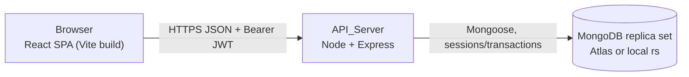
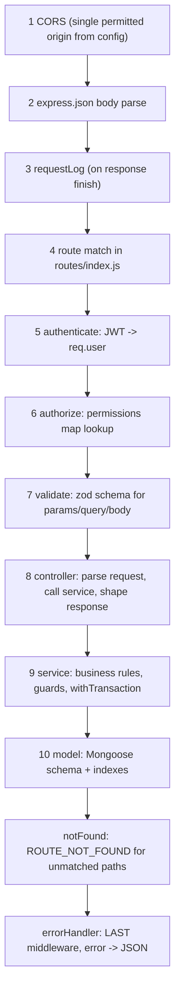
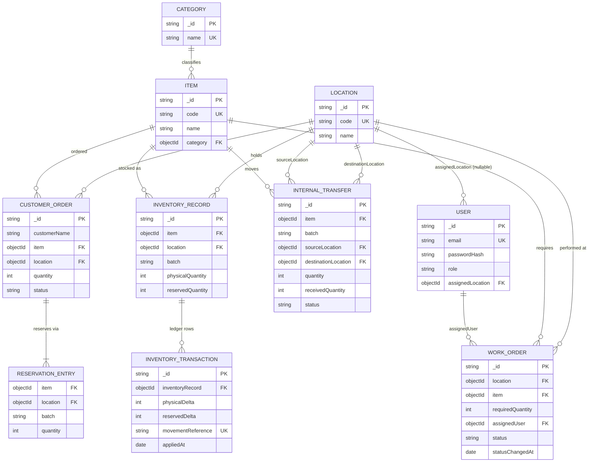

# Design Document

## Overview

Mini Operations ERP is a two-process application: an Express REST API (`backend/`) on Node.js talking to MongoDB through Mongoose, and a React single-page app (`frontend/`) built with Vite. Both are plain JavaScript, no TypeScript.

The design follows one rule above all others: every file must be explainable in an interview. That means conventional Express layering (routes → controllers → services → models, plus middleware), no dependency-injection container, no repository layer wrapping Mongoose, no CQRS, no event bus, no GraphQL. Where the requirements demand something non-obvious (multi-document transactions, conditional reservation updates, movement-reference idempotency), the design states the rule in one place and gives it a name, so a live change request touches one function.

Three decisions carry the correctness of the whole system, and everything else follows from them:

1. **Available quantity is derived, never stored.** `physicalQuantity - reservedQuantity` is computed by exactly one exported function, and the same module owns the one MongoDB expression that encodes the same rule for conditional updates. Adding a `damagedQuantity` later means editing that one file and the schema. (Req 3.3, 15.1)
2. **Every stock movement is a transaction that writes the balance and the ledger row together.** One helper, `withTransaction`, owns session lifecycle, commit, abort, `finally`-block cleanup, and transient-error retry. Services never touch `startSession` directly. (Req 8.1–8.5)
3. **Concurrency safety comes from the database's match result, not from a prior read.** Reservations and dispatches use `updateOne` whose *filter* carries the availability condition. If the filter matches nothing, the movement failed — there is no read-then-write window to lose. (Req 7.4–7.7)

MongoDB substitutes for the relational database in the original brief. To keep the brief's intent, shared entities are referenced by `ObjectId` rather than embedded (Req 3.2), the application enforces referential integrity explicitly (`INVALID_REFERENCE`), and multi-step movements run inside multi-document transactions. Transactions require a replica set, so the deployment target is MongoDB Atlas or a local single-node replica set, and the test suite starts its own in-process replica set via `mongodb-memory-server` so `npm test` needs no external service.

### Research notes that shaped the design

- **Transactions need a replica set.** MongoDB multi-document transactions are unavailable on a standalone `mongod`; a single-node replica set is enough and is what `mongodb-memory-server` can start with `replSet: { count: 1 }`. This is why the README carries an `rs.initiate()` step for local runs. ([MongoDB transactions](https://www.mongodb.com/docs/manual/core/transactions/), [mongodb-memory-server replica set](https://typegoose.github.io/mongodb-memory-server/docs/guides/quick-start-guide/))
- **Transient transaction errors are expected, not exceptional.** MongoDB labels retryable failures with `TransientTransactionError` (write conflict between overlapping transactions) and `UnknownTransactionCommitResult` (commit outcome unknown). The documented pattern is to re-run the whole transaction callback from its first read. That maps directly onto Req 8.5's "at most 3 retries". ([error labels](https://www.mongodb.com/docs/manual/core/transactions-in-applications/))
- **Conditional updates can express a cross-field comparison.** `$expr` inside a query filter allows `reservedQuantity + n <= physicalQuantity` to be evaluated server-side as part of the atomic update, which is what makes Req 7.4 implementable without a stored available field. ([`$expr`](https://www.mongodb.com/docs/manual/reference/operator/query/expr/))
- **Unique indexes give idempotency for free.** A unique index on `movementReference` turns a replayed business action into a duplicate-key error at commit time, which the service maps to `DUPLICATE_INVENTORY_TRANSACTION` / `TRANSFER_ALREADY_RECEIVED`. No separate idempotency table is needed. (Req 4.5, 4.6, 6.9, 6.12, 6.16)

---

## Architecture

### Process and deployment view



The two processes share nothing but the HTTP contract. The frontend reads its API base URL from a build-time variable (`VITE_API_BASE_URL`) with no hard-coded fallback (Req 10.8, 10.11). The backend reads four required environment variables at startup and refuses to start if any is missing (Req 10.1–10.3).

### Backend folder structure

```
backend/
  src/
    config/
      index.js            # Config_Loader: the only module that reads process.env
    db/
      connect.js          # mongoose.connect + replica-set sanity log
      withTransaction.js  # session lifecycle + retry wrapper
    models/
      User.js
      Category.js
      Item.js
      Location.js
      InventoryRecord.js
      InventoryTransaction.js
      WorkOrder.js
      InternalTransfer.js
      CustomerOrder.js
    middleware/
      authenticate.js     # JWT verify -> req.user = { id, role }
      authorize.js        # route-to-role map lookup (deny-by-default for writes)
      validate.js         # zod schema runner for body/params/query
      requestLog.js       # one line per finished response
      errorHandler.js     # centralized error -> JSON
      notFound.js         # ROUTE_NOT_FOUND
    permissions.js        # THE single route-to-role map
    errors/
      AppError.js
      errorCodes.js       # code -> httpStatus table
    services/
      availability.js     # availableQuantity() + availabilityExpr()  <-- single source of truth
      auth.service.js
      inventory.service.js
      workOrder.service.js
      transfer.service.js
      order.service.js
      movementReference.js # movement reference string builders
    controllers/
      auth.controller.js
      inventory.controller.js
      workOrder.controller.js
      transfer.controller.js
      order.controller.js
      reference.controller.js   # items, locations, users for form dropdowns
    routes/
      index.js            # mounts all routers under /api
      auth.routes.js
      inventory.routes.js
      workOrder.routes.js
      transfer.routes.js
      order.routes.js
      reference.routes.js
    validation/
      auth.schemas.js
      inventory.schemas.js
      workOrder.schemas.js
      transfer.schemas.js
      order.schemas.js
      common.js           # objectId, validQuantity, batch, pagination
    app.js                # express app: middleware order, routers, error handler
    server.js             # config -> connect -> listen -> SIGINT/SIGTERM shutdown
  scripts/
    seed.js               # non-interactive seed (Req 13.5)
  tests/
    setup/                # memory replica set, per-test reset, seed fixture, http agent
    *.test.js
  package.json
  .env.example
```

`app.js` exports the Express app without listening, so Supertest can drive it in-process (Req 12.13). `server.js` owns the process concerns.

### Frontend folder structure

```
frontend/
  src/
    api/client.js         # fetch wrapper: base URL, JWT header, global 401 handling
    auth/AuthContext.jsx  # { token, user, login, logout }
    components/
      Nav.jsx
      DataTable.jsx
      ErrorBanner.jsx
      EmptyState.jsx
      RequireAuth.jsx
    screens/
      LoginScreen.jsx
      InventoryScreen.jsx
      WorkOrdersScreen.jsx
      TransfersScreen.jsx
      CustomerOrdersScreen.jsx
    App.jsx               # routes for exactly five screens
    main.jsx
  index.html
  vite.config.js
  .env.example
```

Flat by design: five screens, a handful of shared components, one context, one API client. No state-management library — `useState`/`useEffect` plus refetch-after-write is enough for five list screens and is easy to defend.

### Request pipeline

Middleware order is fixed and is the thing to point at when asked "where does a request go?". Cheap and security-relevant checks run before anything touches the database.



Responsibilities per layer, stated once:

| Layer | Does | Never does |
|---|---|---|
| Route | declares path, attaches middleware in order | business logic |
| Controller | reads `req.validated` and `req.user`, calls one service function, sends response | quantity comparisons, status comparisons, direct model access |
| Service | owns guards, transactions, ledger writes, movement references | HTTP concerns (`req`/`res`) |
| Model | schema, types, enums, indexes, immutability guards | cross-document orchestration |

Req 15.5 is enforced by that table: every quantity comparison and every status transition lives in a named exported service function (`assertSufficientAvailable`, `assertTransferTransition`, `nextWorkOrderStatus`), so a live "change this business rule" request edits one function.

`authenticate` is mounted on the API router for everything except `POST /api/auth/login`, so an unauthenticated request is rejected with 401 before any role evaluation happens (Req 1.8, 2.1).

---

## Components and Interfaces

### 1. Availability: the single source of truth

`services/availability.js` is the only module that knows the availability formula. It exports the JS function every read path and guard calls, and the MongoDB expression every conditional update embeds. Both come from the same file so a new deducted component (for example `damagedQuantity`) is a two-line edit here plus one schema field (Req 15.1).

```js
// backend/src/services/availability.js

/** The one and only definition of Available_Quantity. Req 3.3, 15.1 */
function availableQuantity(record) {
  return record.physicalQuantity - record.reservedQuantity;
}

/** Sum of availableQuantity over records for one item at one location. Req 3.5, 3.12 */
function locationAvailableQuantity(records) {
  return records.reduce((total, record) => total + availableQuantity(record), 0);
}

/**
 * The same rule expressed for a query filter, so a conditional update can
 * decide availability server-side. Req 7.4
 * "this record has at least `quantity` available"
 */
function hasAvailableAtLeastExpr(quantity) {
  return {
    $expr: {
      $gte: [{ $subtract: ['$physicalQuantity', '$reservedQuantity'] }, quantity],
    },
  };
}

module.exports = { availableQuantity, locationAvailableQuantity, hasAvailableAtLeastExpr };
```

Every other module imports from here. No controller, no other service, and no aggregation pipeline subtracts `reservedQuantity` from `physicalQuantity`. Location availability is computed by loading the (few) matching records and reducing with `availableQuantity`, deliberately instead of a `$group` pipeline that would restate the formula in a second place.

### 2. Transaction helper

One wrapper owns session lifecycle and retry. Services pass a callback that receives the session and does all its reads and writes with it.

```js
// backend/src/db/withTransaction.js
const mongoose = require('mongoose');
const AppError = require('../errors/AppError');

const MAX_RETRIES = 3; // 3 retries => at most 4 attempts. Req 8.5

function isTransient(error) {
  return Boolean(
    error &&
      typeof error.hasErrorLabel === 'function' &&
      (error.hasErrorLabel('TransientTransactionError') ||
        error.hasErrorLabel('UnknownTransactionCommitResult'))
  );
}

/**
 * Runs `work(session)` inside one MongoDB transaction.
 * Commits on success, aborts on any error, always ends the session,
 * retries transient transaction errors up to 3 times. Req 8.1-8.5
 */
async function withTransaction(work) {
  let lastError;

  for (let attempt = 0; attempt <= MAX_RETRIES; attempt += 1) {
    const session = await mongoose.startSession();
    try {
      session.startTransaction();
      const result = await work(session);
      await session.commitTransaction();
      return result;
    } catch (error) {
      await session.abortTransaction().catch(() => {});
      lastError = error;
      if (!isTransient(error)) throw error;
    } finally {
      await session.endSession(); // runs on every exit path. Req 8.3
    }
  }

  throw new AppError(409, 'CONCURRENT_MODIFICATION', 'Concurrent modification, please retry.', {
    cause: lastError,
  });
}

module.exports = { withTransaction, MAX_RETRIES };
```

Notes worth defending:

- Each attempt gets a fresh session, so a retry genuinely re-executes the callback **from its first read** (Req 8.5). Nothing is carried over from the failed attempt.
- `abortTransaction()` errors are swallowed because the transaction is already doomed; the original error is what the caller needs. The session is still ended in `finally`.
- Non-transient errors (including our own `AppError` guards and duplicate-key errors) propagate immediately after abort — no pointless retries (Req 8.2).
- `session.endSession()` in `finally` is what makes open-session count return to its pre-request value (Req 8.3).

Typical service usage:

```js
// backend/src/services/transfer.service.js (dispatch, abbreviated)
async function dispatchTransfer(transferId) {
  return withTransaction(async (session) => {
    const transfer = await InternalTransfer.findById(transferId).session(session);
    if (!transfer) throw new AppError(404, 'NOT_FOUND', 'Transfer not found.');
    assertTransferTransition(transfer.status, 'Dispatched'); // named guard, Req 15.5

    const movementReference = transferMovementReference(transfer._id, 'DISPATCH');
    await applyMovement(
      { item: transfer.item, location: transfer.sourceLocation, batch: transfer.batch },
      { physicalDelta: -transfer.quantity, reservedDelta: 0, movementReference },
      session
    );

    transfer.status = 'Dispatched';
    transfer.dispatchedAt = new Date();
    await transfer.save({ session });
    return transfer;
  });
}
```

`applyMovement` in `inventory.service.js` is the single place that writes an `InventoryRecord` change together with its `InventoryTransaction` row, always with the caller's session (Req 4.4, 8.1).

### 3. Movement reference scheme

A movement reference names the business action that caused a ledger row. It is composed from the action type, the originating document id, the lifecycle step, and — where one action touches several records — the affected record id. The `unique` index on `InventoryTransaction.movementReference` then makes replays fail at the database (Req 4.5, 4.6).

```js
// backend/src/services/movementReference.js
const openingMovementReference   = (recordId)           => `INVENTORY:${recordId}:OPENING`;
const adjustMovementReference    = (recordId, clientRef)=> `ADJUST:${recordId}:${clientRef}`;
const transferMovementReference  = (transferId, step)   => `TRANSFER:${transferId}:${step}`;   // DISPATCH | RECEIPT
const reserveMovementReference   = (orderId, recordId)  => `ORDER:${orderId}:RESERVE:${recordId}`;
```

| Action | Movement reference | Uniqueness gives |
|---|---|---|
| Inventory record created | `INVENTORY:<recordId>:OPENING` | exactly one opening row per record (Req 4.9) |
| Inventory adjustment | `ADJUST:<recordId>:<clientMovementReference>` | replay of the same client reference on the same record is rejected (Req 4.6) |
| Transfer dispatch | `TRANSFER:<transferId>:DISPATCH` | a transfer can dispatch once |
| Transfer receipt | `TRANSFER:<transferId>:RECEIPT` | a transfer can be received once, even under concurrent receipts (Req 6.9, 6.12, 6.16) |
| Order reservation | `ORDER:<orderId>:RESERVE:<recordId>` | one row per batch consumed, replay-safe per record (Req 7.1) |

Two details that make this work:

- Ids are generated in application code **before** the insert (`new mongoose.Types.ObjectId()`), so the opening ledger row and the record it describes can be written in the same transaction with a known id.
- The duplicate-key error may surface either on insert or at commit. Both paths are caught in one place: `applyMovement` inspects `error.code === 11000` and rethrows `DUPLICATE_INVENTORY_TRANSACTION` (409); the transfer receipt path maps that same signal to `TRANSFER_ALREADY_RECEIVED` (409) because that is the business meaning there (Req 6.9, 6.16).

### 4. Reservation algorithm (concurrency-safe by construction)

Customer order creation reserves across batches in **ascending batch order**, consuming each record's full availability before moving on (Req 7.1). The critical part is that each increment is a conditional update whose filter carries the availability condition.

```js
// backend/src/services/order.service.js (core loop, abbreviated)
async function reserveAcrossBatches({ item, location, quantity, orderId }, session) {
  const records = await InventoryRecord.find({ item, location })
    .sort({ batch: 1 })            // ascending batch order. Req 7.1
    .session(session);

  let remaining = quantity;
  const entries = [];

  for (const record of records) {
    if (remaining === 0) break;
    const take = Math.min(remaining, availableQuantity(record)); // single source of truth
    if (take <= 0) continue;

    // The availability condition lives in the FILTER, evaluated by MongoDB
    // at update time, not in a JS comparison against a stale read. Req 7.4
    const result = await InventoryRecord.updateOne(
      {
        _id: record._id,
        ...hasAvailableAtLeastExpr(take),
      },
      { $inc: { reservedQuantity: take } },
      { session }
    );

    if (result.matchedCount !== 1) {
      // Availability disappeared between the read and the update.
      // The match result is the decision. Req 7.4
      throw new AppError(409, 'INSUFFICIENT_AVAILABLE_QUANTITY',
        'Not enough available quantity to reserve.');
    }

    await InventoryTransaction.create([{
      inventoryRecord: record._id,
      physicalDelta: 0,
      reservedDelta: take,
      movementReference: reserveMovementReference(orderId, record._id),
      appliedAt: new Date(),
    }], { session });

    entries.push({ item, location, batch: record.batch, quantity: take });
    remaining -= take;
  }

  if (remaining > 0) {
    throw new AppError(409, 'INSUFFICIENT_AVAILABLE_QUANTITY',
      'Not enough available quantity at this location.');
  }
  return entries; // Reservation_Entry list, sums to `quantity`. Req 15.3, 15.6
}
```

The filter/update shape, isolated:

```js
filter = { _id: <recordId>,
           $expr: { $gte: [ { $subtract: ['$physicalQuantity', '$reservedQuantity'] }, take ] } }
update = { $inc: { reservedQuantity: take } }
guard  = result.matchedCount === 1   // else the reservation failed
```

**Why this defeats the two-concurrent-reservations race.** Take availability 100, request A reserving 80, request B reserving 50, both in flight.

A naive read-then-write implementation reads 100 in both requests, both conclude "enough", both `$inc`, and reserved lands at 130 > physical — an oversell.

Here, the decision is never made from the read. The read only picks candidate batches and a `take` size; the *authorization* to reserve is `matchedCount === 1` on a filter MongoDB evaluates against the current document. Two things then guarantee at most one commit:

1. **Write conflict.** Both transactions try to update the same `InventoryRecord`. MongoDB lets one proceed and fails the other with a `TransientTransactionError` write conflict. That transaction aborts; nothing it wrote persists.
2. **Re-evaluation on retry.** `withTransaction` re-runs the loser's callback from its first read. Now it reads reserved = 80, computes `take = 20 < 50`, and either the `$expr` filter fails to match or `remaining > 0` at the end. Either way it throws `INSUFFICIENT_AVAILABLE_QUANTITY` (Req 7.5, 7.6).

So the outcome is: exactly one 201, one 409, total reserved increased by exactly the committed quantity (Req 7.7). Because the guard is a per-document condition rather than a global lock, the order in which the two requests are attempted does not change the final total for the committing subset (Req 7.8). Dispatch uses the identical pattern with `{ $inc: { physicalQuantity: -quantity } }` and the same availability filter, which is also what keeps `reservedQuantity <= physicalQuantity` after an outbound movement (Req 3.8, 6.4, 6.5).

### 5. Authentication and authorization

**Password storage.** `bcrypt` with cost factor 10 (within the required 10–12 band, Req 1.5). Hashing happens in a `pre('save')` hook on `User` when `password` is set, and only `passwordHash` is persisted. `passwordHash` is declared `select: false`, so it cannot leak into a list response by accident (Req 1.1).

**Token.** `jsonwebtoken.sign({ sub, role }, config.jwtSecret, { expiresIn: '8h' })` — user id and role as claims, expiry exactly 8 hours after issuance (Req 1.6).

**`authenticate` middleware.** Reads `Authorization: Bearer <token>`; missing, malformed, badly signed, or expired all produce the same `401 UNAUTHENTICATED` (Req 1.8, 1.9). On success it sets `req.user = { id: payload.sub, role: payload.role }` and nothing else (Req 1.7). Login failures use a distinct `401 INVALID_CREDENTIALS` with an identical message for unknown email and wrong password, so email existence cannot be probed (Req 1.2–1.4, 1.10).

**`authorize` middleware and the one permission map.** Exactly one map covers every write route, including the work-order status change route, so no write route relies on deny-by-default at run time (Req 2.8, 2.14).

```js
// backend/src/permissions.js
const ROLES = ['Admin', 'OperationsUser', 'SalesUser'];

// key = "<METHOD> <mounted path>"; value = every role permitted to reach it.
// Adding a write route or a role means editing this map only. Req 2.8
const WRITE_ROUTE_PERMISSIONS = {
  'POST /api/inventory':                    ['Admin', 'OperationsUser'],
  'POST /api/inventory/:id/adjust':         ['Admin', 'OperationsUser'],
  'POST /api/work-orders':                  ['Admin'],
  'PATCH /api/work-orders/:id/status':      ['Admin', 'OperationsUser'],
  'POST /api/transfers':                    ['Admin', 'OperationsUser'],
  'POST /api/transfers/:id/dispatch':       ['Admin', 'OperationsUser'],
  'POST /api/transfers/:id/receive':        ['Admin', 'OperationsUser'],
  'POST /api/orders':                       ['Admin', 'SalesUser'],
};

module.exports = { ROLES, WRITE_ROUTE_PERMISSIONS };
```

```js
// backend/src/middleware/authorize.js
const { ROLES, WRITE_ROUTE_PERMISSIONS } = require('../permissions');
const AppError = require('../errors/AppError');

const WRITE_METHODS = new Set(['POST', 'PATCH', 'PUT', 'DELETE']);
const forbidden = () =>
  new AppError(403, 'FORBIDDEN', 'Your role is not permitted for this operation.');

function authorize(req, res, next) {
  const role = req.user && req.user.role;
  if (!ROLES.includes(role)) return next(forbidden());        // Req 2.12

  if (!WRITE_METHODS.has(req.method)) return next();          // reads: any valid role. Req 2.13

  const key = `${req.method} ${req.baseUrl}${req.route.path}`;
  const permitted = WRITE_ROUTE_PERMISSIONS[key];
  if (!permitted) return next(forbidden());                   // deny by default. Req 2.11
  if (!permitted.includes(role)) return next(forbidden());     // Req 2.3, 2.5, 2.7

  return next();                                              // Req 2.2, 2.4, 2.6
}
```

`authorize` is attached per route (`router.post('/', authorize, validate(schema), controller)`) so `req.route.path` is populated and the map key is exact. Because it runs after `authenticate`, a request with no valid token never reaches role evaluation (Req 2.1). `WRITE_ROUTE_PERMISSIONS` is also exported to the test suite, which asserts that every write route the app declares has an entry — that is what keeps criterion 2.14 true as routes are added.

**Frontend mirroring.** The same role sets are imported into the frontend as a small constant object and used for role-gated rendering (Req 2.9, 2.10, 11.7, 11.9, 11.11). The backend check is the real one; the frontend gate is only to avoid showing controls that would 403.

**Assigned location.** `User.assignedLocation` is stored as `ObjectId | null` (Req 15.4). Nothing filters on it yet; the extensibility note records that restricting a user to their location is one location comparison added inside `authorize` next to the map lookup.

### 6. Validation

**Library: zod.** Chosen over Joi and express-validator for three concrete reasons: `.strict()` rejects unknown body fields with a per-field issue, which is exactly Req 9.2; `z.coerce` plus `.trim()` give the type coercion and whitespace trimming of Req 9.3 declaratively; and `error.issues` is already a list of `{ path, message }`, which maps one-to-one onto the `details` array Req 9.4 demands without custom formatting. It is also plain JavaScript-friendly — no TypeScript needed to get value from it.

One middleware runs the schemas:

```js
// backend/src/middleware/validate.js
function validate({ params, query, body }) {
  return (req, res, next) => {
    const result = {};
    for (const [part, schema] of Object.entries({ params, query, body })) {
      if (!schema) continue;
      const parsed = schema.safeParse(req[part]);
      if (!parsed.success) return next(validationError(part, parsed.error));
      result[part] = parsed.data;
    }
    req.validated = result;  // controllers read ONLY this. Req 9.3
    next();
  };
}
```

Shared building blocks keep the rules in one place:

```js
// backend/src/validation/common.js
const objectId = z.string().regex(/^[a-f0-9]{24}$/i, 'must be a 24-character hex id');   // Req 9.10
const validQuantity = z.coerce.number().int().min(1).max(1_000_000);                     // Valid_Quantity
const batch = z.string().trim().min(1).max(32);                                          // Req 3.1, 3.6
const customerName = z.string().trim().min(1).max(120);                                  // Req 7.11
```

Rules that follow from these:

- Every body schema ends in `.strict()`, so undeclared fields are rejected before the handler (Req 9.2).
- A failed `objectId` on a path parameter is reported as `INVALID_IDENTIFIER` (400); every other schema failure is `VALIDATION_ERROR` (400) with one entry per rejected field (Req 9.4, 9.10).
- A failure on a quantity field is reported as `INVALID_QUANTITY` (400) — the `validate` middleware checks whether every issue path names a quantity field and picks the code accordingly, so Req 4.1, 5.2, 6.13, 7.9 get their specific code while mixed failures fall back to `VALIDATION_ERROR`.
- Controllers read `req.validated.body/params/query` only, never raw `req.body`. That is the habit that keeps unvalidated input out of services.

### 7. Configuration

```js
// backend/src/config/index.js  -- the only module that touches process.env (Req 10.4)
require('dotenv').config();

const REQUIRED = ['MONGODB_URI', 'JWT_SECRET', 'PORT', 'CORS_ORIGIN']; // exactly four. Req 10.1

function loadConfig() {
  const missing = REQUIRED.filter((name) => !process.env[name] || !process.env[name].trim());
  if (missing.length) {
    console.error(`Missing required environment variables: ${missing.join(', ')}`); // one message
    process.exit(1);                                                                // Req 10.2
  }

  const port = Number(process.env.PORT);
  if (!Number.isInteger(port) || port < 1 || port > 65535) {
    console.error('PORT must be a decimal integer between 1 and 65535');
    process.exit(1);                                                                // Req 10.9
  }
  if (process.env.JWT_SECRET.length < 32) {
    console.error('JWT_SECRET must be at least 32 characters');
    process.exit(1);                                                                // Req 10.10
  }

  return {
    mongoUri: process.env.MONGODB_URI,
    jwtSecret: process.env.JWT_SECRET,
    port,
    corsOrigin: process.env.CORS_ORIGIN,
  };
}

module.exports = loadConfig();   // evaluated before connect() and before listen()
```

| Variable | Required | Purpose | Permitted values | Example (not a credential) |
|---|---|---|---|---|
| `MONGODB_URI` | yes | replica-set connection string | valid MongoDB URI | `mongodb://localhost:27017/mini_erp?replicaSet=rs0` |
| `JWT_SECRET` | yes | token signing secret | ≥ 32 characters | `replace-with-32-plus-random-chars!!` |
| `PORT` | yes | API listen port | integer 1–65535 | `4000` |
| `CORS_ORIGIN` | yes | permitted Web_Client origin | absolute origin | `http://localhost:5173` |
| `VITE_API_BASE_URL` | yes (frontend build) | API base URL for the SPA | absolute URL | `http://localhost:4000` |
| `SEED_ADMIN_PASSWORD`, `SEED_OPS_PASSWORD`, `SEED_SALES_PASSWORD` | yes (seed script only) | seeded user passwords | non-empty, ≤ 72 chars | `set-your-own-value` |

No defaults are applied to required variables, and no decision depends on host name or file path (Req 10.3, 10.5). The seed script validates its own three variables and exits non-zero if absent, keeping the API's required set at exactly four. `vite.config.js` fails the build when `VITE_API_BASE_URL` is missing (Req 10.11).

**Graceful shutdown** lives in `server.js`: on `SIGINT`/`SIGTERM` it stops accepting connections, closes the Mongoose connection (which ends open sessions and aborts their in-progress transactions), and exits 0; a 10-second timer forces `process.exit(1)` if that has not completed (Req 8.4).

### 8. API surface

All routes are mounted under `/api`. Every route except login requires a valid JWT. "Any role" means any of the three valid roles (Req 2.13).

| Method | Path | Roles | Request | Success | Error codes |
|---|---|---|---|---|---|
| POST | `/api/auth/login` | public | `{ email, password }` | 200 `{ token, user: { id, email, role, assignedLocation } }` | `VALIDATION_ERROR` 400, `INVALID_CREDENTIALS` 401 |
| GET | `/api/items` | any role | `?` none | 200 `[{ id, code, name, category: { id, name } }]` | `UNAUTHENTICATED` 401 |
| GET | `/api/locations` | any role | none | 200 `[{ id, code, name }]` | `UNAUTHENTICATED` 401 |
| GET | `/api/users` | any role | none | 200 `[{ id, email, role }]` | `UNAUTHENTICATED` 401 |
| GET | `/api/inventory` | any role | `?item&location` | 200 `[{ id, item, category, location, batch, physicalQuantity, reservedQuantity, availableQuantity }]` | `INVALID_IDENTIFIER` 400 |
| GET | `/api/inventory/availability` | any role | `?item&location` (both required) | 200 `{ item, location, locationAvailableQuantity }` (0 when no records) | `VALIDATION_ERROR` 400, `INVALID_IDENTIFIER` 400 |
| POST | `/api/inventory` | Admin, OperationsUser | `{ item, location, batch, physicalQuantity, movementReference }` | 201 `{ id, ..., availableQuantity }` | `VALIDATION_ERROR` / `INVALID_QUANTITY` / `INVALID_REFERENCE` 400, `FORBIDDEN` 403, `DUPLICATE_INVENTORY_RECORD` / `DUPLICATE_INVENTORY_TRANSACTION` 409 |
| POST | `/api/inventory/:id/adjust` | Admin, OperationsUser | `{ direction: "IN"\|"OUT", quantity, movementReference }` | 200 `{ id, physicalQuantity, reservedQuantity, availableQuantity }` | `VALIDATION_ERROR` / `INVALID_QUANTITY` / `INVALID_IDENTIFIER` 400, `FORBIDDEN` 403, `NOT_FOUND` 404, `INSUFFICIENT_PHYSICAL_QUANTITY` / `INSUFFICIENT_AVAILABLE_QUANTITY` / `DUPLICATE_INVENTORY_TRANSACTION` / `CONCURRENT_MODIFICATION` 409 |
| GET | `/api/work-orders` | any role | `?status&location` | 200 `[{ id, location, item, requiredQuantity, assignedUser, status, statusChangedAt, locationAvailableQuantity, shortageQuantity }]` | `UNAUTHENTICATED` 401 |
| GET | `/api/work-orders/:id` | any role | none | 200 single object as above | `INVALID_IDENTIFIER` 400, `NOT_FOUND` 404 |
| POST | `/api/work-orders` | Admin | `{ location, item, requiredQuantity, assignedUser }` | 201 `{ id, status: "Assigned", createdAt, shortageQuantity }` | `VALIDATION_ERROR` / `INVALID_QUANTITY` / `INVALID_REFERENCE` 400, `FORBIDDEN` 403 |
| PATCH | `/api/work-orders/:id/status` | Admin, OperationsUser | `{ status: "InProgress"\|"Completed"\|"Assigned" }` | 200 `{ id, status, statusChangedAt }` | `VALIDATION_ERROR` / `INVALID_IDENTIFIER` 400, `FORBIDDEN` 403, `NOT_FOUND` 404, `INVALID_STATUS_TRANSITION` 409 |
| GET | `/api/transfers` | any role | `?status` | 200 `[{ id, item, batch, sourceLocation, destinationLocation, quantity, receivedQuantity, status, createdAt, dispatchedAt, receivedAt }]` | `UNAUTHENTICATED` 401 |
| POST | `/api/transfers` | Admin, OperationsUser | `{ item, batch, sourceLocation, destinationLocation, quantity }` | 201 `{ id, status: "Requested", receivedQuantity: 0, createdAt }` | `VALIDATION_ERROR` / `INVALID_QUANTITY` / `INVALID_REFERENCE` / `SAME_LOCATION_TRANSFER` 400, `FORBIDDEN` 403 |
| POST | `/api/transfers/:id/dispatch` | Admin, OperationsUser | `{}` | 200 `{ id, status: "Dispatched", dispatchedAt }` | `INVALID_IDENTIFIER` 400, `FORBIDDEN` 403, `NOT_FOUND` 404, `INSUFFICIENT_AVAILABLE_QUANTITY` / `INVALID_STATUS_TRANSITION` / `DUPLICATE_INVENTORY_TRANSACTION` / `CONCURRENT_MODIFICATION` 409 |
| POST | `/api/transfers/:id/receive` | Admin, OperationsUser | `{}` | 200 `{ id, status: "Received", receivedQuantity, receivedAt }` | `INVALID_IDENTIFIER` 400, `FORBIDDEN` 403, `NOT_FOUND` 404, `TRANSFER_ALREADY_RECEIVED` / `INVALID_STATUS_TRANSITION` / `CONCURRENT_MODIFICATION` 409 |
| GET | `/api/orders` | any role | `?status` | 200 `[{ id, customerName, item, location, quantity, status, reservations: [{ item, location, batch, quantity }], createdAt }]` | `UNAUTHENTICATED` 401 |
| GET | `/api/orders/:id` | any role | none | 200 single object as above | `INVALID_IDENTIFIER` 400, `NOT_FOUND` 404 |
| POST | `/api/orders` | Admin, SalesUser | `{ customerName, item, location, quantity }` | 201 `{ id, status: "Reserved", quantity, reservations: [...] }` | `VALIDATION_ERROR` / `INVALID_QUANTITY` / `INVALID_REFERENCE` 400, `FORBIDDEN` 403, `INSUFFICIENT_AVAILABLE_QUANTITY` / `CONCURRENT_MODIFICATION` 409 |
| any | unmatched path | — | — | — | `ROUTE_NOT_FOUND` 404 (Req 9.12) |

Any request with a JSON content type and an unparseable body returns `MALFORMED_JSON` 400 from the error handler (Req 9.11). Any uncaught failure returns `INTERNAL_ERROR` 500 with no database text, path, or module name (Req 9.6, 9.7).

Note on `POST /api/inventory` and `/adjust`: both take `movementReference` from the client because Req 4.8 requires it, and it is what makes a retried inventory write idempotent from the caller's side.

### 9. Frontend design

**Routing** — exactly five screens, no sixth (Req 11.1):

```jsx
// App.jsx
<Routes>
  <Route path="/login" element={<LoginScreen />} />
  <Route element={<RequireAuth />}>
    <Route path="/inventory" element={<InventoryScreen />} />
    <Route path="/work-orders" element={<WorkOrdersScreen />} />
    <Route path="/transfers" element={<TransfersScreen />} />
    <Route path="/orders" element={<CustomerOrdersScreen />} />
  </Route>
  <Route path="*" element={<Navigate to="/inventory" replace />} />
</Routes>
```

`RequireAuth` renders the Login screen when there is no token and issues no API request for the guarded screen (Req 11.17).

**Auth context** — small on purpose:

```jsx
// auth/AuthContext.jsx
const AuthContext = createContext(null);
// state: { token, user }  persisted in localStorage under one key
// login(email, password): POST /api/auth/login -> store token + user -> navigate('/inventory')  (Req 11.2)
// logout(reason): clear storage and state -> navigate('/login', { state: { reason } })
```

**API client** — one module, so the JWT header and the global 401 rule exist in one place:

```js
// api/client.js
const BASE = import.meta.env.VITE_API_BASE_URL;   // no hard-coded fallback. Req 10.8

export async function request(path, { method = 'GET', body } = {}) {
  const token = readToken();
  const response = await fetch(`${BASE}${path}`, {
    method,
    headers: {
      'Content-Type': 'application/json',
      ...(token ? { Authorization: `Bearer ${token}` } : {}),   // Req 11.3
    },
    body: body ? JSON.stringify(body) : undefined,
  });

  if (response.status === 401) {
    onUnauthorized();            // clears token + role, redirects to Login with session-ended message
    throw new ApiError('UNAUTHENTICATED', 'Your session has ended. Please sign in again.'); // Req 11.4
  }

  const payload = await response.json().catch(() => ({}));
  if (!response.ok) throw new ApiError(payload.code, payload.message);  // Req 11.12
  return payload;
}
```

**Screen pattern**, identical on all four data screens so there is one thing to learn:

1. `useEffect` on mount → `request(listPath)` → rows in local state.
2. Zero rows → `<EmptyState />` message, no data rows (Req 11.15).
3. Any non-401 error → `<ErrorBanner message={error.message} />` while leaving displayed values untouched (Req 11.12).
4. A write control sets `busy` true, disables itself, and re-enables on response (Req 11.13).
5. On write success → refetch the list and render the refetched values (Req 11.14).

**Role gating** — `canWrite('POST /api/work-orders', role)` against the mirrored permission constant decides whether a form or action button renders: the work-order creation form only for `Admin` (Req 11.7); dispatch controls on `Requested` rows and receipt controls on `Dispatched` rows only for `OperationsUser`/`Admin`, never on `Received` rows (Req 11.9); the customer-order form only on the Customer Orders screen (Req 11.11). Before login, only the Login form renders (Req 2.10).

Columns rendered per screen are exactly those named in Req 11.5, 11.6, 11.8, and 11.10, with `availableQuantity` taken from the API response rather than recomputed in the browser.

---

## Data Models

### Entity relationships



`RESERVATION_ENTRY` is the only embedded shape in the model. It is embedded because an entry has no identity or lifecycle outside its order, and because releasing a cancelled order needs exactly the batch-level breakdown stored with the order (Req 15.3). Every other relationship is an `ObjectId` reference, never a duplicated copy (Req 3.2).

### Shared schema helpers

```js
// backend/src/models/fields.js
const nonNegativeCount = {
  type: Number,
  required: true,
  default: 0,
  min: 0,
  max: 999_999_999,                                  // Req 3.1
  validate: { validator: Number.isInteger, message: '{PATH} must be an integer' },
};

const validQuantity = {
  type: Number,
  required: true,
  min: 1,
  max: 1_000_000,                                    // Valid_Quantity
  validate: { validator: Number.isInteger, message: '{PATH} must be an integer' },
};
```

### User

```js
const userSchema = new mongoose.Schema({
  email:      { type: String, required: true, unique: true, lowercase: true, trim: true, maxlength: 254 },
  passwordHash: { type: String, required: true, select: false },        // Req 1.1, 1.5
  role:       { type: String, required: true, enum: ['Admin', 'OperationsUser', 'SalesUser'] },
  assignedLocation: { type: mongoose.Schema.Types.ObjectId, ref: 'Location', default: null }, // Req 15.4
}, { timestamps: true });
// index: { email: 1 } unique  (from `unique: true`)
```

Plaintext passwords are never assigned to a schema path; the service hashes with bcrypt cost 10 and sets `passwordHash` only.

### Category, Item, Location

```js
const categorySchema = new mongoose.Schema({
  name: { type: String, required: true, unique: true, trim: true, minlength: 1, maxlength: 64 },
}, { timestamps: true });

const itemSchema = new mongoose.Schema({
  code:     { type: String, required: true, unique: true, trim: true, minlength: 1, maxlength: 32 },
  name:     { type: String, required: true, trim: true, minlength: 1, maxlength: 120 },
  category: { type: mongoose.Schema.Types.ObjectId, ref: 'Category', required: true },  // Req 3.2
}, { timestamps: true });

const locationSchema = new mongoose.Schema({
  code: { type: String, required: true, unique: true, trim: true, minlength: 1, maxlength: 32 },
  name: { type: String, required: true, trim: true, minlength: 1, maxlength: 120 },
}, { timestamps: true });
```

Indexes: `Category.name` unique, `Item.code` unique, `Item.category` (non-unique, for category lookups), `Location.code` unique.

### InventoryRecord

```js
const inventoryRecordSchema = new mongoose.Schema({
  item:     { type: mongoose.Schema.Types.ObjectId, ref: 'Item',     required: true },
  location: { type: mongoose.Schema.Types.ObjectId, ref: 'Location', required: true },
  batch:    { type: String, required: true, trim: true, minlength: 1, maxlength: 32 },  // Req 3.1, 3.6
  physicalQuantity: nonNegativeCount,
  reservedQuantity: nonNegativeCount,
}, { timestamps: true });

// The uniqueness rule of the whole inventory model. Req 3.6, 3.7
inventoryRecordSchema.index({ item: 1, location: 1, batch: 1 }, { unique: true });
// Supports list/availability reads and the ascending-batch reservation scan. Req 3.5, 7.1
inventoryRecordSchema.index({ item: 1, location: 1, batch: 1 });   // covered by the unique index above
```

`batch` is trimmed by the schema and by the validation layer, so the unique index compares exact trimmed values (Req 3.6). There is deliberately no `availableQuantity` field — it is derived at read time by `availableQuantity(record)` (Req 3.3, 3.4). A virtual `availableQuantity` is defined on the schema that simply delegates to that function, so serialization has one source too.

### InventoryTransaction (append-only ledger)

```js
const inventoryTransactionSchema = new mongoose.Schema({
  inventoryRecord: { type: mongoose.Schema.Types.ObjectId, ref: 'InventoryRecord', required: true },
  physicalDelta: { type: Number, required: true, validate: { validator: Number.isInteger } }, // signed
  reservedDelta: { type: Number, required: true, validate: { validator: Number.isInteger } }, // signed
  movementReference: { type: String, required: true, unique: true, trim: true, minlength: 1, maxlength: 200 },
  appliedAt: { type: Date, required: true, default: Date.now },   // Req 4.4
  createdBy: { type: mongoose.Schema.Types.ObjectId, ref: 'User', default: null },
}, { timestamps: true });

inventoryTransactionSchema.index({ movementReference: 1 }, { unique: true });  // Req 4.5
inventoryTransactionSchema.index({ inventoryRecord: 1, appliedAt: 1 });        // ledger replay, Req 4.7

// Append-only: no update or delete path exists. Req 4.10
const blockMutation = function (next) {
  next(new Error('InventoryTransaction documents are append-only'));
};
['updateOne', 'updateMany', 'findOneAndUpdate', 'deleteOne', 'deleteMany', 'findOneAndDelete']
  .forEach((op) => inventoryTransactionSchema.pre(op, blockMutation));
```

No route, controller, or service function updates or deletes a ledger row; the schema hooks are a second belt so a future mistake fails loudly in tests.

### WorkOrder

```js
const workOrderSchema = new mongoose.Schema({
  location:     { type: mongoose.Schema.Types.ObjectId, ref: 'Location', required: true },
  item:         { type: mongoose.Schema.Types.ObjectId, ref: 'Item',     required: true },
  requiredQuantity: validQuantity,
  assignedUser: { type: mongoose.Schema.Types.ObjectId, ref: 'User',     required: true },
  status:       { type: String, required: true, enum: ['Assigned', 'InProgress', 'Completed'], default: 'Assigned' },
  statusChangedAt: { type: Date, default: null },     // Req 5.7
  createdBy:    { type: mongoose.Schema.Types.ObjectId, ref: 'User', required: true },
}, { timestamps: true });

workOrderSchema.index({ item: 1, location: 1 });
workOrderSchema.index({ status: 1 });
```

No `shortageQuantity` field: shortage is computed at read time from current inventory (Req 5.4).

### InternalTransfer

```js
const internalTransferSchema = new mongoose.Schema({
  item:  { type: mongoose.Schema.Types.ObjectId, ref: 'Item', required: true },
  batch: { type: String, required: true, trim: true, minlength: 1, maxlength: 32 },
  sourceLocation:      { type: mongoose.Schema.Types.ObjectId, ref: 'Location', required: true },
  destinationLocation: { type: mongoose.Schema.Types.ObjectId, ref: 'Location', required: true },
  quantity: validQuantity,
  receivedQuantity: {                                   // Req 15.2
    type: Number, required: true, default: 0, min: 0,
    validate: [
      { validator: Number.isInteger, message: 'receivedQuantity must be an integer' },
      { validator(value) { return value <= this.quantity; }, message: 'receivedQuantity cannot exceed quantity' },
    ],
  },
  status: { type: String, required: true, enum: ['Requested', 'Dispatched', 'Received'], default: 'Requested' },
  dispatchedAt: { type: Date, default: null },
  receivedAt:   { type: Date, default: null },
}, { timestamps: true });

internalTransferSchema.index({ status: 1 });
internalTransferSchema.index({ item: 1, sourceLocation: 1, batch: 1 });
```

`destinationLocation !== sourceLocation` is enforced in the service as the named guard `assertDifferentLocations` returning `SAME_LOCATION_TRANSFER` (Req 6.2).

### CustomerOrder

```js
const reservationEntrySchema = new mongoose.Schema({
  item:     { type: mongoose.Schema.Types.ObjectId, ref: 'Item',     required: true },
  location: { type: mongoose.Schema.Types.ObjectId, ref: 'Location', required: true },
  batch:    { type: String, required: true, trim: true, minlength: 1, maxlength: 32 },
  quantity: validQuantity,
}, { _id: false });

const customerOrderSchema = new mongoose.Schema({
  customerName: { type: String, required: true, trim: true, minlength: 1, maxlength: 120 },  // Req 7.11
  item:     { type: mongoose.Schema.Types.ObjectId, ref: 'Item',     required: true },
  location: { type: mongoose.Schema.Types.ObjectId, ref: 'Location', required: true },
  quantity: validQuantity,
  status:   { type: String, required: true, enum: ['Reserved', 'Cancelled'], default: 'Reserved' },
  reservations: {                                                                            // Req 15.3
    type: [reservationEntrySchema],
    validate: {
      validator: (entries) => entries.length >= 1 && entries.length <= 20,
      message: 'reservations must hold between 1 and 20 entries',
    },
  },
  createdBy: { type: mongoose.Schema.Types.ObjectId, ref: 'User', required: true },
}, { timestamps: true });

customerOrderSchema.index({ item: 1, location: 1 });
customerOrderSchema.index({ status: 1 });
```

### Index summary

| Collection | Index | Unique | Why |
|---|---|---|---|
| users | `{ email: 1 }` | yes | login lookup, one account per email |
| categories | `{ name: 1 }` | yes | no duplicate categories |
| items | `{ code: 1 }` | yes | item code identity |
| items | `{ category: 1 }` | no | list items by category |
| locations | `{ code: 1 }` | yes | location code identity |
| inventoryrecords | `{ item: 1, location: 1, batch: 1 }` | **yes** | Inventory_Record identity; also serves the ascending-batch reservation scan (Req 3.6) |
| inventorytransactions | `{ movementReference: 1 }` | **yes** | idempotency of every business action (Req 4.5) |
| inventorytransactions | `{ inventoryRecord: 1, appliedAt: 1 }` | no | ledger reconstruction (Req 4.7) |
| workorders | `{ item: 1, location: 1 }`, `{ status: 1 }` | no | shortage reads, list filters |
| internaltransfers | `{ status: 1 }`, `{ item: 1, sourceLocation: 1, batch: 1 }` | no | list filters, dispatch lookup |
| customerorders | `{ item: 1, location: 1 }`, `{ status: 1 }` | no | list filters, reservation totals |

---

## Correctness Properties

*A property is a characteristic or behavior that should hold true across all valid executions of a system — essentially, a formal statement about what the system should do. Properties serve as the bridge between human-readable specifications and machine-verifiable correctness guarantees.*

These properties were derived from the acceptance criteria and then consolidated: criteria that state the same rule from different angles (for example the unique index in 3.6 and the 409 response in 3.7) became one property, and concrete numeric criteria (3.4, 5.5, 7.2) stayed as example tests because the general rule already covers them. Each property below is implemented by exactly one property-based test.

**Shared generators** used across the properties:

| Generator | Produces |
|---|---|
| `genQuantity` | integers 1..1,000,000 (biased toward 1, 2, 999_999, 1_000_000) |
| `genInvalidQuantity` | `0`, negatives, `1_000_001`, floats, `NaN`, numeric strings, `null`, absent |
| `genBatch` | strings 1..32 chars, including padded variants and non-ASCII |
| `genRecordLayout` | 0..5 records for one item/location: `{ batch, physicalQuantity, reservedQuantity }` with `reserved <= physical` |
| `genOperationSequence` | 1..20 operations drawn from `{ createRecord, adjustIn, adjustOut, createTransfer, dispatch, receive, createOrder }`, each with generated arguments |
| `genUnusedObjectId` | well-formed 24-hex ids not present in the database |
| `genMalformedId` | non-hex strings, 23/25-char strings, empty string |
| `genRole` | `Admin`, `OperationsUser`, `SalesUser`, plus out-of-enum strings |
| `genConcurrentQuantities` | 2..5 quantities whose sum exceeds a generated availability |

### Property 1: Available quantity is always the derived difference

*For any* inventory record with valid physical and reserved quantities, every read path reports `availableQuantity === physicalQuantity - reservedQuantity`, and *for any* set of records for one item at one location, the reported location availability equals the sum of those per-record differences, which is 0 when the set is empty.

Generators: `genRecordLayout`, `genBatch`.

**Validates: Requirements 3.3, 3.4, 3.5, 3.12, 15.1**

### Property 2: Inventory invariants survive every accepted operation

*For all* sequences of 1 to 20 accepted operations, after each accepted operation and with no transaction in progress, every inventory record satisfies `physicalQuantity >= 0`, `reservedQuantity >= 0`, `reservedQuantity <= physicalQuantity`, and therefore `availableQuantity >= 0`.

Generators: `genOperationSequence`, `genRecordLayout`, `genQuantity`.

**Validates: Requirements 3.8, 3.9**

### Property 3: Item, location, and batch identify at most one record

*For any* item, location, and batch triple, a second creation request naming that triple — including one whose batch differs only by leading or trailing whitespace — is rejected with HTTP 409 and `DUPLICATE_INVENTORY_RECORD`, and every existing record is byte-identical before and after the rejected request.

Generators: `genBatch` with padding mutations, `genQuantity`.

**Validates: Requirements 3.6, 3.7**

### Property 4: The ledger reconstructs the balances

*For all* sequences of 1 to 20 accepted operations, for every inventory record the stored `physicalQuantity` equals the sum of the signed `physicalDelta` values of the ledger rows referencing it — including the opening row written at creation, whose `physicalDelta` equals the initial physical quantity and whose `reservedDelta` is 0 — and the stored `reservedQuantity` equals the sum of the signed `reservedDelta` values of those same rows.

Generators: `genOperationSequence`, `genRecordLayout`, `genQuantity`.

**Validates: Requirements 4.4, 4.7, 4.9**

### Property 5: A movement reference can be applied at most once

*For any* movement reference and any repeat count k from 2 to 5, submitting the same movement k times yields exactly one accepted application, k-1 responses of HTTP 409 with `DUPLICATE_INVENTORY_TRANSACTION`, exactly one ledger row carrying that reference, and inventory quantities equal to those after the single accepted application.

Generators: reference strings, `genQuantity`, repeat count 2..5.

**Validates: Requirements 4.5, 4.6, 4.10**

### Property 6: Rejected movements leave the world untouched

*For any* movement that would drive a physical quantity below 0 or a reserved quantity above its physical quantity, the response is HTTP 409 with `INSUFFICIENT_PHYSICAL_QUANTITY` for the physical case and `INSUFFICIENT_AVAILABLE_QUANTITY` for the reserved case, and the set of inventory records and the set of ledger rows are deep-equal to their values captured immediately before the request (aborted transactions are total).

Generators: `genRecordLayout`, `genQuantity` exceeding the relevant bound, movement direction.

**Validates: Requirements 4.2, 4.3, 8.2, 8.8**

### Property 7: Invalid quantities are rejected identically everywhere

*For any* invalid quantity value and *for any* route that accepts a quantity (inventory creation, inventory adjustment, work order creation, transfer creation, customer order creation), the response is HTTP 400 with `INVALID_QUANTITY`, no document is created or modified, and no ledger row is written.

Generators: `genInvalidQuantity` crossed with the quantity-bearing route table.

**Validates: Requirements 4.1, 5.2, 6.13, 7.9**

### Property 8: Work order shortage is derived and bounded

*For any* work order and *for any* inventory layout at its location, the reported shortage equals `max(0, requiredQuantity - locationAvailableQuantity)` recomputed from the records current at the read, and satisfies `0 <= shortage <= requiredQuantity`; changing inventory between two reads changes the reported shortage accordingly, because no shortage value is stored.

Generators: `genRecordLayout`, `genQuantity` for required quantity, an interleaved adjustment between reads.

**Validates: Requirements 5.1, 5.4, 5.6, 5.10**

### Property 9: A status change is accepted exactly when it is the successor

*For any* current status and any target status, in the work order machine (`Assigned` → `InProgress` → `Completed`) and in the transfer machine (`Requested` → `Dispatched` → `Received`), the change is accepted only when the target is the immediate successor of the current status; every other pair, including equal statuses and every target from a terminal status, is rejected with HTTP 409 and `INVALID_STATUS_TRANSITION` (or `TRANSFER_ALREADY_RECEIVED` for a repeat receipt), leaving the status, the recorded timestamp, and every inventory record unchanged. Any target outside the declared enum is rejected with HTTP 400 and `VALIDATION_ERROR`.

Generators: cross product of status values with target values plus out-of-enum strings.

**Validates: Requirements 5.7, 5.9, 5.11, 6.10, 6.5**

### Property 10: Transfers conserve quantity and hide stock in transit

*For any* transfer of a valid quantity within source availability, measuring total physical quantity for its item across source and destination at three points — before dispatch, while `Dispatched`, and after `Received` — gives a destination reading that is unchanged between the first two points, a total across both locations after receipt equal to the total before dispatch, and a destination reading after receipt equal to the first reading plus the transfer quantity; a transfer in `Requested` status changes no record and writes no ledger row, and a receipt whose destination record does not yet exist creates it with reserved quantity 0.

Generators: `genRecordLayout` at source, `genQuantity` within availability, destination with and without an existing record.

**Validates: Requirements 6.3, 6.4, 6.6, 6.7, 6.8, 6.11**

### Property 11: Receipt is idempotent and received quantity stays bounded

*For all* sequences of receipt requests against one transfer, exactly one receipt is applied, at most one ledger row carries that transfer's receipt reference, the resulting inventory state equals the state after a single accepted receipt, and every later request answers HTTP 409 with `TRANSFER_ALREADY_RECEIVED`; throughout the lifecycle `receivedQuantity` is 0 before receipt, equals the transfer quantity after receipt, and never exceeds the transfer quantity.

Generators: repeat count 2..5, `genQuantity`, `genRecordLayout`.

**Validates: Requirements 6.9, 6.12, 15.2**

### Property 12: A reservation exactly covers its order, in ascending batch order

*For any* order quantity within the location availability and *for any* multi-batch layout, the created order holds between 1 and 20 reservation entries, the entry quantities are all greater than 0 and sum exactly to the order quantity, the entries appear in ascending batch order with every batch before the last fully consumed, one ledger row exists per changed record, and each record's reserved quantity increased by exactly the quantity of its entry.

Generators: `genRecordLayout` with 2..5 batches, `genQuantity` bounded by total availability.

**Validates: Requirements 7.1, 7.3, 15.3, 15.6**

### Property 13: Concurrent reservations can never oversell

*For all* sets of 2 to 5 customer order requests for the same item and location submitted without awaiting one another, the sum of the quantities of the orders that receive HTTP 201 is less than or equal to the location availability measured before the set was submitted, every other request receives HTTP 409 with `INSUFFICIENT_AVAILABLE_QUANTITY` and creates no order, and afterwards `reservedQuantity <= physicalQuantity` holds for every affected record.

Generators: `genConcurrentQuantities`, `genRecordLayout`.

**Validates: Requirements 7.5, 7.6, 7.7**

### Property 14: Reservation outcome is order-independent

*For any* multiset of customer order requests replayed against identical starting inventory in several submission orderings, whenever the same subset of requests commits the final total reserved quantity for that item and location is the same.

Generators: `genConcurrentQuantities`, permutations of the request multiset, fixed seed inventory.

**Validates: Requirements 7.8**

### Property 15: Every rejected request answers from the declared code table and changes nothing

*For any* request that violates a declared precondition — an unknown reference, a well-formed but unmatched identifier, a malformed identifier, an unknown body field, a schema violation, an unparseable JSON body, or an unmatched path — the response status and `code` are exactly the pair declared in the error code table, `message` is a non-empty string containing no stack trace, file path, module name, or database error text, a `VALIDATION_ERROR` response names one entry per rejected field, and every document in every collection is unchanged.

Generators: `genUnusedObjectId`, `genMalformedId`, unknown field names, malformed JSON strings, random unmatched paths, crossed with the route table.

**Validates: Requirements 3.11, 5.3, 5.12, 6.14, 6.15, 7.10, 7.11, 7.12, 9.2, 9.4, 9.5, 9.6, 9.7, 9.9, 9.10, 9.12**

### Property 16: Authentication and role enforcement hold across the route table

*For any* route other than login and *for any* token state (absent, malformed, foreign-signature, expired), the response is HTTP 401 with `UNAUTHENTICATED` and no document changes; *for any* valid token and any role, a read route succeeds and a write route succeeds exactly when that role is named for it in the permission map, every other role receiving HTTP 403 with `FORBIDDEN` and leaving every targeted document unchanged; and *for any* login rejection, whether the email matches no user or the password comparison fails, the status, code, and message are identical.

Generators: `genRole` including out-of-enum values, token mutations, the route table, generated emails and passwords.

**Validates: Requirements 1.2, 1.3, 1.4, 1.7, 1.8, 1.9, 1.11, 2.1, 2.2, 2.3, 2.4, 2.5, 2.6, 2.7, 2.12, 2.13**

### Property 17: Sessions and retries are bounded

*For any* mix of succeeding and failing requests, the number of open MongoDB client sessions after each response is sent equals the number before the request was received; and *for any* count k of consecutive transient transaction failures, the operation succeeds after exactly k+1 attempts when k is 3 or fewer, and answers HTTP 409 with `CONCURRENT_MODIFICATION` after exactly 4 attempts when k is greater than 3.

Generators: request mix, k from 0 to 5 injected transient failures.

**Validates: Requirements 8.3, 8.5**

### Property 18: The config loader accepts exactly the valid environments

*For any* non-empty subset of the four required environment variables removed or blanked, startup fails with a non-zero exit and a single message naming exactly that subset; *for any* port string, startup proceeds only when it is a decimal integer from 1 to 65535; *for any* secret string, startup proceeds only when its length is at least 32.

Generators: subsets of the required variable names, port strings, secret strings of length 0..64.

**Validates: Requirements 10.2, 10.9, 10.10**

### Property 19: The client attaches the token and reacts to every 401

*For any* exported API client call other than login, a stored token is attached as a Bearer Authorization header; *for any* such call answered with HTTP 401, the stored token and role are discarded, the Login screen is shown with a session-ended message, and no further non-login call is issued; *for any* non-401 coded error, the response message is displayed and the previously rendered values remain unchanged; and *for any* successful write, the screen's list is refetched and the rendered rows equal the refetched payload.

Generators: the set of exported client calls, HTTP statuses, error codes and messages, list payloads.

**Validates: Requirements 11.3, 11.4, 11.12, 11.14**

---

## Error Handling

### AppError

One error class carries an HTTP status and a stable code. Nothing else in the codebase decides an HTTP status.

```js
// backend/src/errors/AppError.js
class AppError extends Error {
  constructor(status, code, message, options = {}) {
    super(message);
    this.name = 'AppError';
    this.status = status;      // HTTP status
    this.code = code;          // stable code from errorCodes.js
    this.details = options.details || undefined;  // [{ field, reason }] for VALIDATION_ERROR
    this.cause = options.cause;                   // never serialized
  }
}
```

Services throw `AppError`. Controllers do not catch it — an async wrapper forwards rejections to `next`, and the centralized handler formats the response.

### Error code table

| Code | HTTP | Raised when |
|---|---|---|
| `VALIDATION_ERROR` | 400 | schema violation, unknown body field, blank or over-length string (Req 1.11, 4.8, 5.11, 7.11, 9.2, 9.4) |
| `INVALID_QUANTITY` | 400 | quantity not an integer in 1..1,000,000 (Req 4.1, 5.2, 6.13, 7.9) |
| `INVALID_REFERENCE` | 400 | a referenced item, location, user, or source record does not exist (Req 3.11, 5.3, 6.14, 7.10) |
| `INVALID_IDENTIFIER` | 400 | path or query id is not a 24-character hex string (Req 9.10) |
| `MALFORMED_JSON` | 400 | JSON content type with an unparseable body (Req 9.11) |
| `SAME_LOCATION_TRANSFER` | 400 | transfer source equals destination (Req 6.2) |
| `INVALID_CREDENTIALS` | 401 | login email unmatched or password comparison failed (Req 1.2–1.4) |
| `UNAUTHENTICATED` | 401 | token absent, undecodable, badly signed, or expired (Req 1.8, 1.9) |
| `FORBIDDEN` | 403 | role not permitted, unmapped write route, or unknown role (Req 2.3, 2.5, 2.7, 2.11, 2.12) |
| `NOT_FOUND` | 404 | well-formed id matching no document (Req 5.12, 6.15, 7.12, 9.9) |
| `ROUTE_NOT_FOUND` | 404 | no declared route matches method and path (Req 9.12) |
| `DUPLICATE_INVENTORY_RECORD` | 409 | item + location + batch already exists (Req 3.7) |
| `DUPLICATE_INVENTORY_TRANSACTION` | 409 | movement reference already used (Req 4.6) |
| `INSUFFICIENT_PHYSICAL_QUANTITY` | 409 | movement would drive physical below 0 (Req 4.2) |
| `INSUFFICIENT_AVAILABLE_QUANTITY` | 409 | movement would drive reserved above physical, or dispatch/reservation exceeds availability (Req 4.3, 6.5, 7.3, 7.5) |
| `INVALID_STATUS_TRANSITION` | 409 | target status is not the successor of the current status (Req 5.9, 6.10) |
| `TRANSFER_ALREADY_RECEIVED` | 409 | receipt against an already received transfer (Req 6.9, 6.16) |
| `CONCURRENT_MODIFICATION` | 409 | transient transaction error persisted after 3 retries (Req 8.5) |
| `INTERNAL_ERROR` | 500 | any error carrying no explicit status (Req 9.6) |

This table lives in `errors/errorCodes.js` as a `code -> httpStatus` object and is the single source for the API documentation, so a doc/code mismatch is a direct comparison (Req 13.9).

### Centralized handler

```js
// backend/src/middleware/errorHandler.js  -- mounted LAST
function errorHandler(error, req, res, next) {           // eslint-disable-line no-unused-vars
  // express.json() surfaces a SyntaxError for unparseable bodies
  if (error instanceof SyntaxError && 'body' in error) {
    return res.status(400).json({ code: 'MALFORMED_JSON', message: 'Request body is not valid JSON.' });
  }
  if (error instanceof AppError) {
    return res.status(error.status).json({
      code: error.code,
      message: error.message,
      ...(error.details ? { details: error.details } : {}),
    });
  }
  if (error && error.code === 11000) {  // unique index violation that reached here
    return res.status(409).json({
      code: 'DUPLICATE_INVENTORY_TRANSACTION',
      message: 'This movement has already been applied.',
    });
  }

  console.error('[unhandled]', error);  // full detail to the log, never to the client
  return res.status(500).json({ code: 'INTERNAL_ERROR', message: 'Something went wrong.' });
}
```

The response body shape is always `{ code, message }` plus an optional `details` array — nothing else, so no stack trace or database text can leak (Req 9.5–9.7). `requestLog` writes one line per finished response containing method, path, status, and the code when the status is 400 or above (Req 9.8).

Mongoose duplicate-key errors are normally translated inside the service that knows the business meaning (`DUPLICATE_INVENTORY_RECORD`, `TRANSFER_ALREADY_RECEIVED`); the branch above is the safety net for anything that slips past.

---

## Testing Strategy

### Stack and execution

- **Jest** as the runner, **Supertest** driving the exported Express app in-process. Every mandatory test issues HTTP requests rather than calling services directly, so authorization, validation, and the error handler are inside each assertion (Req 12.13).
- **mongodb-memory-server** started as a single-node replica set, so transactions work and `npm test` needs no external MongoDB (Req 12.8):

```js
// tests/setup/globalSetup.js
const { MongoMemoryReplSet } = require('mongodb-memory-server');
module.exports = async () => {
  const replSet = await MongoMemoryReplSet.create({
    replSet: { count: 1, storageEngine: 'wiredTiger' },
  });
  process.env.MONGODB_URI = replSet.getUri();
  process.env.JWT_SECRET = 'test-secret-at-least-32-characters-long';
  process.env.PORT = '4000';
  process.env.CORS_ORIGIN = 'http://localhost:5173';
  global.__REPLSET__ = replSet;
};
```

- **Replica-set precondition.** `tests/setup/assertReplicaSet.js` runs `db.admin().command({ hello: 1 })` and exits non-zero with the reason on stderr if the result carries no `setName`, before any test executes (Req 12.9).
- **Per-test reset.** `beforeEach` deletes every document from every collection and loads the fixed seed fixture: one user per role, two locations, one category, two items, and two inventory records with stated quantities. Tests therefore pass in any order (Req 12.11).
- **Single command.** `npm test` runs `jest --runInBand` (serial, because tests share one replica set) and exits 0 when everything passes (Req 12.10, 12.12). The concurrency tests still fire genuinely overlapping requests inside a single test with `Promise.allSettled`.
- **fast-check** for property-based tests, `numRuns: 25` minimum, operation sequences of length 1..20, and the failing seed and path reported by fast-check's default counterexample output so a failure is reproducible with `{ seed, path }` (Req 12.7).

### Property test conventions

- One property from the design maps to exactly one property-based test.
- Each test carries a tag comment: `// Feature: mini-operations-erp, Property 4: The ledger reconstructs the balances`.
- Generators live in `tests/setup/generators.js` so the shared ones (`genQuantity`, `genRecordLayout`, `genOperationSequence`, `genUnusedObjectId`) are declared once.
- Property tests use the HTTP API for anything involving guards, transactions, or authorization; they read the database directly only to assert final state.

### Test file map

| File | Contents |
|---|---|
| `tests/auth.test.js` | login success and rejection shape, bcrypt hash format, JWT claims and 8h expiry, token-state rejection (Req 1) |
| `tests/authorization.test.js` | **mandatory test 5**: forbidden role gets 403 `FORBIDDEN` with every targeted document unchanged; route × role matrix; permission-map completeness including the work-order status route (Req 2, 12.5) |
| `tests/inventory.test.js` | creation, duplicate record 409, adjustment guards, opening ledger row, movement-reference replay, availability reads (Req 3, 4) |
| `tests/workOrders.test.js` | creation and 201 payload, shortage examples (100/60 → 40, surplus → 0), guarded transitions, 404 and validation cases (Req 5) |
| `tests/transfers.test.js` | **mandatory test 2** (over-availability dispatch → 409, source physical and status unchanged), **mandatory test 3** (three-point destination reading before dispatch / while dispatched / after receipt), **mandatory test 4** (second receipt → 409 `TRANSFER_ALREADY_RECEIVED`, destination unchanged), plus creation guards (Req 6, 12.2–12.4) |
| `tests/orders.test.js` | **mandatory test 1** (quantity above availability → 409 `INSUFFICIENT_AVAILABLE_QUANTITY`, no order, reserved unchanged), multi-batch allocation, 60-of-100 example (Req 7, 12.1) |
| `tests/concurrency.test.js` | the two-unawaited-orders test (availability 100, requests 80 and 50 → exactly one 201, one 409, one order document, reserved up by exactly the committed quantity) and the two-unawaited-receipts test (Req 7.6, 6.16, 12.6) |
| `tests/errors.test.js` | error envelope, `ROUTE_NOT_FOUND`, `MALFORMED_JSON`, `INVALID_IDENTIFIER`, `INTERNAL_ERROR` message hygiene, request log line (Req 9) |
| `tests/config.test.js` | required-variable subsets, port range, secret length, no `process.env` reads outside the config module (Req 10) |
| `tests/transactions.test.js` | rollback totality on injected failures, session count returns to baseline, retry count and `CONCURRENT_MODIFICATION` at exhaustion, graceful shutdown smoke test (Req 8) |
| `tests/properties/inventory.pbt.test.js` | Properties 1, 2, 3, 4, 5, 6, 7 |
| `tests/properties/workOrders.pbt.test.js` | Properties 8, 9 |
| `tests/properties/transfers.pbt.test.js` | Properties 10, 11 |
| `tests/properties/orders.pbt.test.js` | Properties 12, 13, 14 |
| `tests/properties/api.pbt.test.js` | Properties 15, 16, 17, 18 |
| `frontend/src/**/*.test.jsx` | screen rendering columns, role gating, empty state, disabled-while-busy, login failure retention, and Property 19 over the API client (Req 11) |

Frontend tests use Vitest with React Testing Library and a mocked API client — the same assertions, a runner that matches the Vite toolchain.

### Balance between test types

Unit and example tests cover the concrete numbers in the requirements (100/30 → 70, required 100 vs available 60 → 40, reserve 60 of 100), the structural checks (permission map completeness, append-only ledger, no `process.env` outside config), and the documented mandatory scenarios. Property tests cover the general rules across large input spaces. Neither replaces the other, and there is deliberately no third layer of tests for code that has no rule of its own.

---

## Incremental Delivery Plan

Ten increments, each independently testable, each left with `npm test` passing before it is committed and pushed to `https://github.com/Varundhyani69/FundsRoomRound2` (Req 14.1–14.3, 14.7). Commit messages name the capability in 10–120 characters.

| # | Increment | Deliverables | Proof it works |
|---|---|---|---|
| 1 | Project skeleton and cross-cutting middleware | repo layout, `.gitignore`, `.env.example`, config loader, `AppError` + code table, error handler, request log, `notFound`, `app.js`/`server.js`, graceful shutdown, Jest + memory replica set harness | config tests, `ROUTE_NOT_FOUND`, `MALFORMED_JSON`, `INTERNAL_ERROR` shape |
| 2 | Authentication | `User` model, bcrypt hashing, login route, `authenticate`, JWT claims and expiry | `tests/auth.test.js` |
| 3 | Authorization | `permissions.js` map, `authorize`, applied to every declared write route | `tests/authorization.test.js` including mandatory test 5 |
| 4 | Reference data and seed | `Category`, `Item`, `Location` models, list routes, non-interactive seed script | list route tests, seed run |
| 5 | Inventory core | `availability.js`, `withTransaction`, `InventoryRecord`, `InventoryTransaction`, creation with opening ledger row, adjustment, availability reads | `tests/inventory.test.js`, Properties 1–7 |
| 6 | Work orders | `WorkOrder` model, creation, list/read with derived shortage, guarded status transition | `tests/workOrders.test.js`, Properties 8–9 |
| 7 | Internal transfers | `InternalTransfer` model, create, dispatch, receive, transition guards, movement references | `tests/transfers.test.js` (mandatory tests 2–4), Properties 10–11 |
| 8 | Customer orders and reservation | `CustomerOrder` model, ascending-batch conditional reservation, reservation entries | `tests/orders.test.js` (mandatory test 1), Property 12 |
| 9 | Concurrency and transaction hardening | concurrency tests, retry and session-hygiene tests, rollback totality | `tests/concurrency.test.js`, `tests/transactions.test.js`, Properties 13, 14, 17 |
| 10 | Frontend, then documentation | Vite app, auth context, API client, five screens, role gating; then README, schema document with the ER diagram source, API documentation, extensibility section | frontend tests, Property 19; documentation reviewed against the code's route and code tables |

Increment 10 is committed as two commits (frontend, then documentation) so no single commit introduces more than three capabilities (Req 14.3). No environment file is ever tracked, and every secret — including seeded user passwords — is read from an untracked environment file at run time (Req 14.4–14.6).

---

## Requirements Traceability

| Design element | Requirements satisfied |
|---|---|
| Request pipeline order (CORS → JSON → log → route → authenticate → authorize → validate → controller → service → model → error handler) | 1.7, 1.8, 2.1, 9.1, 9.8 |
| `services/auth.service.js`, bcrypt cost 10, `passwordHash` with `select: false` | 1.1, 1.5 |
| JWT signing with config secret, `{ sub, role }`, `expiresIn: '8h'` | 1.6 |
| `middleware/authenticate.js` | 1.7, 1.8, 1.9, 1.10, 2.1 |
| Identical `INVALID_CREDENTIALS` response for both login failure modes | 1.2, 1.3, 1.4, 1.10 |
| `validation/auth.schemas.js` (email ≤ 254, password ≤ 72, non-blank) | 1.11 |
| `permissions.js` single route-to-role map incl. `PATCH /api/work-orders/:id/status` | 2.2, 2.4, 2.6, 2.8, 2.14 |
| `middleware/authorize.js` deny-by-default, role enum check, read-route pass | 2.3, 2.5, 2.7, 2.11, 2.12, 2.13 |
| Frontend role-gated rendering and `RequireAuth` | 2.9, 2.10, 11.7, 11.9, 11.11, 11.17 |
| `InventoryRecord` schema, `nonNegativeCount`, batch 1..32 | 3.1, 3.10 |
| `ObjectId` references throughout, `RESERVATION_ENTRY` the only embedded shape | 3.2 |
| `services/availability.js` — `availableQuantity`, `locationAvailableQuantity`, `hasAvailableAtLeastExpr` | 3.3, 3.4, 3.5, 3.12, 15.1 |
| Unique compound index `{ item, location, batch }` + trimmed batch | 3.6, 3.7 |
| Invariants held by conditional-update guards and schema bounds | 3.8, 3.9 |
| Existence checks in `inventory.service.js` returning `INVALID_REFERENCE` | 3.11 |
| Quantity schemas in `validation/common.js` (`validQuantity`) | 4.1, 5.2, 6.13, 7.9 |
| `applyMovement` guards → `INSUFFICIENT_PHYSICAL_QUANTITY`, `INSUFFICIENT_AVAILABLE_QUANTITY` | 4.2, 4.3 |
| `applyMovement` writing record + ledger row in one session | 4.4, 8.1 |
| Unique index on `movementReference`; `movementReference.js` builders | 4.5, 4.6, 6.9, 6.12, 6.16 |
| Ledger deltas + `{ inventoryRecord, appliedAt }` index | 4.7 |
| `movementReference` required in inventory write schemas | 4.8 |
| Opening ledger row `INVENTORY:<recordId>:OPENING` | 4.9 |
| Append-only hooks on `InventoryTransaction`, no update/delete route | 4.10 |
| `WorkOrder` model and `workOrder.service.js` creation | 5.1, 5.3 |
| Read-time shortage via `locationAvailableQuantity` | 5.4, 5.5, 5.6, 5.10 |
| `nextWorkOrderStatus` guarded transition function + `statusChangedAt` | 5.7, 5.8, 5.9 |
| Status enum in the request schema | 5.11 |
| `NOT_FOUND` on unmatched ids in every service | 5.12, 6.15, 7.12, 9.9 |
| `InternalTransfer` model, `transfer.service.js` create | 6.1, 6.14 |
| `assertDifferentLocations` → `SAME_LOCATION_TRANSFER` | 6.2 |
| No inventory write on create; dispatch/receive are the only movement steps | 6.3, 6.6 |
| Dispatch conditional update with `hasAvailableAtLeastExpr` | 6.4, 6.5 |
| Receipt step: destination increase, upsert of the destination record, `receivedQuantity` | 6.7, 6.8, 15.2 |
| `assertTransferTransition` | 6.10 |
| Conservation from paired dispatch/receipt deltas in one ledger | 6.11 |
| `reserveAcrossBatches` ascending-batch conditional updates | 7.1, 7.2, 7.4 |
| Reservation failure path aborting the transaction | 7.3, 7.5, 7.6 |
| Match-result-based decision + `withTransaction` retry | 7.7, 7.8 |
| `customerName` schema 1..120 trimmed | 7.11 |
| `withTransaction` (single session, one commit, abort on error, `finally` cleanup, 3 retries) | 8.1, 8.2, 8.3, 8.5 |
| `server.js` SIGINT/SIGTERM shutdown with 10s deadline | 8.4 |
| README replica-set and retry statements | 8.6, 13.4 |
| Transaction isolation from session-scoped reads | 8.7, 8.8 |
| `middleware/validate.js` + zod `.strict()` schemas per route | 9.1, 9.2, 9.3, 9.4 |
| `AppError` + `errorCodes.js` + `errorHandler` | 9.5, 9.6, 9.7 |
| `requestLog` one-line-per-response | 9.8 |
| `objectId` schema → `INVALID_IDENTIFIER` | 9.10 |
| `SyntaxError` branch → `MALFORMED_JSON` | 9.11 |
| `notFound` → `ROUTE_NOT_FOUND` | 9.12 |
| `config/index.js` (four required vars, fail-fast, no defaults, single module) | 10.1, 10.2, 10.3, 10.4, 10.5, 10.9, 10.10 |
| Provider-neutral dependencies only | 10.6 |
| Environment variable table in this document and the README | 10.7, 13.9 |
| `VITE_API_BASE_URL` with no fallback, build fails when absent | 10.8, 10.11 |
| Five-route frontend router | 11.1 |
| `AuthContext.login` storing token and role, navigating to Inventory | 11.2, 11.16 |
| `api/client.js` Bearer header and global 401 handling | 11.3, 11.4 |
| Screen list rendering with the named columns | 11.5, 11.6, 11.8, 11.10 |
| `ErrorBanner`, busy-disable, refetch-after-write, `EmptyState` | 11.12, 11.13, 11.14, 11.15 |
| Test file map and mandatory test placement | 12.1, 12.2, 12.3, 12.4, 12.5, 12.6, 12.13 |
| fast-check config (≥25 runs, 1..20 operation sequences, seed reporting) | 12.7 |
| `mongodb-memory-server` replica set + replica-set precondition check | 12.8, 12.9 |
| `npm test` single command, per-test reset and seed fixture | 12.10, 12.11, 12.12 |
| Documentation set: README, schema document with tracked ER diagram source, API documentation, extensibility section | 13.1, 13.2, 13.3, 13.5, 13.6, 13.7, 13.8 |
| Error code table and route table as the single source shared by docs | 13.9 |
| Incremental delivery plan (10 increments, ≤3 capabilities per commit) | 14.1, 14.2, 14.3 |
| `.gitignore` for env files, `.env.example` placeholders, seeded passwords from env | 14.4, 14.5, 14.6, 14.7 |
| `availability.js` as the single formula owner | 15.1 |
| `receivedQuantity` on `InternalTransfer` with bounds | 15.2 |
| `reservations` entry list (1..20) on `CustomerOrder` | 15.3, 15.6 |
| `User.assignedLocation` nullable reference | 15.4 |
| Named guard functions (`assertSufficientAvailable`, `assertTransferTransition`, `nextWorkOrderStatus`, `assertDifferentLocations`) with comparison-free controllers | 15.5 |
| Extensibility section naming module + function + fields per change | 15.7 |
