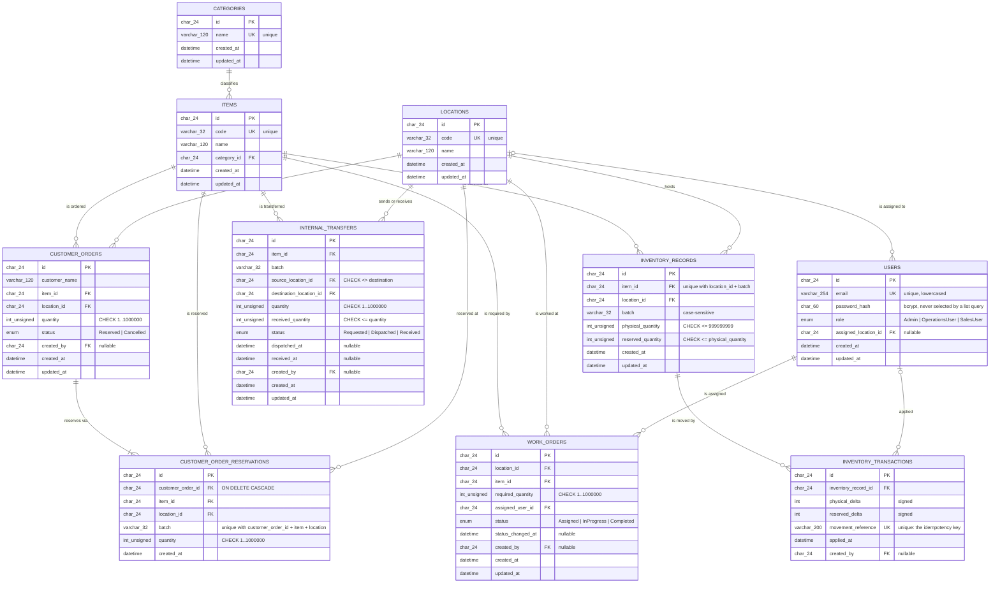

# Database Schema

The authoritative definition is [`backend/src/db/schema.sql`](../backend/src/db/schema.sql),
applied by `npm run migrate` and by the test harness before any test runs, so the schema a
test exercises is byte-for-byte the schema a deployment gets. This document describes that
file column by column; if the two ever disagree, the SQL is right and this document is the bug.

Ten tables, twenty foreign keys, nine `CHECK` constraints, seven unique indexes. No ORM —
queries are hand-written SQL through `mysql2`. See
[`docs/data-integrity.md`](./data-integrity.md) for how the constraints, transactions, and row
locks combine to hold the inventory invariants.

> The tracked Mermaid source for the diagram below lives at
> [`docs/er-diagram.mmd`](./er-diagram.mmd). The copy in this document is kept in sync with it
> so the diagram renders directly on GitHub without a separate viewer.

## Conventions

These apply to every table, so they are stated once here rather than repeated per table.

**Engine and charset.** `ENGINE=InnoDB DEFAULT CHARSET=utf8mb4 COLLATE=utf8mb4_0900_as_cs`.

- **InnoDB** is required for `FOREIGN KEY` constraints and transactions. MyISAM accepts both
  declarations and silently honours neither, which would void every guarantee the application
  depends on without producing a single error.
- **utf8mb4** is 4-byte UTF-8, so an item name or batch label may contain any character
  including emoji. MySQL's `utf8` is 3 bytes and cannot store them.
- **`utf8mb4_0900_as_cs`** is accent- and **case-sensitive**. Codes and batch labels are
  identifiers: `batch-a` and `BATCH-A` are different batches, and the unique indexes must treat
  them as such. MySQL's default collation is case-insensitive and would collapse them into one
  row.

**Primary keys.** Every `id` is `CHAR(24)` holding a 24-character lowercase hex string,
generated by [`backend/src/db/id.js`](../backend/src/db/id.js). Not `AUTO_INCREMENT`, for two
reasons: the public API already exposes these ids and its validation layer enforces
`/^[a-f0-9]{24}$/`, so keeping the shape means the HTTP contract, the OpenAPI spec, and the web
client are unaffected; and a sequential integer key leaks the row count of every table to
anyone who can read one id. The cost is a 24-byte key instead of 8, which is irrelevant at
this scale.

**Foreign key columns** are named `<relation>_id`, except `created_by`, which references
`users(id)` and is named for the relationship rather than the table.

**Referential actions.** Every foreign key is `ON UPDATE RESTRICT`. Primary keys here are
immutable — `id.js` generates one at insert time and nothing rewrites it — so there is no
update for a `CASCADE` to propagate. It also keeps the `CHECK` constraints legal: MySQL refuses
a `CHECK` on any column a referential action would have to touch. `ON DELETE` varies and is
noted per table; the general rule is `RESTRICT` (refuse to delete referenced reference data),
with `SET NULL` for `created_by`-style attribution columns and `CASCADE` only on
`customer_order_reservations`.

**Timestamps.** Every table has
`created_at DATETIME(3) NOT NULL DEFAULT CURRENT_TIMESTAMP(3)`. Every mutable table also has
`updated_at DATETIME(3) NOT NULL DEFAULT CURRENT_TIMESTAMP(3) ON UPDATE CURRENT_TIMESTAMP(3)`,
maintained by MySQL rather than by application code. `inventory_transactions` and
`customer_order_reservations` have no `updated_at` because their rows are never updated.
Millisecond precision (`(3)`) matters for the ledger: two movements applied inside one
transaction would otherwise share a whole-second timestamp and lose their order.

**Column naming.** Tables and columns are `snake_case`; the JSON the API returns is
`camelCase`. The translation happens in exactly one place,
[`backend/src/db/mappers.js`](../backend/src/db/mappers.js), so no controller does it ad hoc.

## Entity relationship diagram

---

## Tables

### `categories`

| Column | Type | Null | Default | Notes |
|---|---|---|---|---|
| `id` | `CHAR(24)` | No | — | Primary key |
| `name` | `VARCHAR(120)` | No | — | The business identity of a category |

Indexes: `PRIMARY (id)`; `UNIQUE uq_categories_name (name)`.

Foreign keys: none.

### `locations`

| Column | Type | Null | Default | Notes |
|---|---|---|---|---|
| `id` | `CHAR(24)` | No | — | Primary key |
| `code` | `VARCHAR(32)` | No | — | The business identity; two locations may share a `name` |
| `name` | `VARCHAR(120)` | No | — | |

Indexes: `PRIMARY (id)`; `UNIQUE uq_locations_code (code)`.

Foreign keys: none.

### `items`

| Column | Type | Null | Default | Notes |
|---|---|---|---|---|
| `id` | `CHAR(24)` | No | — | Primary key |
| `code` | `VARCHAR(32)` | No | — | The business identity; two items may share a `name` |
| `name` | `VARCHAR(120)` | No | — | |
| `category_id` | `CHAR(24)` | No | — | → `categories(id)` |

Indexes: `PRIMARY (id)`; `UNIQUE uq_items_code (code)`;
`KEY ix_items_category (category_id)` — non-unique, so listing one category's items is an
index range scan rather than a full table scan.

Foreign keys:

| Constraint | Column | References | On delete |
|---|---|---|---|
| `fk_items_category` | `category_id` | `categories(id)` | `RESTRICT` |

`RESTRICT` rather than `CASCADE`: deleting a category that items still reference is a
data-entry mistake, and silently deleting those items with it would be worse than refusing.
The application never deletes reference data.

### `users`

| Column | Type | Null | Default | Notes |
|---|---|---|---|---|
| `id` | `CHAR(24)` | No | — | Primary key |
| `email` | `VARCHAR(254)` | No | — | Stored already trimmed and lowercased by the application, so the unique index compares like with like |
| `password_hash` | `CHAR(60)` | No | — | bcrypt output is always exactly 60 characters. Selected only by the login lookup, never by a list query |
| `role` | `ENUM('Admin','OperationsUser','SalesUser')` | No | — | The role set is closed and enforced by the column type |
| `assigned_location_id` | `CHAR(24)` | **Yes** | `NULL` | `NULL` means the user is not bound to one site, e.g. an Admin |

Indexes: `PRIMARY (id)`; `UNIQUE uq_users_email (email)`;
`KEY ix_users_assigned_location (assigned_location_id)`.

Foreign keys:

| Constraint | Column | References | On delete |
|---|---|---|---|
| `fk_users_assigned_location` | `assigned_location_id` | `locations(id)` | `SET NULL` |

`SET NULL`: removing a location should not remove the people who worked there, it should leave
them unassigned.

### `inventory_records`

One row per (item, location, batch). This is where stock lives.

| Column | Type | Null | Default | Notes |
|---|---|---|---|---|
| `id` | `CHAR(24)` | No | — | Primary key |
| `item_id` | `CHAR(24)` | No | — | → `items(id)` |
| `location_id` | `CHAR(24)` | No | — | → `locations(id)` |
| `batch` | `VARCHAR(32)` | No | — | Case-sensitive (see Conventions) |
| `physical_quantity` | `INT UNSIGNED` | No | `0` | Units present |
| `reserved_quantity` | `INT UNSIGNED` | No | `0` | Units promised to customer orders |

There is **no `available_quantity` column**. Availability is derived as
`physical_quantity - reserved_quantity`, defined once in
[`backend/src/services/availability.js`](../backend/src/services/availability.js) and never
stored, so it cannot go stale.

`INT UNSIGNED` is load-bearing, not decorative: an `UPDATE` that would drive either balance
below zero fails with an out-of-range error under MySQL's default strict mode rather than
storing a negative.

Indexes:

| Index | Columns | Purpose |
|---|---|---|
| `PRIMARY` | `id` | |
| `UNIQUE uq_inventory_item_location_batch` | `item_id, location_id, batch` | The natural key. Declared once, as the unique index; a second non-unique index on the same leading columns would be redundant because this one already serves those lookups |
| `KEY ix_inventory_location` | `location_id` | Serves `WHERE location_id = ?` and the location-availability sum, neither of which can use the unique index because `item_id` is not in the predicate |

Foreign keys:

| Constraint | Column | References | On delete |
|---|---|---|---|
| `fk_inventory_item` | `item_id` | `items(id)` | `RESTRICT` |
| `fk_inventory_location` | `location_id` | `locations(id)` | `RESTRICT` |

Check constraints:

| Constraint | Condition |
|---|---|
| `ck_inventory_physical_max` | `physical_quantity <= 999999999` |
| `ck_inventory_reserved_max` | `reserved_quantity <= 999999999` |
| `ck_inventory_reserved_lte_physical` | `reserved_quantity <= physical_quantity` |

The last one is the central invariant of the whole application: it is what makes available
quantity non-negative by construction rather than by convention.

### `inventory_transactions`

The append-only ledger. Every change to an `inventory_records` row writes exactly one row here,
in the same transaction, so balances can be reconstructed by summing deltas.

| Column | Type | Null | Default | Notes |
|---|---|---|---|---|
| `id` | `CHAR(24)` | No | — | Primary key |
| `inventory_record_id` | `CHAR(24)` | No | — | → `inventory_records(id)` |
| `physical_delta` | `INT` | No | — | **Signed**, unlike the balances: a movement out of stock is negative |
| `reserved_delta` | `INT` | No | — | Signed |
| `movement_reference` | `VARCHAR(200)` | No | — | The idempotency key (see below) |
| `applied_at` | `DATETIME(3)` | No | `CURRENT_TIMESTAMP(3)` | |
| `created_by` | `CHAR(24)` | **Yes** | `NULL` | `NULL` for a movement the seed script applied with no acting user |

There is no `updated_at`: rows here are never updated. Append-only is a property of the code
rather than of the schema — no code path issues an `UPDATE` or `DELETE` against this table.
Under MongoDB this was enforced by model-level `pre` hooks; the SQL equivalent would be a
`BEFORE UPDATE` trigger, which was judged not worth the operational weight (triggers are
invisible in the source tree, do not show up in `schema.sql` diffs the way a constraint does,
and complicate the per-test reset) given that no such path exists.

Indexes:

| Index | Columns | Purpose |
|---|---|---|
| `PRIMARY` | `id` | |
| `UNIQUE uq_inventory_transactions_movement_reference` | `movement_reference` | Makes a replayed or concurrent duplicate write fail at the database rather than being applied twice: the second insert raises `ER_DUP_ENTRY`, which the service maps to `DUPLICATE_INVENTORY_TRANSACTION` |
| `KEY ix_inventory_transactions_record_applied` | `inventory_record_id, applied_at` | Ledger reconstruction for one record in application order |
| `KEY ix_inventory_transactions_created_by` | `created_by` | |

Foreign keys:

| Constraint | Column | References | On delete |
|---|---|---|---|
| `fk_inventory_transactions_record` | `inventory_record_id` | `inventory_records(id)` | `RESTRICT` |
| `fk_inventory_transactions_created_by` | `created_by` | `users(id)` | `SET NULL` |

### `work_orders`

| Column | Type | Null | Default | Notes |
|---|---|---|---|---|
| `id` | `CHAR(24)` | No | — | Primary key |
| `location_id` | `CHAR(24)` | No | — | → `locations(id)` |
| `item_id` | `CHAR(24)` | No | — | → `items(id)` |
| `required_quantity` | `INT UNSIGNED` | No | — | |
| `assigned_user_id` | `CHAR(24)` | No | — | → `users(id)` |
| `status` | `ENUM('Assigned','InProgress','Completed')` | No | `'Assigned'` | |
| `status_changed_at` | `DATETIME(3)` | **Yes** | `NULL` | `NULL` until the first accepted transition |
| `created_by` | `CHAR(24)` | **Yes** | `NULL` | → `users(id)` |

No stored shortage column, on purpose: shortage is derived at read time from current
availability, so it can never go stale.

Indexes: `PRIMARY (id)`; `KEY ix_work_orders_item_location (item_id, location_id)`;
`KEY ix_work_orders_status (status)`; `KEY ix_work_orders_assigned_user (assigned_user_id)`;
`KEY ix_work_orders_created_by (created_by)`. No unique index — two work orders for the same
item at the same location are legitimate.

Foreign keys:

| Constraint | Column | References | On delete |
|---|---|---|---|
| `fk_work_orders_location` | `location_id` | `locations(id)` | `RESTRICT` |
| `fk_work_orders_item` | `item_id` | `items(id)` | `RESTRICT` |
| `fk_work_orders_assigned_user` | `assigned_user_id` | `users(id)` | `RESTRICT` |
| `fk_work_orders_created_by` | `created_by` | `users(id)` | `SET NULL` |

Check constraints:

| Constraint | Condition |
|---|---|
| `ck_work_orders_required_quantity` | `required_quantity BETWEEN 1 AND 1000000` |

### `internal_transfers`

| Column | Type | Null | Default | Notes |
|---|---|---|---|---|
| `id` | `CHAR(24)` | No | — | Primary key |
| `item_id` | `CHAR(24)` | No | — | → `items(id)` |
| `batch` | `VARCHAR(32)` | No | — | |
| `source_location_id` | `CHAR(24)` | No | — | → `locations(id)` |
| `destination_location_id` | `CHAR(24)` | No | — | → `locations(id)` |
| `quantity` | `INT UNSIGNED` | No | — | |
| `received_quantity` | `INT UNSIGNED` | No | `0` | 0 until received, then equal to `quantity`. Kept as its own column rather than derived from `status` so a future partial-receipt feature can hold a value strictly between the two without a schema change |
| `status` | `ENUM('Requested','Dispatched','Received')` | No | `'Requested'` | |
| `dispatched_at` | `DATETIME(3)` | **Yes** | `NULL` | |
| `received_at` | `DATETIME(3)` | **Yes** | `NULL` | |
| `created_by` | `CHAR(24)` | **Yes** | `NULL` | → `users(id)` |

Indexes: `PRIMARY (id)`; `KEY ix_internal_transfers_status (status)`;
`KEY ix_internal_transfers_item_source_batch (item_id, source_location_id, batch)` — matches
the lookup dispatch performs against the source record;
`KEY ix_internal_transfers_destination (destination_location_id)`;
`KEY ix_internal_transfers_created_by (created_by)`.

Foreign keys:

| Constraint | Column | References | On delete |
|---|---|---|---|
| `fk_internal_transfers_item` | `item_id` | `items(id)` | `RESTRICT` |
| `fk_internal_transfers_source` | `source_location_id` | `locations(id)` | `RESTRICT` |
| `fk_internal_transfers_destination` | `destination_location_id` | `locations(id)` | `RESTRICT` |
| `fk_internal_transfers_created_by` | `created_by` | `users(id)` | `SET NULL` |

Check constraints:

| Constraint | Condition | Why |
|---|---|---|
| `ck_internal_transfers_quantity` | `quantity BETWEEN 1 AND 1000000` | |
| `ck_internal_transfers_received_lte_quantity` | `received_quantity <= quantity` | A receipt can never book in more than was sent |
| `ck_internal_transfers_distinct_locations` | `source_location_id <> destination_location_id` | The two endpoints of a transfer must differ. Enforced here as well as in the service guard, so no code path can create a same-location transfer |

### `customer_orders`

| Column | Type | Null | Default | Notes |
|---|---|---|---|---|
| `id` | `CHAR(24)` | No | — | Primary key |
| `customer_name` | `VARCHAR(120)` | No | — | |
| `item_id` | `CHAR(24)` | No | — | → `items(id)` |
| `location_id` | `CHAR(24)` | No | — | → `locations(id)` |
| `quantity` | `INT UNSIGNED` | No | — | The total ordered; the reservation lines sum to it |
| `status` | `ENUM('Reserved','Cancelled')` | No | `'Reserved'` | |
| `created_by` | `CHAR(24)` | **Yes** | `NULL` | → `users(id)` |

Indexes: `PRIMARY (id)`; `KEY ix_customer_orders_item_location (item_id, location_id)`;
`KEY ix_customer_orders_status (status)`; `KEY ix_customer_orders_created_by (created_by)`.

Foreign keys:

| Constraint | Column | References | On delete |
|---|---|---|---|
| `fk_customer_orders_item` | `item_id` | `items(id)` | `RESTRICT` |
| `fk_customer_orders_location` | `location_id` | `locations(id)` | `RESTRICT` |
| `fk_customer_orders_created_by` | `created_by` | `users(id)` | `SET NULL` |

Check constraints:

| Constraint | Condition |
|---|---|
| `ck_customer_orders_quantity` | `quantity BETWEEN 1 AND 1000000` |

### `customer_order_reservations`

Which batches an order actually drew its reservation from — one row per batch drawn.

| Column | Type | Null | Default | Notes |
|---|---|---|---|---|
| `id` | `CHAR(24)` | No | — | Primary key |
| `customer_order_id` | `CHAR(24)` | No | — | → `customer_orders(id)`, `ON DELETE CASCADE` |
| `item_id` | `CHAR(24)` | No | — | → `items(id)` |
| `location_id` | `CHAR(24)` | No | — | → `locations(id)` |
| `batch` | `VARCHAR(32)` | No | — | |
| `quantity` | `INT UNSIGNED` | No | — | Units drawn from this batch |

No `updated_at`: a reservation line is written once and never modified.

**This table is the one genuine modelling change from the previous MongoDB version**, where
these lines were an embedded array on the order document. As a child table the lines can be
queried and aggregated on their own — "how much of batch X is spoken for, and by whom" is a
single `GROUP BY` — instead of only ever being readable as part of their parent order. The four
columns `item_id`, `location_id`, `batch`, `quantity` are exactly what a future cancellation
needs to find the `inventory_records` row a line drew from and release the right amount from it.

Indexes:

| Index | Columns | Purpose |
|---|---|---|
| `PRIMARY` | `id` | |
| `UNIQUE uq_reservation_order_batch` | `customer_order_id, item_id, location_id, batch` | One line per batch per order: an order draws from any given batch once, in a single ascending-batch pass |
| `KEY ix_reservation_item_location_batch` | `item_id, location_id, batch` | The reverse lookup — every order holding stock in a given batch |

Foreign keys:

| Constraint | Column | References | On delete |
|---|---|---|---|
| `fk_reservation_order` | `customer_order_id` | `customer_orders(id)` | **`CASCADE`** |
| `fk_reservation_item` | `item_id` | `items(id)` | `RESTRICT` |
| `fk_reservation_location` | `location_id` | `locations(id)` | `RESTRICT` |

`CASCADE` here, unlike everywhere else in this schema: a reservation line has no meaning
without its order, so deleting the order must take its lines with it rather than leaving
orphans behind.

Check constraints:

| Constraint | Condition |
|---|---|
| `ck_reservation_quantity` | `quantity BETWEEN 1 AND 1000000` |

---

## Applying and testing the schema

`npm run migrate` in `backend/` creates `MYSQL_DATABASE` if absent and applies `schema.sql`
to it. Every statement is `CREATE TABLE IF NOT EXISTS`, so re-running it on an existing
database is a no-op — safe after every deploy.

The test suite creates a separate database named `<MYSQL_DATABASE>_test`, applies the same
`schema.sql` through the same migration code, and drops it when the run finishes.
`backend/tests/schema.test.js` then asserts, at the database level with no application code in
the path, that each `CHECK` constraint and each unique index actually rejects the data it is
supposed to.
