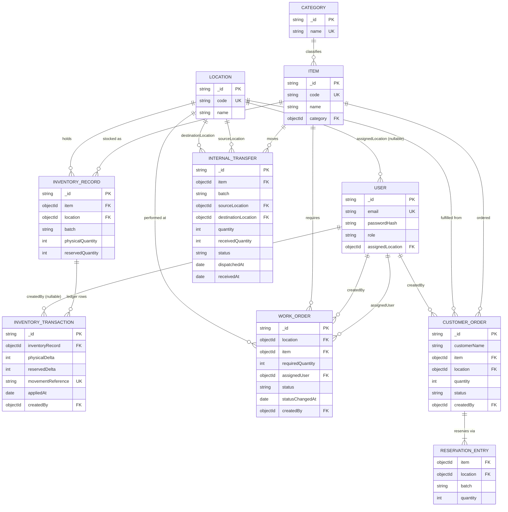

# Database Schema

> The tracked Mermaid source for the entity relationship diagram lives at
> [`docs/er-diagram.mmd`](./er-diagram.mmd). The diagram below is an embedded copy of that
> file's contents, kept in sync with it, so the diagram renders directly on GitHub without
> requiring a separate viewer.

MongoDB replaces the relational database named in the original case study brief. Every
relationship between collections below is modeled as an explicit `ObjectId` reference rather
than a duplicated embedded copy, and every multi-step stock movement is applied inside a
MongoDB multi-document transaction on a replica-set deployment. See
[`docs/mongodb-deviation.md`](./mongodb-deviation.md) for the full rationale and accepted
trade-offs.

The one exception is `RESERVATION_ENTRY` on `CustomerOrder`, which is embedded rather than
referenced because an entry has no identity or lifecycle outside its parent order.

## Entity relationship diagram

## Collections

Every collection also carries `createdAt` and `updatedAt` (Date, required, set automatically
by Mongoose's `{ timestamps: true }`); these are omitted from the per-field tables below since
they are identical across every collection.

### User

Source: `backend/src/models/User.js`

| Field | Type | Required? | Notes |
|---|---|---|---|
| `email` | String | Required | Unique, lowercased, trimmed, max length 254 |
| `passwordHash` | String | Required | `select: false` — excluded from query results unless explicitly selected |
| `role` | String | Required | Enum: `Admin`, `OperationsUser`, `SalesUser` |
| `assignedLocation` | ObjectId (ref `Location`) | Optional | Defaults to `null` |

Reference fields:
- `assignedLocation` → `Location`

Indexes:
- Unique: `{ email: 1 }` (declared implicitly by `unique: true` on the field)
- Non-unique: none

### Category

Source: `backend/src/models/Category.js`

| Field | Type | Required? | Notes |
|---|---|---|---|
| `name` | String | Required | Unique, trimmed, length 1–64 |

Reference fields: none

Indexes:
- Unique: `{ name: 1 }` (declared implicitly by `unique: true` on the field)
- Non-unique: none

### Item

Source: `backend/src/models/Item.js`

| Field | Type | Required? | Notes |
|---|---|---|---|
| `code` | String | Required | Unique, trimmed, length 1–32 |
| `name` | String | Required | Trimmed, length 1–120 |
| `category` | ObjectId (ref `Category`) | Required | |

Reference fields:
- `category` → `Category`

Indexes:
- Unique: `{ code: 1 }` (declared implicitly by `unique: true` on the field)
- Non-unique: `{ category: 1 }`

### Location

Source: `backend/src/models/Location.js`

| Field | Type | Required? | Notes |
|---|---|---|---|
| `code` | String | Required | Unique, trimmed, length 1–32 |
| `name` | String | Required | Trimmed, length 1–120 |

Reference fields: none

Indexes:
- Unique: `{ code: 1 }` (declared implicitly by `unique: true` on the field)
- Non-unique: none

### InventoryRecord

Source: `backend/src/models/InventoryRecord.js`

| Field | Type | Required? | Notes |
|---|---|---|---|
| `item` | ObjectId (ref `Item`) | Required | |
| `location` | ObjectId (ref `Location`) | Required | |
| `batch` | String | Required | Trimmed, length 1–32 |
| `physicalQuantity` | Integer | Required | Default 0, range 0–999,999,999 |
| `reservedQuantity` | Integer | Required | Default 0, range 0–999,999,999 |
| `availableQuantity` | Integer (virtual) | Not stored | Derived at read time as `physicalQuantity - reservedQuantity` by `availableQuantity()` in `src/services/availability.js`; not a persisted field |

Reference fields:
- `item` → `Item`
- `location` → `Location`

Indexes:
- Unique: `{ item: 1, location: 1, batch: 1 }`
- Non-unique: none (the design intentionally declares the compound key only once, as the
  unique index, rather than repeating it as a redundant non-unique index)

### InventoryTransaction

Source: `backend/src/models/InventoryTransaction.js`

| Field | Type | Required? | Notes |
|---|---|---|---|
| `inventoryRecord` | ObjectId (ref `InventoryRecord`) | Required | |
| `physicalDelta` | Integer (signed) | Required | Positive, negative, or zero |
| `reservedDelta` | Integer (signed) | Required | Positive, negative, or zero |
| `movementReference` | String | Required | Unique, trimmed, length 1–200 |
| `appliedAt` | Date | Required | Defaults to `Date.now` |
| `createdBy` | ObjectId (ref `User`) | Optional | Defaults to `null` (some rows originate from the seed script rather than a request) |

Reference fields:
- `inventoryRecord` → `InventoryRecord`
- `createdBy` → `User`

Indexes:
- Unique: `{ movementReference: 1 }` (declared implicitly by `unique: true` on the field)
- Non-unique: `{ inventoryRecord: 1, appliedAt: 1 }`

This collection is append-only: `pre` hooks reject `updateOne`, `updateMany`,
`findOneAndUpdate`, `deleteOne`, `deleteMany`, and `findOneAndDelete` at the model level.

### WorkOrder

Source: `backend/src/models/WorkOrder.js`

| Field | Type | Required? | Notes |
|---|---|---|---|
| `location` | ObjectId (ref `Location`) | Required | |
| `item` | ObjectId (ref `Item`) | Required | |
| `requiredQuantity` | Integer | Required | Range 1–1,000,000 |
| `assignedUser` | ObjectId (ref `User`) | Required | |
| `status` | String | Required | Enum: `Assigned`, `InProgress`, `Completed`; default `Assigned` |
| `statusChangedAt` | Date | Optional | Defaults to `null` until the first accepted transition |
| `createdBy` | ObjectId (ref `User`) | Required | |

There is deliberately no stored shortage field; `shortageQuantity` is computed at read time.

Reference fields:
- `location` → `Location`
- `item` → `Item`
- `assignedUser` → `User`
- `createdBy` → `User`

Indexes:
- Unique: none
- Non-unique: `{ item: 1, location: 1 }`, `{ status: 1 }`

### InternalTransfer

Source: `backend/src/models/InternalTransfer.js`

| Field | Type | Required? | Notes |
|---|---|---|---|
| `item` | ObjectId (ref `Item`) | Required | |
| `batch` | String | Required | Trimmed, length 1–32 |
| `sourceLocation` | ObjectId (ref `Location`) | Required | |
| `destinationLocation` | ObjectId (ref `Location`) | Required | |
| `quantity` | Integer | Required | Range 1–1,000,000 |
| `receivedQuantity` | Integer | Required | Default 0, min 0, bounded above by `quantity` |
| `status` | String | Required | Enum: `Requested`, `Dispatched`, `Received`; default `Requested` |
| `dispatchedAt` | Date | Optional | Defaults to `null` until dispatch is accepted |
| `receivedAt` | Date | Optional | Defaults to `null` until receipt is accepted |

Reference fields:
- `item` → `Item`
- `sourceLocation` → `Location`
- `destinationLocation` → `Location`

Indexes:
- Unique: none
- Non-unique: `{ status: 1 }`, `{ item: 1, sourceLocation: 1, batch: 1 }`

### CustomerOrder

Source: `backend/src/models/CustomerOrder.js`

| Field | Type | Required? | Notes |
|---|---|---|---|
| `customerName` | String | Required | Trimmed, length 1–120 |
| `item` | ObjectId (ref `Item`) | Required | |
| `location` | ObjectId (ref `Location`) | Required | |
| `quantity` | Integer | Required | Range 1–1,000,000 |
| `status` | String | Required | Enum: `Reserved`, `Cancelled`; default `Reserved` |
| `reservations` | Array of `ReservationEntry` (embedded) | Required | 1–20 entries |
| `createdBy` | ObjectId (ref `User`) | Required | |

Embedded `ReservationEntry` subdocument fields (`_id: false`, so entries carry no identifier
of their own):

| Field | Type | Required? | Notes |
|---|---|---|---|
| `item` | ObjectId (ref `Item`) | Required | |
| `location` | ObjectId (ref `Location`) | Required | |
| `batch` | String | Required | Trimmed, length 1–32 |
| `quantity` | Integer | Required | Range 1–1,000,000 |

Reference fields:
- `item` → `Item`
- `location` → `Location`
- `createdBy` → `User`
- `reservations[].item` → `Item`
- `reservations[].location` → `Location`

Indexes:
- Unique: none
- Non-unique: `{ item: 1, location: 1 }`, `{ status: 1 }`
